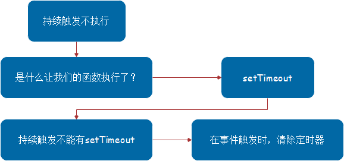
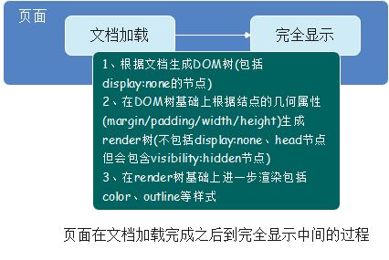

## 20210223

### 概念

#### 1. 判断数据类型的方法？

1. `typeof`：判断基本数据类型
2. `Object.prototype.toString.call()`：判断数据类型


#### 2. js的new操作符做了哪些事情？

> `new操作符`新建了一个空对象，这个对象原型指向`构造函数的prototype`，执行构造函数后返回这个对象

#### 3. 什么是闭包？

* 闭包就是指有权访问另一函数作用域中的变量的函数
  * 这种模式通常在`函数嵌套`结构中实现

* 闭包有如下作用：
  1. 加强封装，设计实现私有变量；
  2. 实现常驻内存的变量。

> 闭包不能滥用，否则会导致内存泄露，影响网页的性能。
> 闭包使用完了后，要立即释放资源，将引用变量指向null。

#### 4.实现继承的方式有哪些？

##### 1. class + extends[ES6]

```js
calss Animal {
  constructor(name) {
    this.name = name
  }
}
class Cat extends Animal {
  // constructor可省略
  constructor(name) {
    // super作为函数调用时，代表父类的构造函数
    super(name)
  } // 可省略
  eat() {
    console.log('eating')
  }
}
```

##### 2. 原型继承--sub.prototype = new sup()

```js
function Animal(name) {
  this.name = name;
}
Animal.prototype.eat = function() {
  console.log('eating');
}
function Cat(furColor) {
  this.color = color;
}
// 子实例的原型等于父类的实例
Cat.prototype = new Animal()
```

##### 3. 借用构造函数继承--sup.call(this, args)

```js
function Animal(name) {
  this.name = name;
}
function Cat() {
  Animal.call(this, 'CatName')
}
```

##### 4. 寄生组合式继承

```js
function Animal(name) {
  this.name = name;
}
Animal.prototype.eat = function() {
  console.log('eating');
}
function Cat(name, age) {
  Animal.call(this, name);
  this.age = age;
}
Cat.prototype = new Animal();
```

#### 5. DOM事件模型和事件流？

##### DOM事件模型

> DOM事件模型包括`事件捕获`与`事件冒泡`机制。

###### 事件冒泡

> 当标签中指定事件被触发时，该事件会向上一层传递，如果上层标签页注册了对应事件，那么上层标签对应事件也会被触发，事件会一直冒泡到根结点（文档）

* 基于事件冒泡可以完成事件委托（事件代理）

* **事件委托**
  * 事件委托是利用事件冒的原理，将事件绑定到父级元素身上，利用事件委托，可以给尚未存在的标签绑定事件，委托的优点是减少内存消耗，提高效率

##### DOM事件流

* DOM事件流包括三个阶段事件捕获阶段、处于目标阶段、事件冒泡阶段。

###### 如何让事件先冒泡后捕获？

* DOM标准事件模型中，是先捕获后冒泡的。
* 监听到捕获事件，先暂缓执行，直到冒泡事件被捕获后再执行捕获事件。

#### 6. EventLoop事件循环是什么？

> js是一门单线程语言，它的异步操作都是通过事件循环来完成的。整个事件循环大体由`执行栈、消息队列、微任务队列`三部分组成。

[js执行机制--EventLoop](../note/js的执行机制.md)

#### 7. require/import的区别？

1. `require`是CommonJS语法，`import`是ES6语法；
2. `require`只在后端服务器支持，`import`在高版本浏览器及Node中都可以支持；
3. `require`引入的是原始导出值的复制，`import`则是导出值的引用；
4. `require`时运行时动态加载，`import`是静态编译；
5. `require`调用时默认不是严格模式，`import`则默认调用严格模式.

#### 8. 什么是防抖和节流？有什么区别？如何实现？


##### 防抖（执行最后一次）

> **当持续触发事件时，函数是完全不执行的，等最后一次触发结束的一段时间之后，再去执行**

###### 应用

1. `search`搜索联想，用户在不断输入值时，用防抖来节约请求资源
2. window触发`resize`时，不断地调整浏览器窗口大小会不断触发该事件，用防抖来让其只触发一次

###### 分解

1. 持续触发不执行
2. 不触发的一段时间之后再执行

###### 实现

1. **不触发的一段时间之后再执行**

> 定时器里面调用要执行的函数，将`arguments`传入

* 封装一个函数，将目标函数（持续触发的事件）作为回调传进去，等待一段时间过后执行目标函数

```js
function debound(func, delay) {
 return function() {
   setTimeout(() => {
     func.apply(this, arguments)
   }, delay)
 }
}
```

2. **持续触发不执行**



```js
function debound(func, delay) {
  let timeout
  return function() {
    clearTimeout(timeout)
    timeout = setTimeout(() => {
      func.apply(this, arguments)
    }, delay)
  }
}
```

3. 用法

```js
box.onmousemove = debound(function(e) {
  box.innerHTML = `${e.clientX}, ${e.clientY}`
}, 1000)
```

##### 节流（执行第一次）

> 让函数有节制地执行，即在一段时间内，只执行一次

###### 应用

1. 鼠标不断点击触发，`mousedown`、`mousemove`
2. 监听滚动事件，比如是否滑到底部自动加载更多

###### 分解

1. 持续触发并不会执行多次
2. 到一定时间再去执行

###### 实现

> 持续触发，并不会执行，但是到时间了就会执行

* 关键点： **执行的时机**

1. 要做到控制执行的时机，可以通过一个开关，与定时器`setTimeout`结合完成
2. 函数执行的前提是开关打开，持续触发时，持续关闭开关，等到`setTimeout`到时间了，再把开关打开，函数就会执行了

```js
function throttle(func, delay) {
  let run = true
  return function() {
    if(!run) {
      return
    }
    run = false
    setTimeout(() => {
      func.apply(this, argument)
      run = true
    }, delay)
  }
}
```

* 用法

```js
box.onmousemove = throttle(function(e) {
  box.innerHTML = `${e.clientX}, ${e.clientY}`
}, 1000)
```

* 节流还能用时间间隔去控制

  > 如果当前事件与上次执行时间的时间差大于一个值，就执行


#### 9. setTimeout、Promise、async/await的区别？

```js
async function async1() {
    console.log('async1 start');
    await async2();
    console.log('async1 end');
}
async function async2() {
    console.log('async2');
}
console.log('script start');
setTimeout(function() {
    console.log('setTimeout');
}, 0)
async1();
new Promise(function(resolve) {
    console.log('promise1');
    resolve();
}).then(function() {
    console.log('promise2');
});
console.log('script end');
```

[js的执行机制-任务队列-宏任务-微任务](../note/js的执行机制.md)

##### setTimeout

> 宏任务

```js
console.log("script start");
setTimeout(() => {
    console.log("setTimeout");
}, 0);
console.log("script end");
// script start -> script end -> setTimeout
```

##### Promise

> Promise本身是同步的，但在执行`resolve`或者`rejects`时是异步的，即then方法是异步的

###### 一句话概括Promise

* **Promise对象用于异步操作，它表示一个尚未完成且预计在未来完成的异步操作**

```js
console.log('script start');
new Promise(function(resolve) {
    console.log('promise1');
    resolve();
}).then(function() {
    console.log('promise2');
});
console.log('script end');
// script start -> promise1 -> script end -> promise2
```

* `promise.then()`的回调放入`microtask queue`
* `setTimeout`的回调放入`macrotask queue` ，即使是0ms的情况

##### async & await

> 由于`async & await`本身就是`promise + generator`的语法糖，所以`await`后面的代码(不包含await语句)是`microtask`

* async函数需要等待await后的函数执行完成并且返回结果之后，才能继续执行下面的代码。await通过返回一个Promise对象来实现同步的效果
* async用于表示函数是一个异步函数，也就意味着该函数的执行不会阻塞后面代码的执行

```js
async function async1() {
  console.log('async1 start');
  await async2();
  console.log('async1 end');
}
// 等价于
async function async1() {
  console.log('async1 start');
  new Promise((resolve) => {
    async2()
    resolve()
  }).then(() => {
    console.log('async1 end');
  })
}
```

###### 如何描述async&await？

* `async`和`await`都是函数定义的关键字；
* `await`用于等待`promise`对象的返回结果，且不能单独使用而必须放在`async`函数中；
* 利用`async`定义的函数会返回一个`promise`对象；
* `async`函数的返回值就是`promise`状态为`resolved`的返回值。

##### setTimeout、Promise、async/await的区别？

* 事件循环中分为宏任务队列和微任务队列。
* 其中`setTimeout`的回调函数放到宏任务队列里，等到执行栈清空以后执行；
* `promise.then`里的回调函数会放到相应宏任务的微任务队列里，等宏任务里面的同步代码执行完再执行；
* `async`函数表示函数里面可能会有异步方法，`await`后面跟一个表达式，`async`方法执行时，遇到`await`会立即执行表达式，然后把表达式后面的代码放到微任务队列里，让出执行栈让同步代码先执行。用同步代码的方式实现异步流程。

#### 10. async/await如何通过同步的方式实现异步？

* `async/await`是参照`Generator`封装的一套异步处理方案，可以理解为`Generator`的语法糖，而`Generator`又依赖于迭代器`Iterator`，`Iterator`的思想又源于单向链表

##### 1.单向链表

* 链表的有点
  > 无需预先分配内存
  > 插入/删除节点不影响其他节点，效率高

* 单向链表
  > 是链表中最简单的一种，包含两个域：信息域与指针域，这个链接指向列表中的下一个节点，而最后一个节点则指向一个空值。

  * 特点：
    1. 节点的链接方向是单向的
    2. 相对于数组来说，单链表的随机访问速度较慢，但单链表删除/添加数据的效率很高

##### 2.Iterator

* **Iterator迭代器**的遍历过程类似于单向链表
* 一个对象要变成可迭代的，必须实现`@@iterator`方法，即对象（或它原型链上的某个对象）必须有一个名字为`Symbol.iterator`的属性
  * 原生具有该属性的有：字符串、数组、类数组的对象、Set和Map
  * 当一个对象需要被迭代时，它的`@@iterator`方法被调用并且无参数，然后返回一个用于在迭代中获得值的迭代器

##### 3.Generator

* **Generator：生成器对象时生成器函数返回的，它符合可迭代协议和迭代器协议，既是迭代器也是可迭代对象，可以调用`next`方法，但它不是函数，更不是构造函数**

###### 本质：暂停

> 它会让程序执行到指定位置先暂停`(yield)`，然后再启动`(next)`，再暂停`(yield)`，再启动`(next)`，而这个暂停就很容易让它和异步操作产生联系

* 处理异步时
  1. 开始异步处理（网络请求、IO操作）
  2. 然后暂停一下
  3. 处理完，再该干嘛干嘛

* js是单线程的，异步还是异步，`callback`还是`callback`，不会因为`Generator`而有任何改变

##### 4.async/await

* `async/await`是`Generator`的语法糖，就是一个自执行的`generate函数`。利用`generator函数`的特性把`异步的代码`写成`同步的形式`

#### 11. js异步解决方案的发展历程以及优缺点？

##### 1.回调函数callback

* 优点：解决了同步的问题（只要有一个任务耗时很长，后面的任务都必须排队等待，会拖延整个程序的执行）
* 缺点：回调地狱，不能用`try catch`捕获错误，不能`return`

##### 2.Promise

* 优点：解决了回调地狱的问题
* 缺点：无法取消`Promise`，错误需要通过回调函数来捕获

##### 3.Generator

* 特点：可以控制函数的执行，可以配合`co函数库使用`

##### 4.async&await

* 优点：代码清晰，不像`Promise`写一堆`then`链，处理了回调地狱的问题
* 缺点：`await`将异步代码改造成同步代码，如果多个异步操作没有依赖性而使用`await`会导致性能上的降低

#### 12. js延迟加载的方式有哪些？

1. `defer`属性
   > `<script defer src="test.js" />`
   * 用于开启新的线程下载脚本文件， 并使脚本在文档解析完成后执行
2. `async`属性
   > `<script async src="test.js" />`
   * 用于异步下载脚本文件，下载完毕立即解析执行代码


#### 13. Promise构造函数是同步执行还是异步执行，那么then方法呢？

```js
const promise = new Promise((res, rej) => {
  console.log(1)
  res()
  console.log(2)
})
promise.then(() => {
  console.log(3)
})
console.log(4)
// 1 -> 2 -> 4 -> 3
```

* `promise构造函数`是同步执行的
* `then方法`是异步执行的

#### 14. 介绍下重绘和回流(repaint&reflow)，以及如何进行优化？

##### 1.重绘和回流



###### 重绘repaint

> **当元素的一部分属性发生变化，如外观背景色不会引起布局变化而需要重新渲染的过程**

###### 回流reflow

> **当`render树`中的一部分或者全部因为大小边距等问题发生改变而需要重建的过程**

##### 2.重绘和回流的区别

* 引起DOM树结构变化，页面布局变化的行为叫`回流`，且回流一定伴随重绘；
* 只是样式的变化，不会引起DOM树变化，页面布局变化的行为叫`重绘`，且重绘不一定会伴随回流。
* 回流往往伴随着布局的变化，代价较大；重绘只是样式的变化，结构不会改变

##### 3.怎么减少回流

###### 1 避免频繁操作DOM

* 栗子：删除某个节点，给某个元素增加子元素，这类操作都会引起回流。如果要加多个子元素，最好使用`documentfragment`

###### 2 避免频繁操作样式

* 栗子：元素宽高变了、border变了、字体大小变了，这种直接会引起页面布局变化的操作会引起回流。如果`要改变多个属性，最好将这些属性定义在一个class中，直接修改class名`，这样只需要引起一次回流

###### 3 元素位置的变化

* 修改一个元素的左右margin、padding之类的操作会引起回流。在做元素位移的动画，不要更改margin之类的属性，使用`定位`脱离文档流后改变位置会更好

###### 4 获取元素的偏移量属性

* 避免频繁读取会引发回流、重绘的属性，多次操作，每次取完做个缓存

###### 5 浏览器窗口尺寸改变

* resize事件发生也会引起回流

##### 4.页面优化-`documentfragment对象`

###### 1 `documentfragment对象`是什么？

* `documentfragment节点`不属于dom树，因此改变它不会引起dom树的变化；
* dom树的操作会引起回流，则可以将`documentfragment`作为一个暂时的dom节点存储器，当我们在`documentfragment`修改完成时，我们就可以将存储dom节点的`documentfragment`一次性加入dom树，从而减少回流次数，达到性能优化的目的

###### 2 `documentfragment对象`怎么用？

```js
// 创建documentfragment，每个新建的documentfragment都会继承所有node方法，且拥有nodeValue、nodeName、nodeType属性
let fragment = document.createDocumentFragment();
console.log(fragment.nodeValue);
console.log(fragment.nodeName);
console.log(fragment.nodeType);
```

* 使用`documentfragment`能解决直接操作DOM引发大量回流的问题

* 栗子
  * 给ul添加5个li节点
  * 直接操作`dom`，回流5次

  

  * 使用`documentfragment`一次性添加，回流一次

  

#### 15. 说说浏览器和node事件循环的区别？

[浏览器的事件循环](../note/js的执行机制.md)

[node的事件循环](../note/node中的eventLoop.md)

* 浏览器环境下，`microtask`的任务队列是每个`macrotask`执行完之后执行
* nodejs中，`micortask`会在事件循环的各个阶段之间执行，也就是一个阶段执行完毕，就会执行`microtask`队列的任务


```js
setTimeout(()=>{
  console.log('timer1')
  Promise.resolve().then(function() {
    console.log('promise1')
  })
}, 0)
setTimeout(()=>{
  console.log('timer2')
  Promise.resolve().then(function() {
    console.log('promise2')
  })
}, 0)
```

##### 浏览器端

* 浏览器端的运行结果：timer1 -> promise1 -> timer2 -> promise2

##### node端

* node端的运行结果：timer1 -> timer2 -> promise1 -> promise2
  * 全局脚本`main()`执行，将2个`timer`依次放入`timer队列`，`main()`执行完毕，调用栈空闲，任务队列开始执行
  * 首先进入`timer阶段`，执行timer1，将promise1.then回调放入`microtask队列`，同样步骤执行timer2
  * `timer阶段`执行结束，`event loop`进入下一个阶段之前，执行`microtask队列`的所有任务

##### 总结

[浏览器与node的事件循环的区别](https://segmentfault.com/a/1190000017893482)

* 浏览器和node环境下，`microtask任务队列的执行时机不同`
  * **node端，microtask在事件循环的各个阶段之间执行**
  * **浏览器端，microtask在事件循环的macrotask执行完之后执行**

#### 16. 介绍模块化发展历程

| 规范 | 框架 | 区别 | 定义与引入 |
| --- | --- | --- | --- |
| **AMD** | require.js | 前端+异步 | **define+require( )** |
| CMD | sea.js | 前端+异步 |  |
| **CommonJS** | node.js | 后端+同步 | **module.exports+require( )** |
| **ES Module** | ES6 | 前端+同步 |  |

#### 17. 全局作用域中，用const和let声明的变量不在window上，到底在哪里？如何去获取？

| |	ES5 |	ES6 |
| --- | --- | --- |
| **变量声明** | `var` `function` | `let` `const` `import` `class` |
| **顶层对象 window** | `顶层对象的属性<=>全局变量` | `新特性声明的全局变量不属于顶层对象的属性` `全局变量和顶层对象的属性分离`|

* 在全局作用域中，用`let`和`const`声明的变量并没有在全局对象中，只是在一个块级作用域中

##### 怎么获取？

* 在定义变量的块级作用域中就能获取

#### 18. 介绍下BFC及其应用

* BFC就是块级格式化上下文，是页面盒模型布局中的一种CSS渲染模式，相当于一个独立的容器，里面的元素和外面的元素互不影响

##### 创建BFC的方式

* html根元素
* float浮动
* 绝对定位
* overflow不为visiable
* display为表格布局或者弹性布局

##### BFC主要的作用

* 清除浮动
* 防止同一BFC容器中的相邻元素间的外边距重叠问题

#### 19. 箭头函数与普通函数的区别是什么？构造函数可以使用new生成实例，那么箭头函数可以吗？为什么？

##### 箭头函数与普通函数的区别是什么？

* 箭头函数没有`this`，函数体内的this对象指向的是`定义时所在的对象`，而不是使用时所在的对象
* 箭头函数没有`arguments对象`，如果要使用，可用`rest参数`代替

##### 构造函数可以使用new生成实例，那么箭头函数可以吗？为什么？

* 箭头函数不能使用`new命令`
* 原因：
  * 箭头函数没有自己的`this`，无法调用`apply`、`call`
  * 箭头函数没有`prototype属性`，而`new命令`在执行时需要将构造函数的`prototype`赋值给新的对象的`_proto_`

#### 20. call和apply的区别是什么，哪个性能更好一些？

> `call`和`apply`方法是在`Function.prototype`身上实现的，因此所有`Function`创建出来的实例对象（函数）都可以调用

##### call和apply的区别

* 传参的方式不同：
  * `call方法`的实参以参数列表传递
  * `apply方法`的实参以数组的方式传递
* 形参的个数不同：
  * `call方法`的期望参数为1个 `...call(target)`
  * `apply方法`的期望参数为2个 `...apply(target, [])`

##### 哪个性能更好一些

* `call`比`apply`的性能更好，`call`传入参数的格式正是内部所需要的格式

#### 21. 分析比较 opacity: 0、visibility: hidden、display: none优劣和适用场景

|  | 优劣 | 适用场景 |
|--|  --  |   --    |
| `opacity: 0;` | 占据空间，可以点击 | 可以跟`transition`搭配 |
| `visibility: hidden;` | 占据空间，不能点击 | 显示不会导致页面结构发生变动，不会撑开 |
| `display: none;` | 不占空间，不能点击 | 显示出原来这里不存在的结构 |

#### 22. ES6代码转成ES5代码的实现思路是什么？

* `babel`将ES6代码转ES5代码的步骤：
  * 解析`parse`：解析代码字符串，生成AST（抽象语法树）
  * 转换`transform`：按一定的规则转换，修改AST
  * 生成`genenrate`：将修改后的AST生成新的普通代码

#### 23. 使用JavaScript Proxy实现简单的数据绑定

```html
<input type="text" v-model="content">
<input type="text" v-model="title">
<input type="text" v-model="title">
<h3 v-bind="title"></h3>
```

```js
// 接收一个参数对象
function view(option) {
  // 给实例对象添加初始化数据对象
  this.initData = option.data;
  let proxy = new Proxy(this.initData, {
    set(obj, prototype, value) {
      //更新视图
      document
        .querySelectorAll(`[v-model="${prototype}"]`)// 获取相应的表单元素
        .forEach((item) => {
          item.value = value
        })
      document.querySelectorAll(`[v-bind="${prototype}"]`)// 获取相应的普通的标签元素
        .forEach((item) => {
          item.innerHTML = value
        })
        return true
      },
      get(obj, prototype) { }
    })
    this.data = proxy;
    // 初始化绑定监听事件
    this.init = function () {
      let els = document.querySelectorAll("[v-model");
      els.forEach((item) => {
        item.addEventListener("input", function () {
          // 此时通过getAttribute获取的是我们绑定在DOM元素上的属性值, 也就是相对应数据的属性名
          proxy[this.getAttribute("v-model")] = this.value
        })
      })
    }
    // 初始化渲染
    this.renderInit = function () {
      for (let key in this.initData) {//对数据进行遍历, 获取key获取相应的DOM元素并更新视图.
      let renerList = document.querySelectorAll(`[v-model="${key}"]`);
      let renerInputList = document.querySelectorAll(`[v-bind="${key}"]`);
      renerInputList.forEach((item) => item.innerHTML = this.initData[key])
      renerList.forEach((item) => item.value = this.initData[key])
    }
  }
  this.renderInit()// 渲染视图
}
let data = {
  title: "张三434",
  content: "43",
}
let vm = new view({
  data,//传递的数据对象, ES6简写方式, 当属性名和属性值相同时,可以简写这种形式.
})
vm.init()
//我们通过实例对象上的data属性改变title属性值, 此时也会被代理对象所拦截并响应.
vm.data.title = "$34"
```

#### 24. 介绍下Promise.all使用、原理实现及错误处理

> `const p = Promise.all([p1, p2, p3])`

* `Promise.all`方法接收一个数组作为参数，p1、p2、p3都是Promise实例（如果不是，就会先调用Promise.resolve()将参数转为Promise实例）
* `Promise.all`的参数可以不是数组，但必须具有Iterator接口，且返回的每个成员都是Promise实例
* 返回值：
  * 一个新的`promise对象`，该`promise对象`在iterable参数对象里所有的`promise对象`都成功时才会触发成功，一旦有任何一个iterable里面的`promise对象`失败则立即触发该`promise对象`的失败。
  * 该`promise对象`在触发成功状态以后，会把一个包含iterable里所有的`promise`返回值的数组作为成功回调的返回值，顺序跟iterable的顺序保持一致。
* 错误处理：若该`promise对象`触发了失败状态，它就把iterable里第一个触发失败的`promise对象`的错误信息作为它的错误信息。
* **`Promise.all()`常被用于处理多个`promise对象`的状态集合**

#### 25. var、let、const区别的实现原理是什么？

##### 变量赋值可以分为三个阶段

1. `创建变量`，在内存中开辟空间；
2. `初始化变量`，将变量初始化为undefined；
3. `真正赋值`。

##### 关于`let`,`var`,`function`

* `let`的**创建**过程被提升了，但是初始化没有提升；
* `var`的**创建**和**初始化**都被提升了；
* `function`的**创建**、**初始化**、**赋值**都被提升了

##### 变量与内存之间的关系，主要由三个部分组成：变量名、内存地址、内存空间

###### JS引擎

* `JS引擎`在读取变量时，先找到**变量绑定的内存地址**，然后找到**地址所指向的内存空间**，最后读取其中的内容。
* 当变量改变时，`JS引擎`不会用新值覆盖之前旧值的内存空间，而是**重新分配一个新的内存空间来存储新值，并将新的内存地址与变量进行绑定**。
* `JS引擎`会在合适的时机进行GC，回收旧的内存空间。

###### const

* `const`定义变量（常量）后，变量名与内存地址之间建立了一种**不可变**的绑定关系，阻隔变量地址被改变。
* 当`const`定义的变量进行重新赋值时，根据前面的论述，JS引擎会尝试重新分配新的内存空间，所以会被拒绝，便会抛出异常。

#### 26. 暂时性死区

* 在代码块中，使用`let`、`const`命令声明变量之前，该变量是不可用的。这在语法上称为`暂时性死区`。

#### 27. 介绍下Set、Map、WeakSet、WeakMap的区别？

##### 1. Set

> ES6 新增的一种新的数据结构，类似于数组，但成员是唯一且无序的，没有重复的值。

###### Set本身是一种构造函数，用来生成Set数据结构

> `new Set([iterable])`

###### Set实例属性

* `constructor`：构造函数
* `size`：元素数量

```js
let set = new Set([1, 2, 3, 2, 1])
console.log(set.length) // undefined
console.log(set.size) // 3
```

###### Set实例方法

* **操作方法**
  * **`add(value)`:**新增，相当于`array`里的`push`
  * **`delete(value)`:**删除
  * **`has(value)`:**判断集合中是否存在`value`
  * **`clear()`:**清空集合
  * **`Array.from`**方法可以将`Set`结构转为数组

```js
let set = new Set()
set.add(1).add(2).add(1)
set.has(1) // true
set.has(3) // false
set.delete(1) // true
set.delete(1) // false
set.has(1) // false

// Array.from
const items = new Set([1, 2, 3, 2])
const array = Array.from(items)
console.log(array) // [1, 2, 3]
const arr = [...items]
console.log(arr) // [1, 2, 3]
```

* 遍历方法（遍历顺序为插入顺序）
  * **`keys()`:**返回一个包含集合中所有键的迭代器
  * **`values()`:**返回一个包含集合中所有值的迭代器
  * **`entries()`:**返回一个包含Set对象中所有元素的键值对迭代器
  * **`forEach(cb, thisArg)`:**用于对集合成员执行`cb`操作，如果提供了`thisArg`参数，回调中的this指向这个参数，没有返回值
  * **`Set`可默认遍历，默认迭代器生成函数是`values()`方法**
    * `Set.prototype[Symbol.iterator] === Set.prototype.values // true`
  * **`Set`可以使用`map``filter`方法**

```js
let set = new Set([1, 2, 3])
console.log(set.keys())     // SetIterator {1, 2, 3}
console.log(set.values())   // SetIterator {1, 2, 3}
console.log(set.entries())  // SetIterator {1 => 1, 2 => 2, 3 => 3}
for (let item of set.keys()) {
  console.log(item);  // 1 2 3
}
for (let item of set.entries()) {
  console.log(item);  // [1, 1] [2, 2] [3, 3]
}
set.forEach((value, key) => {
  console.log(key + ' : ' + value)  // 1 : 1 2 : 2 3 : 3
})
console.log([...set])   // [1, 2, 3]

let set = new Set([1, 2, 3])
set = new Set([...set].map(item => item * 2))
console.log([...set])   // [2, 4, 6]

set = new Set([...set].filter(item => (item >= 4)))
console.log([...set])   //[4, 6]
```

* **交集、并集、差集**

```js
let set1 = new Set([1, 2, 3])
let set2 = new Set([4, 3, 2])

let intersect = new Set([...set1].filter(value => set2.has(value)))
let union = new Set([...set1, ...set2])
let difference = new Set([...set1].filter(value => !set2.has(value)))

console.log(intersect)  // Set {2, 3}
console.log(union)      // Set {1, 2, 3, 4}
console.log(difference) // Set {1}
```

##### 2. WeakSet

> `WeakSet`对象允许你将`弱引用对象`储存在一个集合中

###### 属性

* `constructor`：构造函数，任何一个具有`Iterator`接口的对象都可以作为参数

```js
const arr = [[1, 2], [3, 4]]
const weakset = new WeakSet(arr)
console.log(weakset) // WeakSet {Array(2), Array(2)}
```

###### 方法

* **`add(value)`：**在`WeakSet`对象中添加一个元素
* **`has(value)`：**判断`WeakSet`是否包含`value`
* **`delete(value)`：**删除元素
* **`clear()`：**清空所有元素，该方法已废弃

```js
var ws = new WeakSet()
var obj = {}
var foo = {}

ws.add(window)
ws.add(obj)

ws.has(window)  // true
ws.has(foo) // false

ws.delete(window)   // true
ws.has(window)  // false
```

##### 3. 字典Map

> **任何具有`Iterator`接口、且每个成员都是一个双元素的数组的数据结构**都可以当作`Map`构造函数的参数

```js
const set = new Set([
  ['foo', 1],
  ['bar', 2]
]);
const m1 = new Map(set);
m1.get('foo') // 1

const m2 = new Map([['baz', 3]]);
const m3 = new Map(m2);
m3.get('baz') // 3

// 如果读取一个未知的键，则返回undefined
new Map().get('aaaaa') // undefined
```

* **注意：只有对同一个对象的引用，`Map`结构才将其视为同一个键**

```js
const map = new Map();

map.set(['a', 333])
map.get(['a']) // undefined
```

* **`Map`的键实际上是跟内存地址绑定的，只要内存地址不一样，就视为两个键**

```js
let map = new Map();

map.set(-0, 123);
map.get(+0) // 123

map.set(true, 1);
map.set('true', 2);
map.get(true) // 1

map.set(undefined, 3);
map.set(null, 4);
map.get(undefined) // 3

map.set(NaN, 123);
map.get(NaN) // 123
```

###### Map的属性

* **`constructor`：**构造函数
* **`size`：**返回字典中所包含的元素个数

```js
const map = new Map([
  ['name', 'An'],
  ['des', 'JS']
])
map.size // 2
```

###### Map方法

* **操作方法**
  * **`set(key, value)`：**向字典中添加新元素
  * **`get(key)`：**通过键查找特定的数值并返回
  * **`has(key)`：**判断字典中是否存在键key
  * **`delete(key)`：**通过键key从字典中移除对应的数据
  * **`clear()`：**将这个字典中的所有元素删除

* **遍历方法**
  * **`keys()`：**将字典中包含的所有键名以迭代器形式返回
  * **`values()`：**将这个字典中包含的所有数值以迭代器形式返回
  * **`entries()`：**返回所有成员的迭代器
  * **`forEach()`：**遍历字典的所有成员

```js
const map = new Map([
    ['name', 'An'],
    ['des', 'JS']
]);
console.log(map.entries()) // MapIterator {"name" => "An", "des" => "JS"}
console.log(map.keys()) // MapIterator {"name", "des"}
```

##### 4. WeakMap

> `WeakMap`对象是一组键值对的集合，其中的**弱是弱引用对象，而值可以是任意**

* **`WeakMap`弱引用的只是键名，而不是键值。键值依然是正常引用**
* `WeakMap`中，每个键对自己所引用对象的引用都是弱引用，在没有其他引用和该键引用同一对象，这个对象将会被垃圾回收（相应的key则变成无效的），所以，*`*WeakMap`的`key`是不可枚举的**

###### WeakMap的属性

* **`constructor`：**构造函数

###### WeakMap方法

* **`has(key)`：**判断是否有key关联对象
* **`get(key)`：**返回key关联对象（无则返回undefined）
* **`set(key, value)`：**设置一组key关联对象
* **`delete(key)`：**移除key的关联对象

##### 5. 总结

1. `Set`
   * 成员唯一、无序且不重复
   * `[value, value]`键值与键名是一致的（或者说只有键值没有键名）
   * 可以遍历，方法有`delete、add、has`
2. `WeakSet`
   * 成员都是对象
   * 成员可以是弱引用，可以被垃圾回收机制回收，可以用来保存`DOM`节点，不容易造成内存泄漏
   * 不能遍历，方法有`delete、add、has`
3. `Map`
   * 本质上是键值对的集合，类似集合
   * 可以遍历，方法很多可以跟各种数据格式转换
4. `WeakMap`
   * 只接受对象作为键名（null除外），不接受其他类型的值作为键名
   * 键名是弱引用，键值可以是任意的，键名所指向的对象可以被垃圾回收，此时键名是无效的
   * 不能遍历，方法有`get、set、has、delete`

##### 6. 扩展：Object、Set、Map

1. `Object`与`Set`

```js
// Object
const properties1 = {
  'width': 1,
  'height': 1
}
console.log(properties1['width'] ? true : false) // true

// Set
const properties2 = new Set()
properties2.add('width')
properties2.add('height')
console.log(properties2.has('width')) // true
```

2. `Object`与`Map`

```js
// js中的对象(Object)，本质上是键值对的集合（hash结构）
const data = {};
const element = document.getElementsByClassName('App');

data[element] = 'metadata';
console.log(data['[object HTMLCollection]']) // 'metadata'
```

* 但当以一个`DOM节点`作为`对象data的键`，对象会自动转化为字符串`[Object HTMLCollection]`
* 所以说，`Object结构`提供了"字符串-值"对应，`Map`则提供了"值-值"的对应


#### 28. ES5/ES6的继承除了写法以外还有什么区别？

##### 区别1

* `ES5`的继承实质上是**先创建子类的实例对象，然后再将父类的方法添加到`this`上（`Parent.apply(this)`）。**
* `ES6`的继承机制完全不同，实质上是**先创建父类的实例对象`this`（所以必须先调用父类的`super()`方法），然后再用子类的构造函数修改`this`。**

##### 区别2

* `ES5`的继承是**通过原型或构造函数机制来实现**。
* **`ES6`通过`class关键字`定义类，里面有构造方法，类之间通过`extends关键字`实现继承。** 子类必须在`constructor方法`中调用`super方法`，否则新建实例报错。
  * 因为子类没有自己的`this对象`，而是**继承了父类的`this对象`**，然后对其进行加工。
  * 如果不调用`super方法`，子类得不到`this对象`。
  * 注意`super关键字`指代父类的实例，即父类的`this对象`。

#### 29. 跨域的原理

* 跨域，是指浏览器不能执行其他网站的脚本。它是由**浏览器的同源策略**造成的，是浏览器对js实施的安全限制，那么只要**协议、域名、端口**有任一不同，都被当做是不同的域。

##### CORS

* 服务器设置响应头`res.header('Access-Control-Allow-Origin','*');`

#### 30. this指向

* **this指向由函数调用的方式决定**

| 函数调用方式 | 栗子 | 指向 | 严格模式指向 |
| --- | --- | --- | --- |
| `普通函数调用` | `f()` | `window` | `undefined` |
| `对象方法调用` | `o.f()` | `当前的对象o` | `当前的对象o` |
| `构造函数调用` | `new f()` | `当前实例对象` | `当前实例对象` |
| `函数上下文` | `call` `apply` `bind` | `第一个参数` | `第一个参数` |

#### 31. 什么是按需加载？

* 当用户触发了动作时才加载对应的功能
* 触发的动作：鼠标点击、输入文字、拉动滚动条、鼠标移动、窗口大小更改等
* 加载的文件：js、图片、css、html等

#### 32. virtual dom是什么？

* 一个结构类似于真实DOM节点的js对象

#### 33. webpack用来干什么的？

* `webpack`是一个现代js应用程序的静态模块打包器`(module bundler)`
* 当`webpack`处理应用程序时，它会递归地构建一个依赖关系图`(dependency graph)`，其中包含应用程序需要的每个模块，然后将这些模块打包成一个或多个`bundle`

#### 34. es6新特性

1. let关键字
    > let声明的变量不会进行变量声明的提升
2. const关键字
3. 暂时性死区
4. 对象的增强写法
5. 箭头函数
6. 扩展运算符
7. 对象解构
8. class类
    > constructor + 原型方法 + 静态方法
9. for...of循环
10. Symbol符号类型
11. Object.assign()
    > 用来合并多个对象
12. Set集合
13. Map映射
14. 数组扩展方法
    > `include()` `find()` `findIndex()` `from()` `of()<->new Array()`
15. 字符串扩展方法
    > `includes()` `trim()` `repeat()` `endWith()`

### 编码实现

#### 1. js的拖拽功能？

* `mousedown`,`mousemove`,`mouseup`

```js
 // 鼠标移动后坐标(clientX1,clientY1)-鼠标初始坐标(clientX2,clientY2) = 元素移动后坐标(offsetLeft1,offsetTop1)-元素初始坐标(offsetLeft2,offsetTop2)

 // 定位
 offsetLeft = clientX1 - clientX2 + offsetLeft2
 offsetTop = clientY1 - clientY2 + offsetTop2
```

#### 2. ['1', '2', '3'].map(parseInt) what & why?

##### what？

```js
["1","2","3"].map(parseInt) // [1, NaN, NaN]
```

##### why？

1. **map()方法**：按照原始数组元素顺序依次处理元素，然后返回一个新数组
   * **`array.map((item, index, array), this)`**
2. **parseInt()函数**：解析一个字符串，并返回一个整数。
   > 当参数radix的值为0时，或没有设置该参数时，parseInt()会根据string来判断数字的基数

    * 当忽略参数radix，js默认数字的基数如下：
      * string以"0x"开头，parseInt()会把string的其余部分解析为十六进制的整数
      * string以"0"开头，parseInt()会把string的其余部分解析为八进制或者十六进制的整数
      * string以1~9的数字开头，parseInt()会把string解析为十进制的整数
    * 语法：
      * **`parseInt(string, radix)`**
      * string：必填，要被解析的字符串
      * radix：选填，表示要解析的数字基数，介于2-36

```js
console.log(parseInt(1, 0)) // 1
console.log(parseInt(2, 1)) // 将一进制的2转为十进制数，NaN
console.log(parseInt(3, 2)) // 将二进制的3转为十进制数，NaN
```

#### 3. 实现一个sleep函数

* sleep(1000)意味着等待1000ms，可以从`Promise、Generator、async/await`等角度实现

```js
const sleep = time => {
  return new Promise(resolve => setTimeout(resolve, time))
}
sleep(1000).then(() => {
  // 操作
})
```

#### 4. 使用sort()对数组[3,15,8,29,102,22]进行排序，输出结果

* 默认的排序方法会将数组元素转换为字符串，然后比较字符串中字符的`UTF-16`编码顺序来排序

```js
let arr1 = [3,15,8,29,102,22].sort() // [102, 15, 22, 29, 3, 8]
let arr2 = [3,15,8,29,102,22].sort((a, b) => {
  return a-b
}) // [3, 8, 15, 22, 29, 102]
```

#### 5. 实现(5).add(3).minus(2)功能

```js
// 5+3-2=6
Number.prototype.add = function(n) {
  return this.valueOf() + n;
}
Number.prototype.minus = function(n) {
  return this.valueOf() - n;
}
```

#### 6. 怎么让一个div水平垂直居中

```html
<div vlass="parent">
  <div class="children"></div>
</div>
```

```css
/* 方法1 */
.parent {
  display: flex;
}
.children {
  margin: auto;
}

/* 方法2 */
.parent {
  position: relative;
}
.children {
  position: absolute;
  top: 50%;
  left: 50%;
  transform: translate(-50%, -50%);
}
```

#### 7. 如何设计实现无缝轮播？

* 无缝轮播的核心是制造一个连续的效果。最简单的方法就是复制一个轮播的元素，当复制元素将要滚到目标位置后，把原来的元素进行归位的操作，以达到无缝的轮播效果

> 栗子：大屏信息上下滚动

```html
<article class="container-body" id="demo">
  <ul id="demo1"></ul>
  <ul id="demo2"></ul>
</article>
```

```js
function listToHtml(newList) {
    var htmlStr = ''
    for(var i = 0; i < newList.length; ++i) {
        htmlStr+=`
          ...
        `
    }
    return htmlStr;
}
// 表格滚动是否开启  默认不开
function routeStart(type = false, dom) {
  if(type) {
    let demo = $(dom)[0]
    let demo1 = $('#demo1')[0]
    let demo2 = $('#demo2')[0]
    var speed = 50;
    demo2.innerHTML = demo1.innerHTML;
    function Marquee() {
      //当滚动至dome1与dome2交界时
      // offsetHeight 该元素的像素高度
      // scrollTop 元素的滚动条的垂直位置
      if (demo2.offsetHeight - demo.scrollTop <= 0) {
        demo.scrollTop = 0;
      } else {
        demo.scrollTop ++ ;
      }
    }
    MyMar = setInterval(Marquee, speed);
  }
}
// 设置表格数据
function setrealTMList(dom1, dom2, dataList) {
  var htmlStr = ''
  htmlStr = listToHtml(dataList)
  $(dom1).html(htmlStr)
  // clientHeight即是元素在可视区的高度
  // scrollHeight是自身的高度+隐藏元素的高度
  if($(dom2)[0].clientHeight < $(dom2)[0].scrollHeight) {
    if(dataList.length >= 25) {
      routeStart(true)
      return;
    }
    $(dom1).html(htmlStr)
    routeStart(true, dom2)
  }
}
setrealTMList('#demo1', '#demo', list) // list即后台返回的data
```

#### 8. 模拟实现一个Promise.finally

[Promise](../note/promise.md)

```js
Promise.prototype.finally = function(callback) {
  let P = this.constructor;
  return this.then(
    value => P.resolve(callback()).then(() => value),
    reason => P.resolve(callback()).then(() => {throw reason})
  );
}
```

#### 9. a.b.c.d 和 a['b']['c']['d'] 哪个性能更高？

* 编译器解析前者要比后者容易

#### 10. 为什么普通for循环的性能远高于forEach的性能？

##### 回答

* `for`循环没有任何额外的函数调用和上下文
* `forEach`函数签名实际上是`array.forEach(function(currentValue, index, arr), thisValue)`

##### for和forEach的区别

###### 1. 遍历

* `for`循环按顺序遍历
* `forEach`使用iterator迭代器遍历

###### 2. 数据结构

* `for`循环式随机访问元素
* `forEach`是顺序链表访问元素

###### 3. 性能上

* 对于`顺序表arraylist`
  * 使用`for`循环可以顺序访问，速度较快；
* 对于`单链表linkedlist`
  * 使用`for`循环每次都要从第一个元素读取next域来读取，速度非常慢；
  * 使用`forEach`可以直接读取当前节点，速度较快

#### 11. 数组里有10w数据，取第一个和第10w个元素的时间相差多少

* 数组可以直接根据索引取的对应的元素，所以不管取哪个位置的元素的时间复杂度都是 O(1)
* 得出结论：**消耗时间几乎一致，差异可以忽略不计**

```js
var arr=new Array(100000).fill(100);
console.time('index_0')
arr[0];
console.timeEnd('index_0')

console.time('index_100000')
arr[100000-1];
console.timeEnd('index_100000')

// index_0:      0.00390625 ms
// index_100000: 0.003173828125 ms
```

#### 12. 在输入框中如何判断输入的是一个正确的网址？

```js
function isUrl(url) {
  const a = document.createElement("a"); 
  a.href = url; 
  return ( 
    [ 
      /^(http|https):$/.test(a.protocol),
      a.host, 
      a.pathname !== url, 
      a.pathname !== `/${url}` 
    ].find(x => !x) === undefined 
  ); 
}
```

##### 拓展 [1, 2, 3].find(x => x)返回的值

> `[1, 2, 3].find(x => x) // 1`

##### 拓展 [1, 2, 3].find(x => !x)返回的值

> `[1, 2, 3].find(x => !x) // undefined`

* `find()`方法返回通过测试(函数内判断)的数组的第一个元素的值。
* `find()`方法为数组中的每个元素都调用一次函数执行：
  * 当数组中的元素在测试条件时返回`true`时, `find()`返回符合条件的元素，之后的值不会再调用执行函数。
  * 如果没有符合条件的元素返回`undefined`

#### 13. 设计并实现Promise.race()

> `Promise.race([p1, p2, p3])`里面哪个结果获得的快，就返回那个结果，不管结果本身是成功状态还是失败状态。

```js
Promise._race = promises => new Promise((resolve, reject) => {
  promises.forEach(promise => {
    // promise.then(resolve, reject) 
    Promise.resolve(promise).then(res => {
      resolve(res);
    }, error => {
      resolve(error);     
    });
  })
})
```

#### 14. 使用迭代的方式实现flatten函数

> 数组扁平化

##### 1.arr.flat(infinity)

> ES6的`arr.flat(infinity)`方法会递归到指定深度将所有子数组链接，并返回一个新数组，`depth`指定嵌套数组中的结构深度，默认为1，不管多少层都可以用`infinity`关键字作为参数

```js
let arr = ['a', 2, [3, 'b', 5, [6, 7], 8], 9, 10, [11, [12, 13]]];
console.log(arr.flat(Infinity)) //["a", 2, 3, "b", 5, 6, 7, 8, 9, 10, 11, 12, 13]
```

##### 2.递归实现

```js
let arr = ['a', 2, [3, 'b', 5, [6, 7], 8], 9, 10, [11, [12, 13]]];
let result = [];
let flatten = function(arr) {
  for(let i = 0; i < arr.length; i++) {
    let item = arr[i];
    if(Array.isArray(item)) {
      flatten(item);
    } else {
      result.push(item);
    }
  }
  return result;
}
console.log('递归实现', flatten(arr)) //["a", 2, 3, "b", 5, 6, 7, 8, 9, 10, 11, 12, 13]

// 简写版本
const flatten = array => array.reduce((acc, cur) => (Array.isArray(cur) ? [...acc, ...flatten(cur)] : [...acc, cur]), [])
```

##### 3.扩展运算符

```js
 let arr = ['a', 2, [3, 'b', 5, [6, 7], 8], 9, 10, [11, [12, 13]]];
function flatten(arr) {
  var arr;
  while (arr.some(v => Array.isArray(v))) {
     arr = [].concat(...arr);
  }
  console.log(arr)
  return arr;
}
console.log('扩展运算符', flatten(arr)) //["a", 2, 3, "b", 5, 6, 7, 8, 9, 10, 11, 12, 13]
```

#### 15. input搜索如何防抖，如何处理中文输入

```js
<input id="myinput" />

function jieliu(timeout) {
  var timer;
  function input(e) {
    if(e.target.composing) {
      return;
    }
    if(timer) {
      clearTimeout(timer);
    }
    timer = setTimeout(() => {
      timer = null;
    }, timeout)
  }
  return input;
}

function onCompositionStart(e) {
  e.target.composing = true;
}
function onCompositionEnd(e) {
  e.target.composing = false;
  var event = document.createEvent('HTMLEvents');
  event.initEvent('input');
  e.target.dispatchEvent(event);
}
var input_dom = document.getElementById('myinput');
input_dom.addEventListener('input', jieliu(1000));
// 中文输入的开始时触发一次
input_dom.addEventListener('compositionstart', onCompositionStart);
// 在输入完毕通过输入法选择中文汉字填入搜索框时触发一次
input_dom.addEventListener('compositionend', onCompositionEnd);
```

#### 16. 下面代码输出什么？

```js
{
  function foo() {}
  foo = 1
  function foo() {}
  foo = 10
  console.log(11, foo)
}
console.log(111, foo)

{
  foo = 1
  function foo() {}
  foo = 10
  console.log(22, foo)
}
console.log(222, foo)

{
  function foo() {}
  foo = 1
  foo = 10
  console.log(33, foo)
}
console.log(333, foo)

{
  foo = 1
  foo = 10
  console.log(44, foo)
}
console.log(444, foo)
```

#### 17. 用setTimeout来实现setInterval

> js引擎确保了setInterval加入队列中最小的时间间隔为指定时间。存在的问题：1、某些间隔会被跳过；2、多个定时器的代码执行时间可能会比预期小

```js
function say() {
  // do something
  setTimeout(say, 200);
}
setTimeout(say, 200);

// 或者
setTimeout(function() {
  // do something
  setTimeout(arguments.callee, 200)
}, 200)
```

#### 18. js实现深度拷贝一个元素

```js
var deepCopy = function(obj) {
  if(typeof obj != 'object') return;
  var newObj = obj instanceof Array ? [] : {};
  for(var key in obj) {
    if(obj.hasOwnProperty(key)) {
      newObj[key] = typeof obj[key] === 'object' ? deepCopy(obj[key]) : obj[key];
    }
  }
  return newObj;
}
```

```js
function clone(obj) {
  var copy;
  switch(typeof obj) {
    case 'undefined':
      break;
    case 'number':
      copy = obj - 0;
      break;
    case 'string':
      copy = obj + '';
      break;
    case 'boolean':
      copy = obj;
      break;
    case 'object':
      if(obj === null) {
        copy = null;
      } else {
        if(Object.prototype.toString.call(obj).slice(8, -1) === "Array") {
          copy = [];
          for(var i =0; i < obj.length; i++) {
            copy.push(clone(obj[i]));
          }
        } else {
          copy = {};
          for(var i in obj) {
            copy[i] = clone(obj[i]);
          }
        }
      }
      break;
    default:
      copy = obj;
      break;
  }
  return copy;
}
```

#### 19. 编码满足以下条件

##### 1. 条件

1. `Hero("37er");` 执行结果为 `Hi! This is 37er`
2. `Hero("37er").kill(1).recover(30);` 执行结果为 `Hi! This is 37er Kill 1 bug Recover 30 bloods`
3. `Hero("37er").sleep(10).kill(2);` 执行结果为 `Hi! This is 37er`//等待10s后 `Kill 2 bugs`//注意为bugs

##### 2. 实现

```js
function Hero(name) {
  let o = new Object();
  o.name = name;
  o.time = 0;
  console.log(`Hi! This is ${o.name}`);
  o.kill = function(bugs) {
    if(bugs === 1) {
      console.log(`Kill 1 bug`)
    } else {
      setTimeout(() => {
        console.log(`Kill ${bugs} bugs`)
      }, 1000 * this.time)
    }
    return o;
  }
  o.recover = function(bloods) {
    console.log(`Recover ${bloods} bloods`)
    return o;
  }
  o.sleep = function(sleepTime) {
    o.time = sleepTime;
    return o;
  }
  return o;
}
```

#### 20. 写一个函数，第一秒打印1，第二秒打印2......

```js
// 方法一：let块级作用域
for(let i = 0; i < 5; i++) {
  setTimeout(() => {
    console.log(i)
  }, 1000 * i)
}

// 方法二：闭包
for(var i = 0; i < 5; i++) {
  (function(i) {
    setTimeout(() => {
      console.log(i)
    }, 1000 * i)
  })(i)
}
```

#### 21. 有3个promise，A、B、C，想串行执行，该怎么写？

```js
// promise
A.then(B).then(C).catch(...)
// async/await
(async() => {
  await A();
  await B();
  await C();
})()
```

#### 22. 提取url的查询字符串，将其按key-value形式返回一个json结构

```js
var url = "https:...?username=lh&...";
var oIndex = url.indexOf('?');
var oUrl = url.splice(oIndex, url.length-1);
var oArr = oUrl.split('&');
var obj = {};
oArr.map(item => {
  var o = item.split('=');
  var key = o[0];
  var value = o[1];
  obj[key] = value;
})
```

### 场景题

#### 1. 单机游戏：一只小鸟在飞，前面是无尽的沙漠，上下不断有钢管生成，你要躲避钢管。小明在玩游戏时老是卡顿甚至崩溃，说出原因（3-5个）以及解决办法（3-5个）

##### 原因

1. **内存溢出问题**
2. **资源过大问题**
3. **资源加载问题**
4. **canvas绘制频率问题**

##### 解决办法

1. 内存溢出问题：在钢管离开可失去之后，销毁钢管，让垃圾收集器回收钢管。
2. 资源过大问题：应该选择图片文件大小更小的图片格式【webp、png】。
3. 资源加载问题：应该在可视区之前就预加载好资源，如果在可视区才生成钢管，用户体验就认为钢管是卡顿后才生成的，不流畅。
4. canvas绘制频率问题：提高绘制频率

### 打印题目

#### 1. 栗子

##### 题目1

```js
for(var i = 0; i < 5; i++) {
  setTimeout(function() {
    console.log(i)
  }, 1000);
}
```

##### 题目2

```js
for(let i = 0; i < 5; i++) {
  setTimeout(function() {
    console.log(i)
  }, 1000);
}
```

##### 解析

###### 题目1

* 一秒后输出5个5
* `setTimeout`会被放入`任务队列`，等待主线程运行，即`for循环`的5次执行完后再执行任务队列中的函数

###### 题目2

* 1 2 3 4 5
* 使用`es6`中`let`使`for循环`中的变量变成`块级作用域`，通过函数作用域可以保存变量的特性来将每次循环的变量爆粗到函数中

#### 2. 基础的js

```js
Function.prototype.a = 1;
Object.prototype.b = 2;
function A() {};
var a = new A();
console.log(a.a, a.b);
console.log(A.a, A.b);
```


