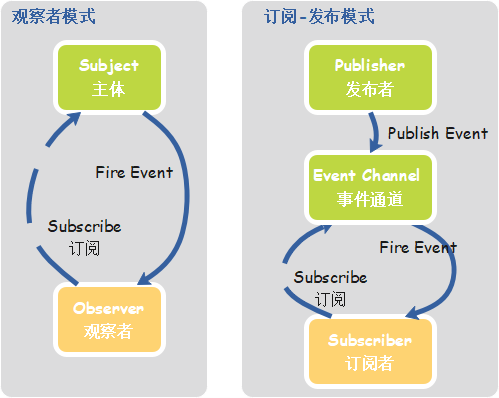

## Vue框架

### Vue

#### 1. vue的工作原理

> 核心：**数据驱动、组件系统**

* **`vue`是一个构建`数据驱动`的web界面的`渐进式框架`，采用`MVVM模式`实现视图层与数据层的数据修改、更新监听。**
* **其工作原理是`vue`在实例化的过程中会遍历`data`下的数据，通过`Object.defineProperty()`方法将它们设置为存储器属性（即具有`getter`、`setter`属性）。**

#### 2. Vue的双向数据绑定，Model如何改变View，View又是如何改变Model的？

##### 核心思想

> `MVVM`是一个构建数据驱动的渐进式框架：关注`Model`的变化，让`MVVM框架`利用自己的机制去`自动更新DOM`，从而把开发者从操作`DOM`的繁琐中解脱

* `MVVM`分为`Model`、`View`、`ViewModel`三者。`Model是数据层`，`View是视图层`，Model和View并无直接联系，而是通过`ViewModel`进行联系。`Model和ViewModel之间存在双向绑定的联系`。因此当Model中的数据改变时会**触发**View层的刷新，View层中由于用户交互操作而改变的数据也会在Model中**同步**。这种模式实现了Model和View的数据自动同步，因此开发者只需要专注于对数据的维护即可，而不需要自己操作dom

##### Model -> (vm) -> View

* 从`model`到`view`的映射(data binding)，可以节省操作`update view`的代码

> `v-bind:value='val'`

##### View -> (vm) -> Model

* 从`view`到`model`的事件监听(dom listeners)，`model`会随着`view`触发事件而改变

> `v-on:input='val=$event.target.value'`

##### View <-> Model

> `<input type="text" v-model="scole.English">`  [指令：v-model]

#### 3. vue的特点

1. **简洁**：页面由HTML模板+ JSON数据+ Vue实例组成；
2. **数据驱动**：自动计算属性和追踪依赖的模板表达式；
3. **组件化**：用可复用、解耦的组件来构造页面；
4. **轻量**：代码量小，不依赖其他库；
5. **快速**：精确有效批量DOM更新。

#### 4. vue改变组件触发视图更新（如何设置响应式属性）？

1. 初始化时写入`data`属性
2. 调用方法：`Vue.set(target,key,value)`
3. 以下方法的调用会更改原始数组：
   * `push()`
   * `pop()`
   * `shift()`
   * `unshift()`
   * `splice()`
   * `sort()`
   * `reverse()`

#### 5. 为什么vue中的data必须是一个函数？

* 对象是引用类型，在重用组件时，由于数据对象指向同一个`data`对象，当在一个组件中修改`data`时，其它重用的组件中的`data`会同时被修改。使用返回对象的函数，由于每次返回的是一个新的对象，引用地址不同，就不会出现这个问题。

#### 6. vue中的ref是什么？

* `ref`被用来给组件或元素注册引用信息，然后引用信息会注册在父组件的`$refs`对象上。
* 也就是说如果在`普通dom`上使用，引用指向的就是`dom元素`；如果用在子组件上，引用指向的就是组件实例。

#### 7. v-for、key的作用是什么？

* 当`vue`用`v-for`更新已经渲染过的元素列表时，默认采用`“复用”原则`。如果数据项的顺序被改变，`vue`不是移动`DOM元素`来匹配数据项的改变，而是简单复用此处每个元素，并且确保它在特定索引下显示已被渲染过的每个元素。
* 为了给`vue`一个提示，以便他能够`跟踪`每个节点，从而重新排序现有的元素，需要为每项提供一个唯一的`key`属性。`key`属性的类型只能是`string`或者`number`类型。
* 使用`key`，`vue`会基于`key`的变化重新排列元素顺序，并且会移除`key`不存在的元素。

#### 8. watch和computed计算属性的区别？

> 既能用`computed`实现又可以用`watch`监听来实现的功能，推荐用`computed`。重点在于`computed的缓存功能`。

* **`computed计算属性`用来声明式地描述一个值依赖了其他值，当他所依赖的值或变量发生改变时，计算属性也会跟着改变**
* **`watch`用来监听实例下的属性，当监听的值发生改变时会自动调用对应的方法**

#### 9. 简述每个生命周期具体适合哪些操作？

* `beforecreated`：可以在这加个`loading`事件，在加载实例时触发；
* `created`：初始化完成时的事件写在这里，如结束`loading`、异步请求调用；
* `mounted`：挂载节点，获取`DOM`节点；
* `updated`：对数据统一处理；
* `beforeDestory`：可做确认停止事件。

#### 10. 第一次加载会触发哪几个钩子？

* `beforeCreate`、`created`、`beforeMount`、`mounted`

#### 11. DOM渲染在哪个周期中就完成了？

* `mounted`阶段。`mounted`不会承诺所有子组件都一起被挂载，使用`vm.$nextTick`可以实现整个视图已经渲染完毕。

#### 12. Vue父组件和子组件生命周期钩子执行顺序是什么？

1. 加载渲染过程： `父beforeCreate -> 父created -> 父beforeMount -> 子beforeCreate -> 子created -> 子beforeMounted -> 子mounted`
2. 子组件更新过程：`父beforeUpdate -> 子beforeUpdate -> 子updated -> 父updated`
3. 父组件更新过程：`父beforeUpdate -> 父updated`
4. 销毁过程：`父beforeDestory -> 子beforeDestory -> 子destoryed -> 父destoryed`

#### 13. Vue在 v-for 时给每项元素绑定事件需要用事件代理吗？为什么？

##### 事件代理（事件委托）

###### 什么是事件代理？

* 如果某些标签当前不存在，未来才可能被创建出来，我们无法直接给他们添加事件，到那时可以把这个操作添加到这些元素的祖先节点身上

###### 事件代理的作用？

* 事件代理能够避免我们逐个去给元素新增和删除事件
* 事件代理比每一个元素都绑定一个事件性能要更好

* **总结**
  1. 将事件处理程序代理到父节点，减少内存占用率
  2. 动态生成子节点时能自动绑定事件处理程序到父节点

##### 没必要

* 在`v-for`中，我们直接使用`for循环`就能在模板上将每个元素都绑定事件，并且当组件销毁时，vue也会自动给我们将所有的事件处理器移除。所以事件代理能做到的第一点vue已经做到了
* 在`v-for`中，给元素绑定的都是相同的事件，所以除非上千行的元素需要加上事件，其实和使用事件代理的性能差别不大，所以没必要用事件代理

#### 14. Virtual DOM真的比操作原生DOM快吗？

> 虚拟dom：一个结构类似于真实DOM节点的js对象

##### 1. 原生DOM操作vs通过框架封装操作

* 这是一个`性能`vs`可维护性`的取舍。
* 框架的意义在于**为你掩盖底层的`DOM`操作，让你用更声明式的方式来描述你的目的，从而让你的代码更容易维护。**
* 没有任何框架可以比纯手动的优化`DOM`操作更快，因为框架的`DOM`操作层需要应对任何上层`API`可能产生的操作，它的实现必须是普适的。

##### 2.性能比较也要看场合

1. 分清楚**初始渲染、小量数据更新、大量数据更新**这些不同场合。
2. **Virtual DOM、脏检查MVVM、数据收集MVVM**在不同场合各有不同的表现和不同的优化需求。
3. **Virtual DOM为了提高小量数据更新时的性能，也需要针对性的优化**

* 初始渲染：Virtual DOM > 脏检查 >= 依赖收集
* 小量数据更新：依赖收集 >> Virtual DOM + 优化 > 脏检查(无法优化) > Virtual DOM无优化
* 大量数据更新：脏检查+优化 >= 依赖收集 + 优化 > Virtual DOM(无优化) >> MVVM无优化

#### 15. v-show和v-if的相同点和不同点

* `v-show`指令是通过`修改元素的display属性`让其显示或隐藏。
* `v-if`是直接`销毁和重建DOM`达到让元素显示和隐藏的效果。

#### 16. v-on常用修饰符

* `.native`主要是给自定义组件添加原生事件
* `.stop`主要用于阻止事件冒泡
  * `e.stopPropagation()`
* `.prevent`主要用于阻止当前事件的默认行为
* `.self`主要用于设置当事件是从事件绑定的元素本身触发时才会触发回调
* `.once`表示绑定的事件是一次性的，仅被触发一次

#### 17. Vue的响应式原理中Object.defineProperty有什么缺陷？

> 为什么在`Vue3.0`采用了`Proxy`，抛弃了`Object.defineProperty`？

* `Object.defineProperty`无法监控到数组下标的变化，导致通过数组下标添加元素，不能实时响应;
* `Object.defineProperty`只能劫持对象的属性，从而需要对每个对象，每个属性进行遍历，如果属性值是对象，还需要深度遍历;
* `Proxy`可以劫持整个对象，并返回一个新的对象;
* `Proxy`不仅可以代理对象，还可以代理数组。还可以代理动态增加的属性。

### 组件化

#### 1. 在vue中，子组件为何不可以修改父组件传递的prop？

> 因为`vue`设计是单向数据流，数据的流动方向只能是自上往下的方向

#### 2. 组件通讯

##### 1.父传子

* 父：自定义属性名+ 数据
* 子：`props["父组件上的自定义属性名"]`
　　
##### 2.子传父

> **在父组件中注册子组件并在子组件标签上绑定自定义事件的监听**

* 子：`this.$emit("自定义事件名", 数据)`
* 父：`methods: { 自定义事件() {} } + 组件标签上绑定 @自定义事件名 = "回调函数"`
　　
##### 3.事件总线  `let bus = new Vue()`

* A：`methos:{ 函数 { bus.$emit("自定义事件名", 数据) } }` -> 发送
* B：`created(){ bus.$on("A发送过来的自定义事件名") }` -> 接收

### Vue-Cli

#### 1.vue-cli项目中src目录中每个文件夹和文件的用法

* assets：放静态资源
* component：放组件
* router：定义路由相关的配置
* app.vue：是一个应用主组件
* main.js：是入口文件

### Vue-Router

#### 1. vue的路由模式及实现方式？

> `hash` && `history`

##### hash

* `hash`路由原理是`window`下的`hashchange`事件，它会在浏览器`url`地址中`hash`值改变时触发
* `hash`虽然在`url`中，但不被包括在`http`请求中，只用来指导浏览器动作，对浏览器安全无用，`hash`不会重加载页面

##### history

* `history`路由采用了`h5`的新特性，`h5`提供了`pushState()`和`replaceState()`实现不刷新页面的路由跳转
* `history`模式需要后台配合配置。

#### 2. vue-router有哪几种导航钩子？

##### 1. 全局导航钩子

> 可以用在路由跳转前做判断拦截

* 所有的路由切换都会执行，一般写在路由配置文件中
* **`router.beforeEach(fn)`**
  * to
  * from
  * next()

* **router.afterEach(fn)**
  * to
  * from

##### 2. 组件内钩子

* **beforeRouteEnter(fn)**
  > 此时组件实例还没有被创建，因此无法访问this
  * to
  * from
  * next()

* **beforeRouteUpdate(fn)**
  * to
  * from
  * next()

* **beforeRouteLeave(fn)**
  * to
  * from
  * next()

##### 3. 路由独享钩子

* 写在路由配置中
* **beforeEnter(fn)**
  * to
  * from
  * next()

#### 3. vue路由传参

* 使用`query方式`传入的参数使用`this.$route.query`接收：`query传参`可通过`path`和`name`方式跳转，页面刷新参数任然存在；
* 使用`params方法`传入的参数使用`this.$route.params`接收：`params传参`只能通过`name`方式跳转，页面刷新时params参数会丢失，除非作为动态路由

#### 4. $route和$router的区别

* **`$route`是“路由信息对象”**，包括`path`、`params`、`query`、`hash`、`fullpath`、`name`等路由信息参数。
* **`$route`r是“路由实例对象”**，包括`路由的跳转方式`、`钩子函数`等。

### Vuex

#### 1. vuex是什么？有哪几种属性？

* `vuex`是一个专门为vue.js程序开发的状态管理模式。有五种属性：`state`、`getter`、`mutation`、`action`、`module`

#### 2. vuex的state是什么？

* `vuex`就是一个`store`，`store`里面放了很多对象。
* 其中`state`就是数据源存放地，`对应于vue中的data`。
* `state`里存放的数据是响应式的，`vue`从`store`中读取数据，当`store`中的数据发生改变时，依赖这些数据的组件也会发生改变。
* 它通过`mapState`把全局的`state`和`getter`映射到当前组件的`computed`属性。

#### 3. vuex的getter是什么？

* `getter`用来对`state`进行计算操作，它就是`store`的计算属性。
* `getter`的返回值会根据它的依赖被缓存起来，且只有当它依赖的值发生了改变才会被重新计算，`getter`可以用于监听`state`中的值的变化，返回计算后的结果。
* 虽然在组件内也可以做计算属性，但是`getter`可以在多组件复用。
* 它对应于`vue`对象中的`computed`。

#### 4. vuex的mutation是什么？

* 更改`vuex`中`store`中的`state`的唯一方法是通过`this.$store.commit`提交`mutation`。

#### 5. vuex的action是什么？

* `action`类似于`mutation`，不同的是`action`的是通过`this.$store.dispatch`提交`mutation`，而不是直接变更状态。
* `action`可以包含任何异步操作。

#### 6. 为什么Vuex的mutation不能做异步操作？

* Vuex中所有的状态更新的唯一途径都是`mutation`，异步操作通过`Action`来提交`mutation`实现，这样使得我们可以方便地跟踪每一个状态的变化，从而让我们能够实现一些工具帮助我们更好地了解我们的应用。
* 每个`mutation`执行完成后都会对应到一个新的状态变更，这样`devtools`就可以打个快照存下来，然后就可以实现`time-travel`了。如果`mutation`支持异步操作，就没有办法知道状态是何时更新的，无法很好的进行状态的追踪，给调试带来困难。

#### 7. 双向绑定和vuex是否冲突？

> 严格模式中使用`vuex`时，在属于`vuex`的`state`上使用`v-model`会比较棘手

##### 栗子

```js
<input v-model="obj.message">
```

###### 解析

1. 假设`obj`是在计算属性中返回的一个属于`vuex store`的对象
2. 用户输入时，`v-model`会试图直接修改`obj.message`
3. 在严格模式中，由于这个修改不是在`mutation`函数中执行的，这里会抛出一个错误

###### vuex思维

> 用`vuex思维`去解决这个问题的方法是：**给`<input>`中绑定`value`，然后侦听`input`或者`change`事件，在事件回调中调用一个方法：**

```js
<input :value="message" @input="updateMessage">

computed: {
  ...mapState({
    message: state => state.obj.message
  })
},
methods: {
  updateMessage(e) {
    this.$store.commit('updateMessage', e.target.value)
  }
}

// vuex中的mutation函数
mutations: {
  updateMessage(state, message) {
    state.obj.message = message
  }
}
```

###### 双向绑定的计算属性

> 使用带有`setter`的双向绑定计算属性

```js
<input v-model="message">

computed: {
  message: {
    get() {
      return this.$store.state.obj.message
    },s
    et(value) {
      this.$store.commit('updateMessage', value)
    }
  }
}
```

### 其它

#### 1. Promise对象是什么？

> `Promise`是异步编程的一种解决方案，它是一个容器，保存着未来某个时间点才会结束的事件的结果。
> `Promise`是一个对象，从它可以获取异步操作的消息。
> `Promise`提供统一的`API`，各种异步操作都可以用同样的方式进行处理。
> `Promise`对象是一个构造函数，用来生成`Promise`实例。

##### 特点

* 对象的状态不受外界影响。`promise`对象代表一个异步操作，有三种状态：`pending（进行中）`、`fukfikked（已成功）`和`rejected（已失败）`。只有异步操作的结果可以决定当前是哪一种状态，任何其他操作都无法改变这个状态。
* 一旦状态改变，就不会再变，任何时候都是可以得到这个结果。

##### 缺点

1. 无法取消`promise`，一旦建立他就会立即执行，无法中途取消。
2. 如果不设置回调函数，`promise`内部跑出的错误无法反映到外部。
3. 当`pending`的时候，无法知道进展到了哪一步。

#### 2. axios的特点是什么？

1. `axios`是一个基于`promise`的`http`库，支持`promise`的所有`API`；
2. 它可以拦截请求和响应；
3. 它可以转换请求数据和响应数据，并对响应回来的数据转换为`json`类型的数据；
4. 它安全性更高，客户端支持防御`CSRF`（跨域请求伪造）

#### 3. 如何描述async & await？

* `async`和`await`都是函数定义的关键字；
* `await`用于等待`promise`对象的返回结果，且不能单独使用而必须放在`async`函数中；
* 利用`async`定义的函数会返回一个`promise`对象；
* `async`函数的返回值就是`promise`状态为`resolved`的返回值。

#### 4. 介绍下npm模块安装机制，为什么输入npm install就可以自动安装对应的模块？

##### npm模块安装机制

1. 发出`npm install`命令
2. 查询`node_modules`目录之中是否已经存在指定模块
   * 若存在，不再重新安装
   * 若不存在
     1. `npm`向`registry`查询模块压缩包的网址
     2. 下载压缩包，存放在根目录下的`.npm目录`里
     3. 解压压缩包到当前项目的`node_modules目录`

#### 5. 介绍下观察者模式和订阅-发布模式的区别，各适用于什么场景？

##### 区别

* **观察者模式中主体和观察者是相互感知的；发布-订阅模式是借助第三方来实现调度的，发布者和订阅者之间互不感知**



1. 在**观察者模式**中，观察者是知道`Subject`的，`Subject`一直保持对观察者进行记录；在**发布订阅模式**中，发布者和订阅者不知道对方的存在。它们只有通过消息代理进行通信。
2. 在发布订阅模式中，组件是松散耦合的，正好和观察者模式相反。
3. **观察者模式**大多数时候是同步的，比如当事件触发，Subject就会去调用观察者的方法；而发布-订阅模式大多数时候是异步的（使用消息队列）。
4. **观察者模式**需要在单个应用程序地址空间中实现，而**发布-订阅**更像交叉应用模式。

#### 6. 介绍下webpack热更新原理，是如何做到在不刷新浏览器的前提下更新页面的？

1. 当修改了一个或多个文件；
2. 文件系统接收更改并通知`webpack`；
3. `webpack`重新编译构建一个或多个模块，并通知`HMR服务器`进行更新；
4. `HMR Server`使用`webSocket`通知`HMR runtime`需要更新，`HMR`运行时,通过`HTTP请求`更新`jsonp`；
5. `HMR`运行时替换更新中的模块，如果确定这些模块无法更新，则触发整个页面刷新。

#### 7. webpack配置

> `webpack`是基于配置的构建工具，用户只需要关注配置文件即可

##### webpack的工作原理

* 从入口开始，逐层分析项目下的所有模块和依赖，进行编译处理，并把他们打包成一个或多个文件
* 配置文件`webpack.config.js`
  > 是一个`commonJS`规范的模块文件
  * `entry` 入口
  * `output` 出口
  * `loader` 加载器(module.rules)
  * `plugin` 插件
  * `devServer` 测试服务器
  * `mode`
    * `production` 生产环境
    * `development` 开发环境

#### 8. git和svn的区别

1. `git`是分布式的，`svn`是集中式的
2. `git`将每个历史版本都存储完整的文件，`svn`只是存储差异的文件，历史版本不可恢复
3. `git`可以离线完成大部分的操作，`svn`不可以离线操作
4. `git`可以实现分支合并
5. `git`可以修改和撤销修改历史版本
6. `git`速度快，效率高
7. `git`有本地仓库
8. `git`以元数据方式存储，`svn`以原始文件存储
