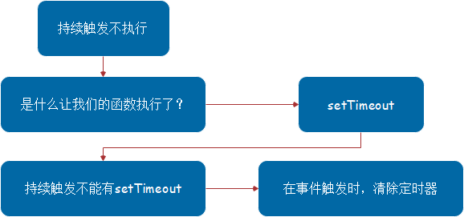
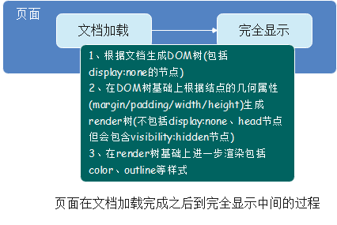
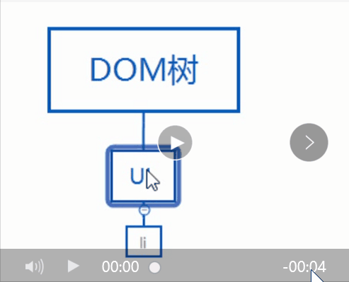
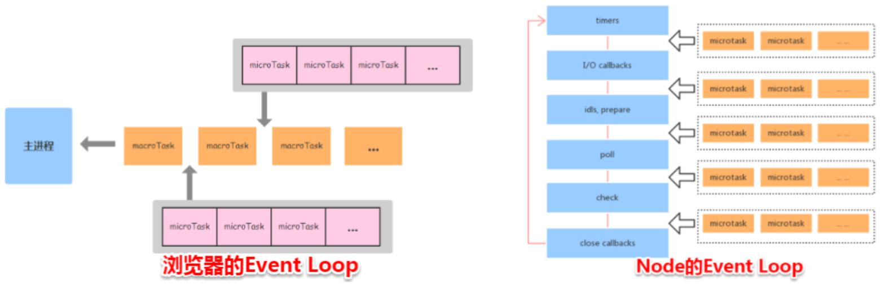

## 20210223

### 前端

#### 1. 写React/vue项目时为什么要在列表组件中写key，其作用是什么？

#### 2. ['1', '2', '3'].map(parseInt) what & why?

##### what？

```js
["1","2","3"].map(parseInt) // [1, NaN, NaN]
```

##### why？

1. **map()方法**：按照原始数组元素顺序依次处理元素，然后返回一个新数组
   * **`array.map((item, index, array), this)`**
2. **parseInt()函数**：解析一个字符串，并返回一个整数。
   > 当参数radix的值为0时，或没有设置该参数时，parseInt()会根据string来判断数字的基数

    * 当忽略参数radix，js默认数字的基数如下：
      * string以"0x"开头，parseInt()会把string的其余部分解析为十六进制的整数
      * string以"0"开头，parseInt()会把string的其余部分解析为八进制或者十六进制的整数
      * string以1~9的数字开头，parseInt()会把string解析为十进制的整数
    * 语法：
      * **`parseInt(string, radix)`**
      * string：必填，要被解析的字符串
      * radix：选填，表示要解析的数字基数，介于2-36

```js
console.log(parseInt(1, 0)) // 1
console.log(parseInt(2, 1)) // 将一进制的2转为十进制数，NaN
console.log(parseInt(3, 2)) // 将二进制的3转为十进制数，NaN
```

#### 3. 什么是防抖和节流？有什么区别？如何实现？

##### 防抖

> **当持续触发事件时，函数是完全不执行的，等最后一次触发结束的一段时间之后，再去执行**

###### 分解

1. 持续触发不执行
2. 不触发的一段时间之后再执行

###### 实现

1. **不触发的一段时间之后再执行**

> 定时器里面调用要执行的函数，将`arguments`传入

* 封装一个函数，将目标函数（持续触发的事件）作为回调传进去，等待一段时间过后执行目标函数

```js
function debound(func, delay) {
 return function() {
   setTimeout(() => {
     func.apply(this, arguments)
   }, delay)
 }
}
```

2. **持续触发不执行**



```js
function debound(func, delay) {
  let timeout
  return function() {
    clearTimeout(timeout)
    timeout = setTimeout(() => {
      func.apply(this, arguments)
    }, delay)
  }
}
```

3. 用法

```js
box.onmousemove = debound(function(e) {
  box.innerHTML = `${e.clientX}, ${e.clientY}`
}, 1000)
```

##### 节流

> 让函数有节制地执行，即在一段时间内，只执行一次

###### 分解

1. 持续触发并不会执行多次
2. 到一定时间再去执行

###### 实现

> 持续触发，并不会执行，但是到时间了就会执行

* 关键点： **执行的时机**

1. 要做到控制执行的时机，可以通过一个开关，与定时器`setTimeout`结合完成
2. 函数执行的前提是开关打开，持续触发时，持续关闭开关，等到`setTimeout`到时间了，再把开关打开，函数就会执行了

```js
function throttle(func, delay) {
  let run = true
  return function() {
    if(!run) {
      return
    }
    run = false
    setTimeout(() => {
      func.apply(this, argument)
      run = true
    }, delay)
  }
}
```

* 用法

```js
box.onmousemove = throttle(function(e) {
  box.innerHTML = `${e.clientX}, ${e.clientY}`
}, 1000)
```

* 节流还能用时间间隔去控制

  > 如果当前事件与上次执行时间的时间差大于一个值，就执行


#### 4. 介绍下Set、Map、WeakSet、WeakMap的区别？

#### 5. ES5/ES6的继承除了写法以外还有什么区别？

#### 6. setTimeout、Promise、async/await的区别？

```js
async function async1() {
    console.log('async1 start');
    await async2();
    console.log('async1 end');
}
async function async2() {
    console.log('async2');
}
console.log('script start');
setTimeout(function() {
    console.log('setTimeout');
}, 0)
async1();
new Promise(function(resolve) {
    console.log('promise1');
    resolve();
}).then(function() {
    console.log('promise2');
});
console.log('script end');
```

[js的执行机制-任务队列-宏任务-微任务](../note/js的执行机制.md)

##### setTimeout

> 宏任务

```js
console.log("script start");
setTimeout(() => {
    console.log("setTimeout");
}, 0);
console.log("script end");
// script start -> script end -> setTimeout
```

##### Promise

> Promise本身是同步的，但在执行`resolve`或者`rejects`时是异步的，即then方法是异步的

```js
console.log('script start');
new Promise(function(resolve) {
    console.log('promise1');
    resolve();
}).then(function() {
    console.log('promise2');
});
console.log('script end');
// script start -> promise1 -> script end -> promise2
```

* `promise.then()`的回调放入`microtask queue`
* `setTimeout`的回调放入`macrotask queue` ，即使是0ms的情况

##### async & await

> 由于`async & await`本身就是`promise + generator`的语法糖，所以`await`后面的代码(不包含await语句)是`microtask`

* async函数需要等待await后的函数执行完成并且返回结果之后，才能继续执行下面的代码。await通过返回一个Promise对象来实现同步的效果

```js
async function async1() {
  console.log('async1 start');
  await async2();
  console.log('async1 end');
}
// 等价于
async function async1() {
  console.log('async1 start');
  new Promise((resolve) => {
    async2()
    resolve()
  }).then(() => {
    console.log('async1 end');
  })
}
```

##### setTimeout、Promise、async/await的区别？

* 事件循环中分为宏任务队列和微任务队列。
* 其中`setTimeout`的回调函数放到宏任务队列里，等到执行栈清空以后执行；
* `promise.then`里的回调函数会放到相应宏任务的微任务队列里，等宏任务里面的同步代码执行完再执行；
* `async`函数表示函数里面可能会有异步方法，`await`后面跟一个表达式，`async`方法执行时，遇到`await`会立即执行表达式，然后把表达式后面的代码放到微任务队列里，让出执行栈让同步代码先执行。

#### 7. async/await如何通过同步的方式实现异步？

* `async/await`是参照`Generator`封装的一套异步处理方案，可以理解为`Generator`的语法糖，而`Generator`又依赖于迭代器`Iterator`，`Iterator`的思想又源于单向链表

##### 1.单向链表

* 链表的有点
  > 无需预先分配内存
  > 插入/删除节点不影响其他节点，效率高

* 单向链表
  > 是链表中最简单的一种，包含两个域：信息域与指针域，这个链接指向列表中的下一个节点，而最后一个节点则指向一个空值。

  * 特点：
    1. 节点的链接方向是单向的
    2. 相对于数组来说，单链表的随机访问速度较慢，但单链表删除/添加数据的效率很高

##### 2.Iterator

* **Iterator迭代器**的遍历过程类似于单向链表
* 一个对象要变成可迭代的，必须实现`@@iterator`方法，即对象（或它原型链上的某个对象）必须有一个名字为`Symbol.iterator`的属性
  * 原生具有该属性的有：字符串、数组、类数组的对象、Set和Map
  * 当一个对象需要被迭代时，它的`@@iterator`方法被调用并且无参数，然后返回一个用于在迭代中获得值的迭代器

##### 3.Generator

* **Generator：生成器对象时生成器函数返回的，它符合可迭代协议和迭代器协议，既是迭代器也是可迭代对象，可以调用`next`方法，但它不是函数，更不是构造函数**

###### 本质：暂停

> 它会让程序执行到指定位置先暂停`(yield)`，然后再启动`(next)`，再暂停`(yield)`，再启动`(next)`，而这个暂停就很容易让它和异步操作产生联系

* 处理异步时
  1. 开始异步处理（网络请求、IO操作）
  2. 然后暂停一下
  3. 处理完，再该干嘛干嘛

* js是单线程的，异步还是异步，`callback`还是`callback`，不会因为`Generator`而有任何改变

##### 4.async/await

* `async/await`是`Generator`的语法糖，就是一个自执行的`generate函数`。利用`generator函数`的特性把`异步的代码`写成`同步的形式`

#### 8. js异步解决方案的发展历程以及优缺点？

##### 1.回调函数callback

* 优点：解决了同步的问题（只要有一个任务耗时很长，后面的任务都必须排队等待，会拖延整个程序的执行）
* 缺点：回调地狱，不能用`try catch`捕获错误，不能`return`

##### 2.Promise

* 优点：解决了回调地狱的问题
* 缺点：无法取消`Promise`，错误需要通过回调函数来捕获

##### 3.Generator

* 特点：可以控制函数的执行，可以配合`co函数库使用`

##### 4.async&await

* 优点：代码清晰，不像`Promise`写一堆`then`链，处理了回调地狱的问题
* 缺点：`await`将异步代码改造成同步代码，如果多个异步操作没有依赖性而使用`await`会导致性能上的降低

#### 9. Promise构造函数是同步执行还是异步执行，那么then方法呢？

```js
const promise = new Promise((res, rej) => {
  console.log(1)
  res()
  console.log(2)
})
promise.then(() => {
  console.log(3)
})
console.log(4)
// 1 -> 2 -> 4 -> 3
```

* `promise构造函数`是同步执行的
* `then方法`是异步执行的

#### 10. 介绍下npm模块安装机制，为什么输入npm install就可以自动安装对应的模块？

#### 11. 介绍下重绘和回流(repaint&reflow)，以及如何进行优化？

##### 1.重绘和回流



###### 重绘repaint

> **当元素的一部分属性发生变化，如外观背景色不会引起布局变化而需要重新渲染的过程**

###### 回流reflow

> **当`render树`中的一部分或者全部因为大小边距等问题发生改变而需要重建的过程**

##### 2.重绘和回流的区别

* 引起DOM树结构变化，页面布局变化的行为叫`回流`，且回流一定伴随重绘；
* 只是样式的变化，不会引起DOM树变化，页面布局变化的行为叫`重绘`，且重绘不一定会伴随回流。
* 回流往往伴随着布局的变化，代价较大；重绘只是样式的变化，结构不会改变

##### 3.怎么减少回流

###### 1 避免频繁操作DOM

* 栗子：删除某个节点，给某个元素增加子元素，这类操作都会引起回流。如果要加多个子元素，最好使用`documentfragment`

###### 2 避免频繁操作样式

* 栗子：元素宽高变了、border变了、字体大小变了，这种直接会引起页面布局变化的操作会引起回流。如果`要改变多个属性，最好将这些属性定义在一个class中，直接修改class名`，这样只需要引起一次回流

###### 3 元素位置的变化

* 修改一个元素的左右margin、padding之类的操作会引起回流。在做元素位移的动画，不要更改margin之类的属性，使用`定位`脱离文档流后改变位置会更好

###### 4 获取元素的偏移量属性

* 避免频繁读取会引发回流、重绘的属性，多次操作，每次取完做个缓存

###### 5 浏览器窗口尺寸改变

* resize事件发生也会引起回流

##### 4.页面优化-`documentfragment对象`

###### 1 `documentfragment对象`是什么？

* `documentfragment节点`不属于dom树，因此改变它不会引起dom树的变化；
* dom树的操作会引起回流，则可以将`documentfragment`作为一个暂时的dom节点存储器，当我们在`documentfragment`修改完成时，我们就可以将存储dom节点的`documentfragment`一次性加入dom树，从而减少回流次数，达到性能优化的目的

###### 2 `documentfragment对象`怎么用？

```js
// 创建documentfragment，每个新建的documentfragment都会继承所有node方法，且拥有nodeValue、nodeName、nodeType属性
let fragment = document.createDocumentFragment();
console.log(fragment.nodeValue);
console.log(fragment.nodeName);
console.log(fragment.nodeType);
```

* 使用`documentfragment`能解决直接操作DOM引发大量回流的问题

* 栗子
  * 给ul添加5个li节点
  * 直接操作`dom`，回流5次

  

  * 使用`documentfragment`一次性添加，回流一次

  

#### 12. 介绍下观察者模式和订阅-发布模式的区别，各适用于什么场景？

#### 13. 说说浏览器和node事件循环的区别？

[浏览器的事件循环](../note/js的执行机制.md)

[node的事件循环](../note/node中的eventLoop.md)

* 浏览器环境下，`microtask`的任务队列是每个`macrotask`执行完之后执行
* nodejs中，`micortask`会在事件循环的各个阶段之间执行，也就是一个阶段执行完毕，就会执行`microtask`队列的任务



```js
setTimeout(()=>{
  console.log('timer1')
  Promise.resolve().then(function() {
    console.log('promise1')
  })
}, 0)
setTimeout(()=>{
  console.log('timer2')
  Promise.resolve().then(function() {
    console.log('promise2')
  })
}, 0)
```

##### 浏览器端

* 浏览器端的运行结果：timer1 -> promise1 -> timer2 -> promise2

##### node端

* node端的运行结果：timer1 -> timer2 -> promise1 -> promise2
  * 全局脚本`main()`执行，将2个`timer`依次放入`timer队列`，`main()`执行完毕，调用栈空闲，任务队列开始执行
  * 首先进入`timer阶段`，执行timer1，将promise1.then回调放入`microtask队列`，同样步骤执行timer2
  * `timer阶段`执行结束，`event loop`进入下一个阶段之前，执行`microtask队列`的所有任务

##### 总结

[浏览器与node的事件循环的区别](https://segmentfault.com/a/1190000017893482)

* 浏览器和node环境下，`microtask任务队列的执行时机不同`
  * **node端，microtask在事件循环的各个阶段之间执行**
  * **浏览器端，microtask在事件循环的macrotask执行完之后执行**

#### 14. 介绍模块化发展历程

| 规范 | 框架 | 区别 | 定义与引入 |
| --- | --- | --- | --- |
| **AMD** | require.js | 前端+异步 | **define+require( )** |
| CMD | sea.js | 前端+异步 |  |
| **CommonJS** | node.js | 后端+同步 | **module.exports+require( )** |
| **ES Module** | ES6 | 前端+同步 |  |

#### 15. 全局作用域中，用const和let声明的变量不在window上，到底在哪里？如何去获取？

| |	ES5 |	ES6 |
| --- | --- | --- |
| **变量声明** | `var` `function` | `let` `const` `import` `class` |
| **顶层对象 window** | `顶层对象的属性<=>全局变量` | `新特性声明的全局变量不属于顶层对象的属性` `全局变量和顶层对象的属性分离`|

* 在全局作用域中，用`let`和`const`声明的变量并没有在全局对象中，只是在一个块级作用域中

##### 怎么获取？

* 在定义变量的块级作用域中就能获取

#### 16. 两个数组合并成一个数组

##### 请把两个数组 `['A1', 'A2', 'B1', 'B2', 'C1', 'C2', 'D1', 'D2']` 和 `['A', 'B', 'C', 'D']`，合并 为 `['A1', 'A2', 'A', 'B1', 'B2', 'B', 'C1', 'C2', 'C', 'D1', 'D2', 'D']`

#### 17.浏览器缓存读取规则

#### 18. 使用迭代的方式实现flatten函数

#### 19.介绍下BFC及其应用

### 前端安全

#### 1. cookie和token都存放在header中，为什么不会劫持token？

### http

#### 1. 简单讲解一下http2的多路复用

#### 2. 谈谈对TCP三次握手和四次挥手的理解

#### 3. A、B机器正常连接后，B机器突然重启，问A此时处于TCP什么状态？

### 算法

#### 1. 介绍下深度优先遍历和广度优先遍历，如何实现？

#### 2. 请分别用深度优先思想和广度优先思想实现一个拷贝函数？
