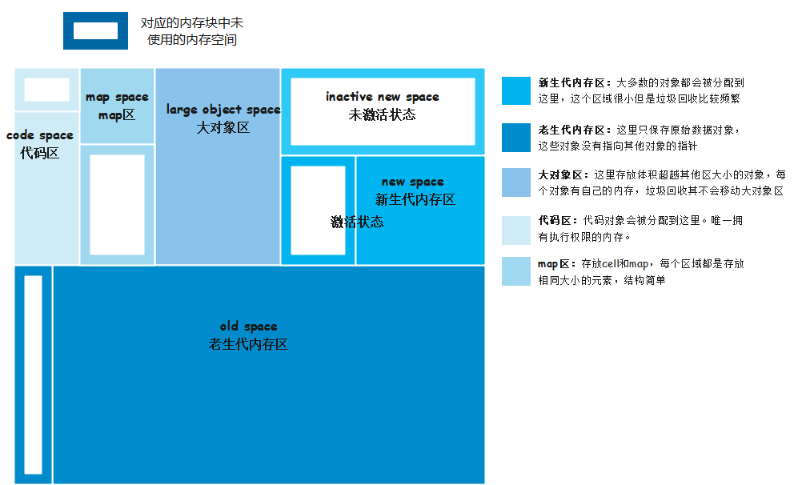
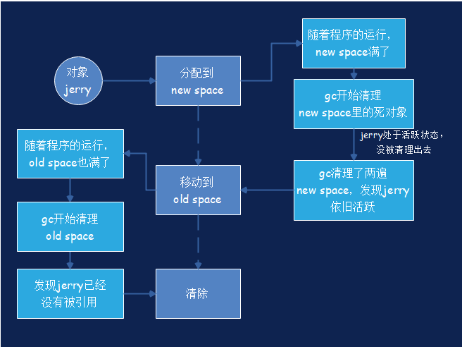
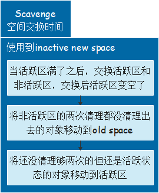
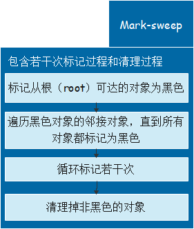
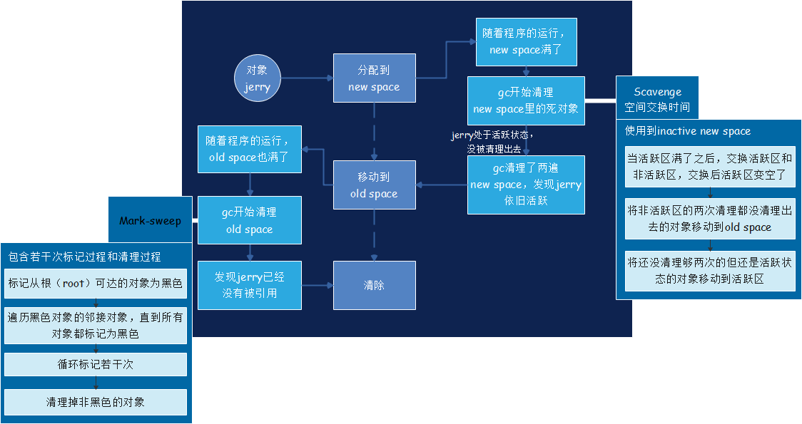

# V8引擎内存

* V8是谷歌使用C++开发的`高性能js引擎`，主要应用在`google浏览器`和`nodejs`当中
* V8自带的`高性能垃圾回收机制`，使开发者能够专注于程序开发中，极大的提高开发者的编程效率

## V8内存构成

* 由于js是单线程语言，所以V8为每一个js上下文使用一个进程
* 在V8进程中，一个正在运行的程序总是由一些分配的内存来表示，称为**常驻集**

### 堆内存（Heap memory）

> 这是V8`存储对象和动态数据`的地方。是内存区域中最大的块，也是`垃圾回收（GC）`发生的地方。整个堆内存不是垃圾回收的，只有`新旧空间（new space、old space）`是垃圾回收管理的。

* 堆内存包括
  1. new space
  2. old space
  3. large object space
  4. code space
  5. map space

> 每个空间都由一组`页`组成，`页`是使用`mmap`从操作系统分配的连续内存块。每页大小为1MB，但大对象空间较大

### 栈（Stack）

> 每个V8进程都有一个栈。这里存储`静态数据`，包括`方法、函数框架、原语值、指向对象的指针`
> 栈内存限制可以使用`-stack_size` `V8标志设置`

### 堆&&栈

* 栈是由操作系统自动管理的，而不是V8
* 堆并不是操作系统自动管理的，因为堆是最大的内存空间，并保存动态数据。
* 区分堆上的指针和数据对于垃圾收集很重要，V8使用`标记指针`方法来实现这一点。在这种方法中，他的每个单词的末尾保留一个位，以指示它是指针还是数据。这种方法需要有限的编译器支持，但实现起来很简单，同时效率也相当高。

## V8内存生命周期

### 栗子

## V8内存管理-垃圾回收（GC）

> `Orinoco`是V8 GC项目的代码名，用于使用并行、增量和并发的垃圾回收技术来释放主线程

### V8如何自动管理对内存

* V8通过`垃圾回收`来管理堆内存。

> 简单来说，它释放孤立对象（即不再直接或间接从堆栈中引用的对象）使用的内存，以便为创建新对象腾出空间

### V8垃圾回收器是分代的

> 堆中的对象按其年龄分组并在不同阶段清除，V8有两个阶段和三种不同的垃圾收集算法

#### **阶段一：`Minior GC--Scavenge`空间交换时间**

#### **阶段二：`Major GC--Mark-sweep`把从根节点无法获取的对象清理掉**

### 栗子

