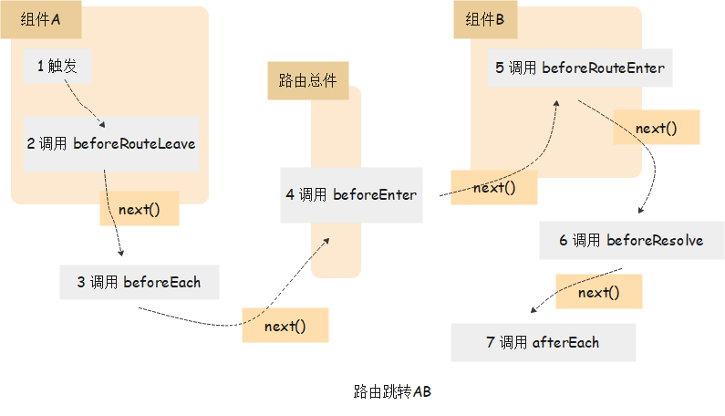
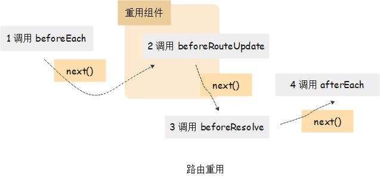

# 路由钩子（路由守卫）

## 全局守卫

> 所有的路由切换都会执行，一般写在路由配置文件中

* router.beforeEach((to, from, next) => {})
* router.afterEach((to, from) => {})

## 路由独享守卫

> 写在路由配置中

* router.beforeEnter((to, from, next) => {})

## 组件内守卫

* router.beforeRouteEnter((to, from, next) => {})
* router.beforeRouteUpdate((to, from, next) => {})
* router.beforeRouteLeave((to, from, next) => {})

## 路由跳转的过程

### 1.跨组件跳转

### 2.组件重用跳转

