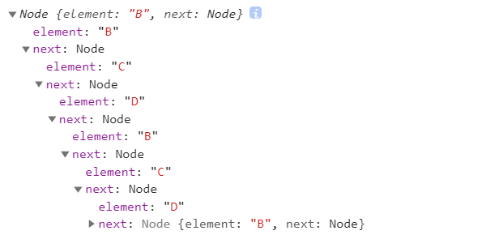

# 20210201

## HTML

### 如何让img自动适应div容器大小?

```html
<div>
  
</div>
```

```css
div {
  width: 100px;
  height: 100px;
  display: flex;
  justify-content: center;
  align-items: center;
}
/* 横向拉伸 */
img {
  width: 100%;
  height: auto;
}
/* 纵向拉伸 */
img {
  width: auto;
  height: 100%;
}
```

### 如何阻止屏幕旋转时自动调整字体的大小?

> 设置属性`text-size-adjust`

```css
body {
  text-size-adjust: none;
  -ms-text-size-adjust: none;
  -moz-text-size-adjust:none;
  -webkit-text-size-adjust: none;
}
```

#### `text-size-adjust`

* 该属性一般用来防止iphone在竖屏转向横屏时放大文字，而且iphone和ipad的默认设定是不一样的，iphone默认设定是`-webkit-text-size-adjust: auto;`ipad默认设定是`-webkit-text-size-adjust: none;`
* 可使用`-webkit-text-size-adjust: 100%;`可保有`webkit浏览器人为放大文字大小的功能`

## CSS

### 在less中命令行里编译的命令是什么?

> **`lessc index.less index.css`**

## JS

### 请解释下什么是softbind，并实现一个softbind?

#### 1.softbind是什么？

* softbind是`软绑定`，是和硬绑定相对应的一个词

> 绑定规则有`默认绑定`、`隐式绑定`、`显式绑定`、`new绑定`等

* `硬绑定`是`显式绑定`中的一种，通常情况下是通过调用函数的`apply()`、`call()`、`bind()`方法来实现硬绑定的。硬绑定有一个弊端：`被绑定后的函数无法再更改 this`
* `软绑定`让`this`在默认情况下指向第一个参数(这点与硬绑定效果相同)，但是同时又保留了`绑定之后的函数可以修改this指向`的能力

> `bind函数`多次调用会以`第一次绑定的this为准`，`softbind`以`最后一次绑定传入的this为准`

```js
var func = function() { console.log(this) }

var funcA = func.bind({})
funcA() // Object {}
funcA.call({ a: 1 }) // Object {}

var funcB = func.softbind({})
funcB() // Object {}
funcB.call({ a: 1 }) // Object { a: 1 }
```

#### 2.实现softbind

```js
if(!Function.prototype.softBind) {
  Function.prototype.softBind = function(obj) {
    var fn = this;
    var curried = [].slice.call(arguments, 1)
    var bound = function() {
      return fn.apply((!this || this === (window || global)) ? obj : this
      curried.concat.apply(curried, arguments);
      );
    }
    bound.prototype = Object.create(fn.prototype);
    return bound;
  }
}
```

### 说说你`对map的理解`?

* `map()`方法返回一个由原数组中的每个元素调用一个指定方法后的返回值组成的新数组

#### 题目

```js
["1","2","3"].map(parseInt) // [1, NaN, NaN]
```

#### 解析

1. map()方法：按照原始数组元素顺序依次处理元素，然后返回一个新数组
   * `array.map((item, index, array), this)`
2. parseInt()函数：解析一个字符串，并返回一个整数。当参数radix的值为0时，或没有设置该参数时，parseInt()会根据string来判断数字的基数
    * 当忽略参数radix，js默认数字的基数如下：
      * string以"0x"开头，parseInt()会把string的其余部分解析为十六进制的整数
      * string以"0"开头，parseInt()会把string的其余部分解析为八进制或者十六进制的整数
      * string以1~9的数字开头，parseInt()会把string解析为十进制的整数
    * 语法：
      * `parseInt(string, radix)`
      * string：必填，要被解析的字符串
      * radix：选填，表示要解析的数字基数，介于2-36

```js
console.log(parseInt(1, 0)) // 1
console.log(parseInt(2, 1)) // 将一进制的2转为十进制数，NaN
console.log(parseInt(3, 2)) // 将二进制的3转为十进制数，NaN
```

### 如何判断链表是否有环?



#### 方法一：创建哈希表

> 会占用较大的空间，不是最佳方法（时间复杂度为O(n)）

* 遍历链表，将链表个结点添加至哈希表中，添加前判断此节点是否已存在哈希表中，存在的话说明链表中存在环

```js
function judge(list) {
  var set = new Set();
  while(list) {
    if(set.has(list)) {
      console.log('存在环');
      console.log(list);
      return true;
    }
    set.add(list);
    list = list.next;
  }
  return set;
}
```

#### 方法二：给节点添加visited访问标记

> 时间复杂度（O(n)），不需要额外的空间

* `this.visited`

```js
function judge(list) {
  while(list) {
    if(list.visited) {
      console.log('存在环');
      console.log(list);
      return true;
    }
    list.visited = 1;
    list = list.next;
  }
}
```

#### 方法三：快慢指针法，设定快指针fast慢指针slow，每次循环快指针fast移动两个位置，慢指针移动一个位置

> 时间复杂度（O(n)），需要额外的空间

```js
function judge(list) {
  // 创建快慢指针
  var fast = list.next.next;
  var slow = list.next;
  while(list) {
    if(fast === slow) {
      console.log('环');
      return true
    }
    false = fast.next.next;
    slow = slow.next;
  }
}
```
