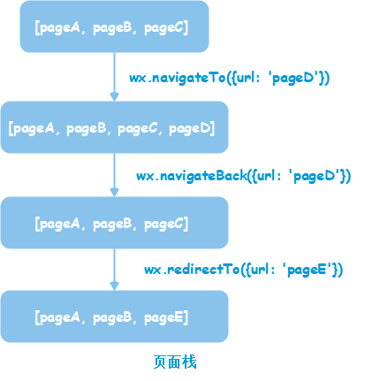

## 小程序

* 小程序主体部分

| 文件 | 必需 | 作用 |
| -- | -- | -- |
| app.js | 是 | 小程序逻辑 |
| app.json | 是 | 小程序公共配置 |
| app.wxss | 否 | 小程序公共样式表 |

* 一个页面由4个文件组成

| 文件类型 | 必需 | 作用 |
| -- | -- | -- |
| js | 是 | 页面逻辑 |
| wxml | 是 | 页面结构 |
| json | 否 | 页面配置 |
| wxss | 否 | 页面样式表 |

### 小程序框架

* 通过App()来注册一个小程序
* 通过Page()来注册一个页面
* 通过Component()来注册组件
* 整个小程序只有一个App实例

#### 1 注册小程序

1. 在 app.js 中调用 App()注册小程序实例
2. 整个小程序只有一个 App 实例，是全部页面共享的
3. 开发者可以通过 getApp() 方法获取到全局唯一的 App 实例，获取App上的数据或调用开发者注册在 App 上的函数。

#### 2 自定义组件

* Component组件与页面、小程序的区别
    * Component方法需要放在methods: {}里面

##### 组件定义步骤

1. 需要在json文件中进行自定义组件声明
   
    > `{"component": true}`
2. 在js文件中，需要使用Component()来注册组件，并提供组件的属性定义、内部数据和自定义方法

```js
Component({
    properties: {
        innerText: {
            type: String,
            value: 'default value'
        }
    },
    data: {
        someData: {}
    },
    methods: {
        customMethods: function() {}
    }
})
```

##### 组件使用步骤

1. 在页面的json文件中进行引用声明
2. 在页面的wxml像使用基础组件一样使用自定义组件

```js
{
    "usingComponents": {
        "component-tag-name": "path/to/the/custom/component"
    }
}
```
```html wxml
<view>
    <component-tag-name inner-text="some text"></component-tag-name>
</view>
```

##### 注意

* 自定义组件也可以引用自定义组件的，引用方法类似于页面自定义组件的方法
* 自定义组件和页面所在项目根目录名不能以"wx-"为前缀，否则会报错

#### 3 页面路由 -- 栈

##### 路由方式

| 操作 | |
| -- | -- |
| wx.navigationTo | 只能打开非tabBar |
| wx.redirectTo | 只能打开非tabBar |
| wx.navigateBack | |
| wx.switchTab | 只能打开tabBar |
| wx.reLaunch | 可以打开任意页面 |

* 页面底部的tabBar由页面决定，即只要是定义为tabBar的页面，底部都有tabBar
* 调用页面路由带的参数可以在目标的onLoad中获取

##### 页面栈



#### 4 模块化

* module.exports+ require

#### 5 事件系统

##### 5.1 绑定事件

| 绑定事件 | |
| -- | -- |
| bindtap | 冒泡 |
| catchtap | 不冒泡 |

* 如果一个view有多个bindtap，只走最后一个
* 如果一个vuew同时有bindtap和catchtap，只走catchtap

##### 5.2 双向绑定

```html wxml
<view class="list">
<text class="list_left">身份证号：</text>
    <input value="{{idCard}}" data-type="idCard" bindinput="inputChange"/>
</view>
```
```js
inputChange(e){
    var content = e.detail.value
    var type = e.currentTarget.dataset.type
    switch (type) {
      case "idCard":
        this.setData({
          idCard: content
        })
        break;
    }
}
```

##### 5.3 本地数据缓存

* wx.getStorageSync | wx.getStorage
* wx.setStorageSync | wx.setStorage

###### wx.setStorageSync和wx.setStorage的区别

* wx.setStorage(object)是一个异步接口，参数object包含key和data（需要存储的内容）
    * 3个回调函数
        * success（接口调用成功的回调函数）
        * fail（接口调用失败的回调函数）
        * complete（接口调用结束的回调函数，调用成功、失败都会执行）
* wx.setStorageSync(key，data)是一个同步接口，需要接受key和data（String/Object）2个参数

### 常用API

#### 图片上传

##### 选择上传

```js
wx.chooseImage({}) // 选择图片
wx.chooseVideo({}) // 选择视频
```

##### 预览图片，生成临时路径

```js
//声明文件系统
const fs = wx.getFileSystemManager();
//随机定义路径名称
var times = new Date().getTime();
var codeimg = wx.env.USER_DATA_PATH + '/' + times + '.png';
//将base64图片写入
fs.writeFile({
  filePath: codeimg,
  data: '图片',
  encoding: 'base64',
  success: (res) => {
    //写入成功了的话，新的图片路径就能用了
    var urls = new Array(codeimg)
    wx.previewImage({
      //当前显示图片
      urls,
    })
  }
});
```

#### 服务通知

* 消息模板id在[微信公众平台(mp.weixin.qq.com)-功能-订阅消息]中配置。

#### 文本复制

#### 长按识别二维码 show-menu-by-longpress

#### 实现分享到朋友圈

#### 小程序内跳转至其它小程序
