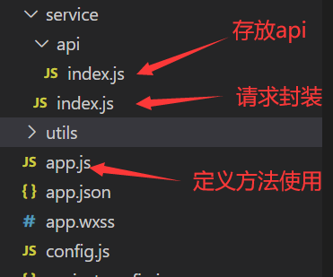

## wx小程序

### 请求封装 -- 方法一



```js
// service > api > index.js
export default {
  KGetInfoByGd: '/claimCard/GetInfoByGd31', //社保卡查询
  IsOnlyCard: '/claimCard/GetInfoByGd31', // 一人一卡查询
  GetMsgCheck: '/claimCard/sendCaptcha', // 获取短信验证码
  CheckCaptcha: '/claimCard/checkCaptcha', // 短信验证码验证
  UnionCheck: '/claimCard/Core5566', // 联网信息核查
  GetAreaList: '/claimCard/getAreaList', //获取区域列表
  GetMakeLiveList: '/claimCard/getGdWdList', //获取网点信息列表
  GetCodeByConstants: '/claimCard/getCodeByConstants', //获取民族列表
  GZNewApply: '/claimCard/GZNewApply', // 提交数据
  KjudgeUploadPic: '/claimCard/judgeUploadPic', //获取是否可以补传照片
  KUploadPhoto: '/claimCard/UploadPhoto', //上传照片
  KgetAreaList: '/claimCard/getAreaList', //获取区域级
  KsendCaptcha: '/claimCard/sendCaptcha', //发送手机验证码
  KcheckCaptcha: '/claimCard/checkCaptcha', //校验验证码
  KgetGdCity: '/claimCard/getGdCity', //获取广东省下拉
}
```

```js
// service > index.js
const api = require('./api/index')
const apiHost = 'https://ssmi.cebbank.com/Integration'
function createRequest(url ,method = 'post'){
  return function (data,callback,config = {}){
    let request = res => {
      console.info("回参",res)
      if(res.data.data && JSON.stringify(res.data.data) !== "{}"){
        console.info("响应回参",res.data.data)
      }else{
        console.info("响应回参为空")
      }
      callback(res.data);
    }
    let option = Object.assign({
      url:apiHost + url,
      data:data,
      success:request,
      method:method
    },config)
    wx.request(option)
  }
}
var service = {} // 方法集
var apis= api.default
Object.keys(apis).forEach(module => {
  const apiConfig = apis[module]
  if(typeof apiConfig === 'string') {
    service[module] = createRequest(apiConfig)
  }else {
    service[module] = createRequest(apiConfig.url,apiConfig.method)
  }
})
module.exports = service
```

```js
// app.js
Object.defineProperty(wx,'kservice',{
    get(){
        return service
    }
})
const params = {
    phone: _this.data.infoData.mobile
}
wx.kservice.GetMsgCheck(params,res=>{
    wx.showToast({
        title: res.message,
        icon: 'none',
        duration: 2000
    })
})
```

### 请求封装 -- 方法二

```js
// util > request.js
var app = getApp();
var host = 'http://localhost:8081/demo/';

function request(url, postData, doSuccess, doFail) {
    wx.request({
        url: host + url,
        header: {
            "content-type": "application/json;chartset=UTF-8"
        },
        data: postData,
        methods: 'POST',
        success: function(res) {
            doSuccess(res.data)
        },
        fail: function() {
            doFail()
        }
    })
}

function getData(url, doSuccess, doFail) {
    wx.request({
        url: host + url,
        header: {
            "content-type": "application/json;chartset=UTF-8"
        },
        method: 'GET',
        success: function(res) {
            doSuccess(res.data)
        },
        fail: function() {
            doFail()
        }
    })
}

module.exports.request = request;
module.exports.getData = getData;
```
