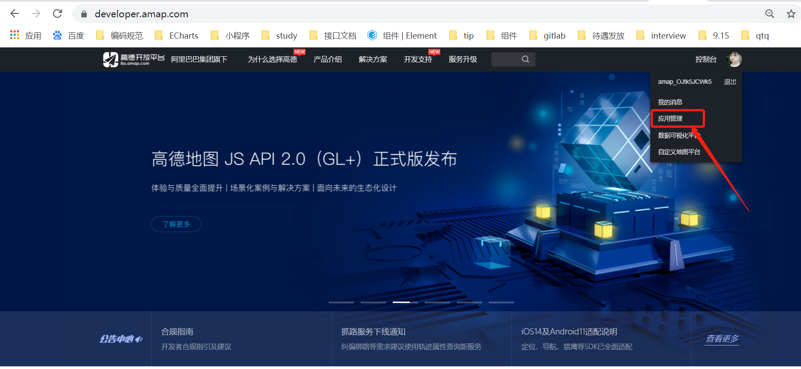
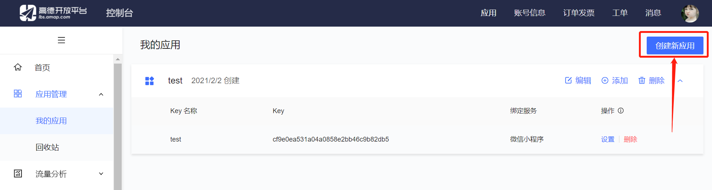
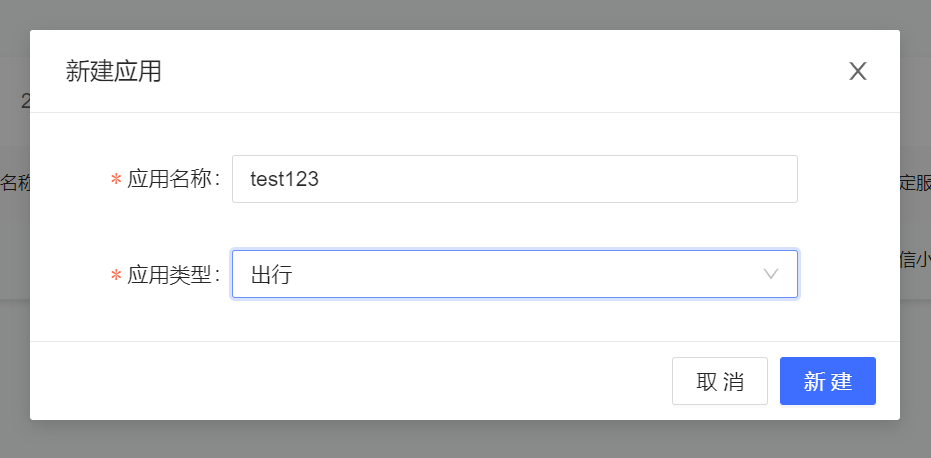
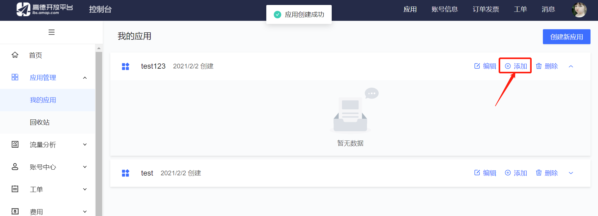
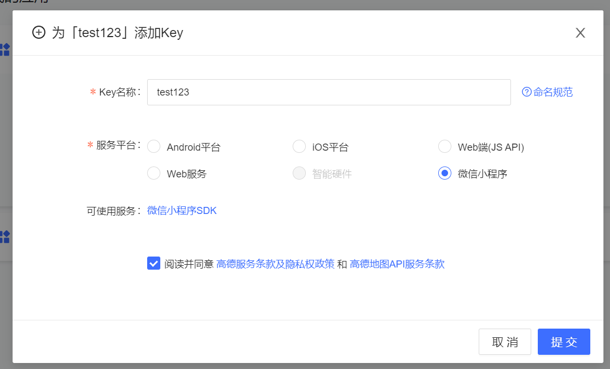
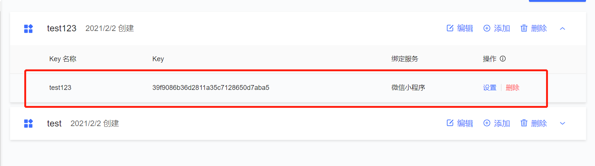
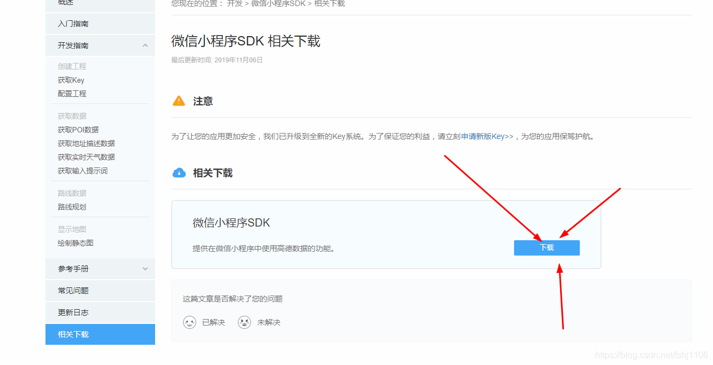
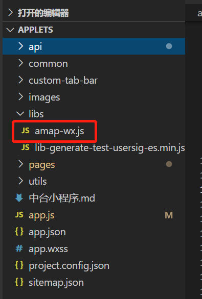

# 微信小程序整合高德地图定位

## 1.登录高德地图 `https://lbs.amap.com/`

### 1.1 应用管理



### 1.2 创建新应用




### 1.3 添加key





### 1.4 下载SDK

> `https://lbs.amap.com/api/wx/download`



## 2.微信小程序中

### 2.1 将下载的sdk存放在项目中



### 2.2 使用

```js
var amapFile = require('../../libs/amap-wx.js');
/**
  * 1.
  * 获取定位
  */
getLocation: function() {
  console.log("开始定位")
  var that = this;
  var key = config.Config.key; // 前面添加的应用的key
  var myAmapFun = new amapFile.AMapWX({
    key: key
  });
  myAmapFun.getRegeo({
    success: function(data) {
      //获取定位成功
      console.log("定位成功", data)
      //获取位置编码
      var adCode = data[0].regeocodeData.addressComponent.adcode;
      //保存省市编码
      if (adCode && adCode.length >= 4) {
        var areaCode = parseInt(adCode)
        var area = data[0].regeocodeData.addressComponent.district
        var cityCode = adCode.slice(0, 4) + "00"
        var city = data[0].regeocodeData.addressComponent.city
        var provinceCode = adCode.slice(0, 2) + "0000"
        var province = data[0].regeocodeData.addressComponent.province
        that.setData({
          province: province,
          city: city,
          district: area,
          isLocationSuccess: true,
          cityDistrict: city + area,
          latitude: data[0].latitude ? data[0].latitude : '',
          longitude: data[0].longitude ? data[0].longitude : ''
        });
        that.findRegionCodeByName(province, city, area, areaCode)
      } else {
        that.getCert()
      }

    },
    fail: function(info) {
      //获取定位失败
      that.getCert();
      var msg = '定位失败！'
      if (info.errMsg && info.errMsg.indexOf('WIFI_LOCATIONSWITCHOFF') != -1) {
        msg = '定位失败,亲，你的定位关了！请去设置里面打开'
      }
      wx.showModal({
        title: "提示",
        content: msg,
        showCancel: false
      })
    }
  })
},
```
