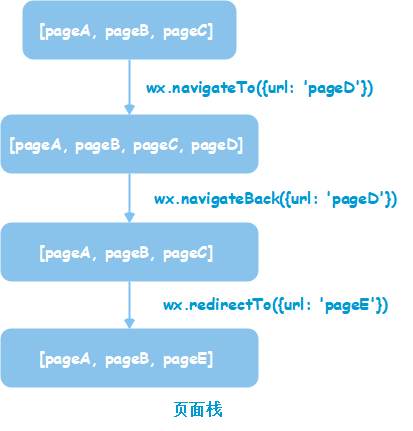
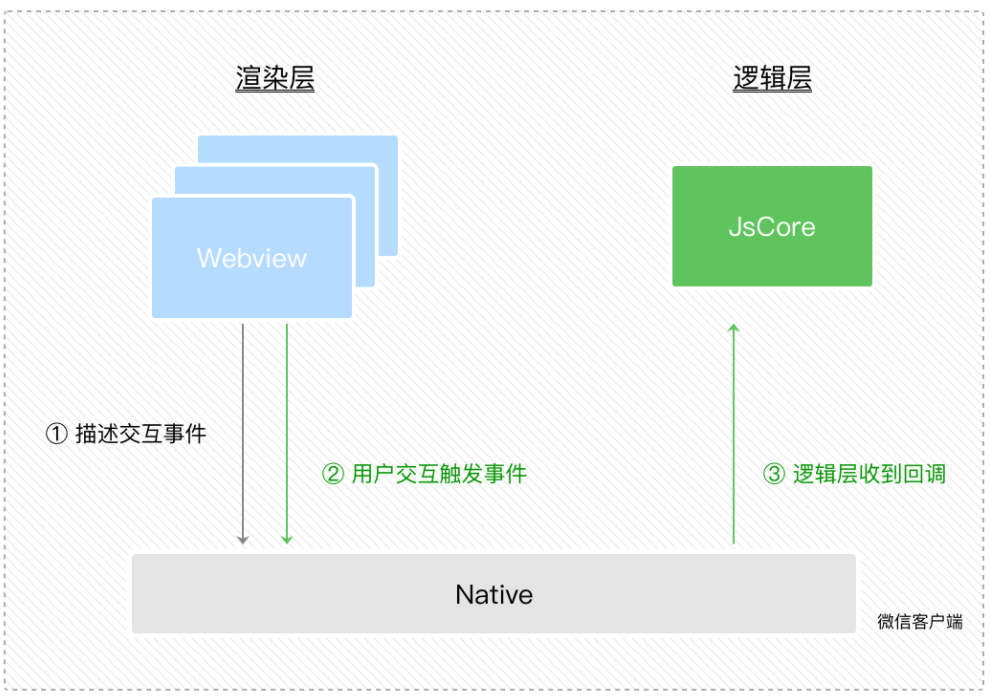
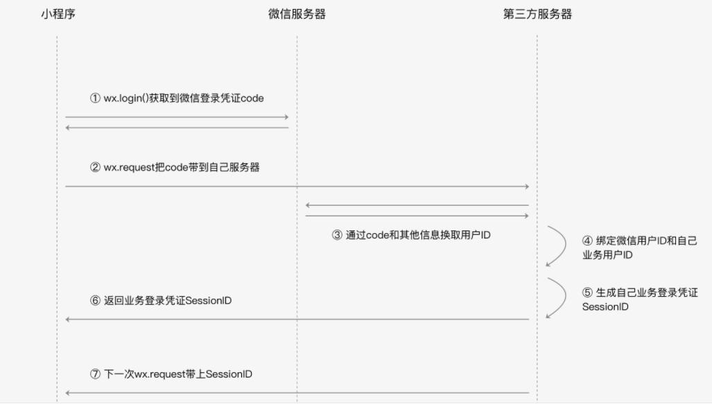

# 小程序开发指南

## 1. 小程序代码组成

### 1.1 JSON配置

* JSON 用于做静态配置。

### 1.2 WXML模板

* WXML 是小程序框架设计的一套标签语言，结合小程序的基础组件、事件系统，可以构建出页面的结构。

#### 1 数据绑定

* __WXML 通过 `{{变量名}}` 来绑定 WXML 文件和对应的 JavaScript 文件中的 data 对象属性__

```html wxml
  <!--
  {
    time: (new Date()).toString()
  }
  -->
  <text>当前时间：{{time}}</text>
```

* __属性值也可以动态的去改变，有所不同的是，属性值必须被包裹在`双引号`中__

```html wxml
  <!-- 正确的写法 -->
  <text data-test="{{test}}"> hello world</text>
  <!-- 错误的写法  -->
  <text data-test={{test}}> hello world </text >
```

* __变量名是大小写敏感的__，也就是说 {{name}} 和 {{Name}} 是两个不同的变量
* __没有被定义的变量或者是被设置为 undefined 的变量不会被同步到 wxml 中__

```html wxml
  <!--
  {
    var2: undefined,
    var3: null,
    var4: "var4"
  }
  -->
  <view>{{var1}}</view>
  <view>{{var2}}</view>
  <view>{{var3}}</view>
  <view>{{var4}}</view>
  <!--
  输出：
    null
    var4
  -->
```

#### 2 逻辑语法

* __通过 `{{ 变量名 }}` 语法可以使得 WXML 拥有动态渲染的能力，除此外还可以在 {{ }} 内进行简单的逻辑运算__

#### 3 条件逻辑

* 使用 `wx:if="{{condition}}"` 来判断是否需要渲染该代码块
* 使用 `wx:elif` 和 `wx:else` 来添加一个 else 块
* wx:if 是一个控制属性，需要将它添加到一个标签上【block】

#### 4 列表渲染

* 在组件上使用 `wx:for` 控制属性绑定一个数组，即可使用数组中各项的数据重复渲染该组件
* 使用 `wx:for-item` 指定数组当前元素的变量名
* 使用 `wx:for-index` 指定数组当前下标的变量名
* 使用 `wx:key` 来指定列表中项目的唯一的标识符

#### 5 共同属性

| 属性名 | 类型 | 描述 | 注解 |
| -- | -- | -- | -- |
| `id` | `String` | 组件的唯一标识 | 整个页面唯一 |
| `class` | `String` | 组件的样式类 | 在对应的 WXSS 中定义的样式类 |
| `style` | `String` | 组件的内联样式 | 可以动态设置的内联样式 |
| `hidden` | `Boolean` | 组件是否显示 | 所有组件默认显示 |
| `data-*` | `Any` | 自定义属性 | 组件上触发的事件时，会发送给事件处理函数 |
| `bind*/catch*` | `EventHandler` | 组件的事件 |

### 1.3 WXSS样式

> WXSS 是一套用于小程序的样式语言，用于描述 WXML 的组件样式，也就是视觉上的效果

#### 尺寸单位rpx

> 小程序编译后，rpx会做一次px换算。换算是以`375个物理像素为基准`，也就是在一个宽度为375物理像素的屏幕下，1rpx = 1px。

### 1.4 js脚本

> 小程序的主要开发语言是 JavaScript ，开发者使用 JavaScript 来开发业务逻辑以及调用小程序的 API 来完成业务需求


#### 1 小程序的执行环境

> 小程序中ios9和ios10所使用的运行环境并没有完全的兼容到ES6标准，在开发工具>项目设置中，勾选ES6转ES5开启转码工具

#### 2 模块化

* 浏览器中，所有 JavaScript 是在运行在同一个作用域下的，定义的参数或者方法可以被后续加载的脚本访问或者改写
* 同浏览器不同，小程序中可以将任何一个JavaScript 文件作为一个模块，通过`module.exports` 或者 `exports` 对外暴露接口
* 使用 `require(path)` 引入模块

#### 3 脚本的执行顺序

* 浏览器中，脚本严格按照加载的顺序执行
* 小程序的执行的入口文件是 app.js。并且会根据其中 require 的模块顺序决定文件的运行顺序

#### 4 作用域

* 同浏览器中运行的脚本文件有所不同，小程序的脚本的作用域同 NodeJS 更为相似
* 在文件中声明的变量和函数只在该文件中有效，不同的文件中可以声明相同名字的变量和函数，不会互相影响

> 当需要使用全局变量的时，通过使用全局函数 `getApp()` 获取全局的实例，并设置相关属性值，来达到设置全局变量的目的

## 2. 小程序宿主环境

> 小程序可以调用宿主环境提供的微信客户端的能力

### 2.1 渲染层和逻辑层

> WXML 模板和 WXSS 样式工作在渲染层，JS 脚本工作在逻辑层

#### 1 通信模型

* 小程序的渲染层和逻辑层分别由2个线程管理
  * 渲染层的界面使用了WebView 进行渲染
  * 逻辑层采用JsCore线程运行JS脚本
* 一个小程序存在多个界面，所以渲染层存在多个WebView线程
* 这两个线程的通信会经由微信客户端做中转，逻辑层发送网络请求也经由Native转发


#### 2 数据驱动

* WXML 可以先转成JS对象，然后再渲染出真正的DOM树


#### 3 双线程下的界面渲染

* __小程序的逻辑层和渲染层是分开的两个线程__
  * 在渲染层，宿主环境会把WXML转化成对应的JS对象
  * 在逻辑层发生数据变更的时候，我们需要通过宿主环境提供的setData方法把数据从逻辑层传递到渲染层
* 再经过对比前后差异，把差异应用在原来的Dom树上，渲染出正确的UI界面


### 2.2 程序与页面

#### 1 程序

> “小程序”指产品层面的程序，“程序”指代码层面的程序实例

##### 程序构造器App()

> 宿主环境提供了 `App()` 构造器用来注册一个程序App，需要留意的是App() 构造器必须写在项目根目录的app.js里，App实例是单例对象，在其他JS脚本中可以使用宿主环境提供的 `getApp()` 来获取程序实例

##### 小程序全局数据

* App实例是单例的，因此不同页面直接可以通过App实例下的属性来共享数据

> 所有页面的脚本逻辑都是跑在同一个JsCode线程，页面使用定时器，然后跳转到其它页面时，这些定时器并没有被清除，需要开发者自己在页面离开时清理

#### 2 页面

##### 页面构造器Page()

> 宿主环境提供了 `Page()` 构造器用来注册一个小程序页面，Page()在页面脚本page.js中调用
> Page构造器接受一个Object参数，其中data属性是当前页面WXML模板中可以用来做数据绑定的初始数据

##### 页面的数据

> 通过在Page实例下的方法调用this.setData把数据传递给渲染层，从而达到更新界面的目的

* 由于小程序的渲染层和逻辑层分别在两个线程中运行，所以setData传递数据实际是一个 __异步__ 的过程，所以setData的第二个参数是一个callback回调，在这次setData对界面渲染完毕后触发
* data中的key可以非常灵活，以数据路径的形式给出
  * this.setData({"d[0]": 100})
  * this.setData({"d[1].text": 'Goodbye'})
  * 保持一个原则就可以提高小程序的渲染性能：每次只设置需要改变的最小单位数据。

> 直接修改Page实例的this.data而不调用this.setData是无法改变页面的状态的，还会造成数据不一致

##### 页面的用户行为

> 小程序宿主环境提供了四个和页面相关的用户行为回调

1. 下拉刷新 onPullDownRefresh
   * 在app.json的window选项|page.json中设置enablePullDownRefresh为true
   * 当处理完数据刷新后，wx.stopPullDownRefresh可以停止当前页面的下拉刷新
2. 上拉触底 onReachBottom
   * 在app.json的window选项|page.json中设置触发距离onReachBottomDistance
   * 在触发距离内滑动期间，本事件只会触发一次
3. 页面滚动 onPageScroll
4. 用户转发 onShareAppMessage

##### 页面跳转和路由

> __小程序宿主环境限制了这个页面栈的最大层级为10层__



### 2.3 组件

> 组件就是小程序页面的基本组成单元

* 所有组件名和属性都是小写，多个单词会以英文横杠 "-" 进行连接

### 2.4 API

> wx对象实际上就是小程序的宿主环境所提供的全局对象，几乎所有小程序的API都挂载在wx对象底下（除了Page/App等特殊的构造器）

### 2.5 事件

#### 1 什么是事件

> 把“用户在渲染层的行为反馈”以及“组件的部分状态反馈”抽象为渲染层传递给逻辑层的“事件”



#### 2 事件类型和事件对象

> 常见事件类型

| 类型 | 触发条件 |
| -- | -- |
| `touchstart` | 手指触摸动作开始 |
| `touchmove` | 手指触摸后移动 |
| `touchcancel` | 手指触摸动作被打断，如来电提醒，弹窗 |
| `touchend` | 手指触摸动作结束 |
| `tap` | 手指触摸后马上离开 |
| `longpress` | 手指触摸后，超过350ms再离开，如果指定了事件回调函数并触发了这个事件，tap事件将不被触发 |
| `longtap` | 手指触摸后，超过350ms再离开（推荐使用longpress事件代替）|

* 当事件回调触发的时候，会收到一个事件对象，需要注意target和currentTarget属性的区别
  * `currentTarget`为当前事件所绑定的组件
  * `target`为触发该事件的源头组件

#### 3 事件绑定与冒泡捕获

> 以key="value"的形式

1. key以bind或者catch开头，然后跟上事件的类型
2. value是一个字符串，需要在对应的页面Page构造器中定义同名的函数，否则触发事件时在控制台会有报错信息

* bind和capture-bind的含义分别代表事件的冒泡阶段和捕获阶段
* bind事件绑定不会阻止冒泡事件向上冒泡，catch事件绑定可以阻止冒泡事件向上冒泡

> 其他组件自定义事件，如无特殊声明都是非冒泡事件
> 如`<form/>`的submit事件，`<input/>`的input事件，`<scroll-view/>`的scroll事件

## 3. 场景应用

### 3.1 界面常见的交互反馈

#### 1 触摸反馈

* 小程序的view容器组件和button组件提供了hover-class属性，触摸时会往该组件加上对应的class改变组件的样式。

```css html
/*page.wxss */
.hover{
  background-color: gray;
}
<!--page.wxml -->
<button hover-class="hover"> 点击button </button>
<view hover-class="hover"> 点击view</view>
```

* 在点击button按钮处理更耗时的操作时，也会使用button组件的loading属性

```js
<!--page.wxml -->
<button loading="{{loading}}" bindtap="tap">操作</button>
//page.js
Page({
  data: { loading: false },
  tap: function() {
    this.setData({
      loading: true
    })
    // 接着做耗时的操作
  }
})
```

#### 2 Toast和模态对话框

* Toast应用场景：在完成某个操作成功之后，我们希望告诉用户这次操作成功并且不打断用户接下来的操作。

```js
Page({
  onLoad: function() {
    wx.showToast({ // 显示Toast
      title: '已发送',
      icon: 'success',
      duration: 1500
    })
    // wx.hideToast() // 隐藏Toast
  }
})
```

* 一般需要用户明确知晓操作结果状态的话，会使用模态对话框来提示

```js
Page({
  onLoad: function() {
    wx.showModal({
      title: '标题',
      content: '告知当前状态，信息和解决方法',
      confirmText: '主操作',
      cancelText: '次要操作',
      success: function(res) {
        if (res.confirm) {
          console.log('用户点击主操作')
        } else if (res.cancel) {
          console.log('用户点击次要操作')
        }
      }
    })
  }
})
```

#### 3 界面滚动

* 用户往下拉动界面触发下拉刷新操作时，Page构造器的onPullDownRefresh回调会被触发，此时开发者重新拉取新数据进行渲染

```js
//page.json
{"enablePullDownRefresh": true }
//page.js
Page({
  onPullDownRefresh: function() {
    // 用户触发了下拉刷新操作
    // 拉取新数据重新渲染界面
    // wx.stopPullDownRefresh() // 可以停止当前页面的下拉刷新。
  }
})
```

* 多数的购物小程序会在首页展示一个商品列表，用户滚动到底部的时候，会加载下一页的商品列表渲染到列表的下方，我们把这个交互操作叫为上拉触底。

```js
//page.json
// 界面的下方距离页面底部距离小于onReachBottomDistance像素时触发onReachBottom回调
{"onReachBottomDistance": 100 }
//page.js
Page({
  onReachBottom: function() {
    // 当界面的下方距离页面底部距离小于100像素时触发回调
  }
})
```

* 只需要页面中某一小块区域可滚动时，就要用到scroll-view可滚动视图组件。

### 3.2 发起HTTPS网络通信

#### 1 wx.require()接口

* wx.require()的详细参数

| 参数名 | 类型 | 必填 | 默认值 | 描述 |
| -- | -- | -- | -- | -- |
| `url` | String | 是 | | 开发者服务器接口地址 |
| `data` | Object/String |否 | | 请求的参数 |
| `header` | Object | 否 | | 设置请求的 header |
| `method` | String | 否 | GET（需大写）| 有效值：OPTIONS, GET, HEAD, POST, PUT, DELETE, TRACE, CONNECT |
| `dataType` | String | 否 | json | | 回包的内容格式，如果设为json，会尝试对返回的数据做一次 JSON解析 |
| `success` | Function | 否 | | 收到服务成功返回的回调函数 |
| `fail` | Function | 否 | | 接口调用失败的回调函数 |
| `complete` | Function | 否 | | 接口调用结束的回调函数 |

#### 2 服务器接口

* wx.request请求的域名需要在小程序管理平台进行配置

#### 3 请求参数

* 通过wx.request这个API，有两种方法把数据传递到服务器：通过url上的参数以及通过data参数
* url是有长度限制的，其最大长度是1024字节，同时url上的参数需要拼接到字符串里，参数的值还需要做一次urlEncode

#### 4 一般使用技巧

##### 设置超时时间

```json
// app.json
{
  "networkTimeout": {
    "request": 3000 // 3000ms
  }
}
```

##### 请求前后的状态处理

* 节流

```js
var hasClick = false;
Page({
  tap: function() {
    if (hasClick) {
      return
    }
    hasClick = true
    wx.showLoading()
    wx.request({
      url: 'https://test.com/getinfo',
      method: 'POST',
      success: function (res) {
        if (res.statusCode === 200) {
          console.log(res.data)// 服务器回包内容
        }
      },
      fail: function (res) {
        wx.showToast({ title: '系统错误' })
      },
      complete: function (res) {
        wx.hideLoading()
        hasClick = false
      }
    })
  }
})
```

### 3.3 微信登录



#### 1 获取微信登录凭证code

> 为什么不直接获取微信用户的id --> 安全性

* wx.login是生成一个带有时效性的凭证--微信登录凭证code，其有效时间仅为5分钟

#### 2 发送code到开发者服务器

> code在成功换取一次信息之后也会立即失效，即便凭证code生成时间还没过期

* 在wx.login的success回调中拿到微信登录凭证，紧接着会通过wx.request把code传到开发者服务器，为了后续可以换取微信用户身份id -- openid
* 如果当前微信用户还没有绑定当前小程序业务的用户身份，那在这次请求应该顺便把用户输入的帐号密码一起传到后台，然后开发者服务器就可以校验账号密码之后再和微信用户id进行绑定

```js
Page({
  tapLogin: function() {
    wx.login({
      success: function(res) {
        if (res.code) {
          wx.request({
            url: 'https://test.com/login',
            data: {
              username: 'zhangsan', // 用户输入的账号
              password: 'pwd123456', // 用户输入的密码
              code: res.code
            },
            success: function(res) {
              // 登录成功
              if (res.statusCode === 200) {
               console.log(res.data.sessionId)// 服务器回包内容
              }
            }
          })
        } else {
          console.log('获取用户登录态失败！' + res.errMsg)
        }
      }
    });
  }
})
```

#### 3 到微信服务器换取微信用户身份id

* 微信服务器为了确保拿code过来换取身份信息的人就是刚刚对应的小程序开发者，到微信服务器的请求要同时带上AppId和AppSecret

#### 4 绑定openid和业务用户身份

> 有了这个绑定信息，小程序在下次需要用户登录的时候就可以不需要输入账号密码，因为通过wx.login()获取到code之后，可以拿到用户的微信身份openid，通过绑定信息就可以查出业务侧的用户身份id，这样静默授权的登录方式显得非常便捷。

#### 5 业务登录凭证SessionId

### 3.4 本地数据缓存

> 可以利用本地数据缓存来存储用户在小程序上产生的操作，在用户关闭小程序重新打开时可以恢复之前的状态
> 还可以利用本地缓存一些服务端非实时的数据提高小程序获取数据的速度，在特定的场景下可以提高页面的渲染速度，减少用户的等待时间

#### 1 读写本地数据缓存

* wx.getStorage/wx.getStorageSync：读取本地缓存
* wx.setStorage/wx.setStorageSync：写数据到缓存

#### 2 缓存限制和隔离

* __不同小程序的本地缓存空间是分开的__
* 每个小程序的缓存空间上限为`10MB`，如果当前缓存已经达到10MB，再通过wx.setStorage写入缓存会触发fail回调。
* __对不同用户的缓存进行了隔离，避免用户间的数据隐私泄露__

#### 3 利用本地缓存提前渲染界面

* 一般在对数据实时性|一致性要求不高的页面可以利用本地缓存来做提前渲染，用以优化小程序体验

```js
Page({
  onLoad: function() {
    var that = this
    var list =wx.getStorageSync("list")
    if (list) { // 本地如果有缓存列表，提前渲染
      that.setData({
        list: list
      })
    }
    wx.request({
      url: 'https://test.com/getproductlist',
      success: function (res) {
        if (res.statusCode === 200) {
          list = res.data.list
          that.setData({ // 再次渲染列表
            list: list
          })
          wx.setStorageSync("list",list) // 覆盖缓存数据
        }
      }
    })
  }
})
```

#### 4 缓存用户登录态SessionId

> 通常用户在没有主动退出登录前，用户登录态会一直保持一段时间

* 利用本地缓存持久存储用户登录态SessionId

```js
//page.js
var app = getApp()
Page({
  onLoad: function() {
    // 调用wx.login获取微信登录凭证
    wx.login({
      success: function(res) {
        // 拿到微信登录凭证之后去自己服务器换取自己的登录凭证
        wx.request({
          url: 'https://test.com/login',
          data: { code: res.code },
          success: function(res) {
            var data = res.data
            // 把 SessionId 和过期时间放在内存中的全局对象和本地缓存里边
            app.globalData.sessionId =data.sessionId
            wx.setStorageSync('SESSIONID',data.sessionId)
            // 假设登录态保持1天
            var expiredTime = +new Date() +1*24*60*60*1000
            app.globalData.expiredTime =expiredTime
            wx.setStorageSync('EXPIREDTIME',expiredTime)
          }
        })
      }
    })
  }
})
```

* 利用本地缓存恢复用户登录态SessionId

```js
//app.js

App({
  onLaunch: function(options) {
    var sessionId =wx.getStorageSync('SESSIONID')
    var expiredTime =wx.getStorageSync('EXPIREDTIME')
    var now = +new Date()
    if (now - expiredTime <=1*24*60*60*1000) {
      this.globalData.sessionId = sessionId
      this.globalData.expiredTime = expiredTime
    }
  },
  globalData: {
    sessionId: null,
    expiredTime: 0
  }
})
```

### 3.5 设备能力

#### 1 利用微信扫码能力

* __利用wx.scanCode获取二维码的数据__

```js
//page.js
Page({
  // 点击“扫码订餐”的按钮，触发tapScan回调
  tapScan: function() {
    // 调用wx.login获取微信登录凭证
    wx.scanCode({
      success: function(res) {
        var num = res.result // 获取到的num就是餐桌的编号
      }
    })
  }
})
```

#### 2 获取网络状态

* __利用wx.getNetworkType获取网络状态__

```js
//page.js
Page({
  // 点击“预览文档”的按钮，触发tap回调
  tap: function() {
    wx.getNetworkType({
      success: function(res) {
        // networkType字段的有效值：
        // wifi/2g/3g/4g/unknown(Android下不常见的网络类型)/none(无网络)
        if (res.networkType == 'wifi') {
          // 从网络上下载pdf文档
          wx.downloadFile({
            url:'http://test.com/somefile.pdf',
            success: function (res) {
              // 下载成功之后进行预览文档
              wx.openDocument({
                filePath: res.tempFilePath
              })
            }
          })
        } else {
          wx.showToast({ title: '当前为非Wifi环境' })
        }
      }
    })
  }
})
```

* 动态监听网络状态变化的接口wx.onNetworkStatusChange
