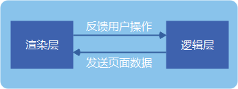

# 小程序开发指南

## 1. 底层框架

### 1.1 双线程模型

* 小程序的逻辑层与渲染层分开在不同的线程运行
* 跟传统的Web 单线程模型有很大的不同

#### 1 技术选型

* __要求：快--渲染快、加载快__

* 三种渲染界面的技术
  * 用纯客户端原生技术来渲染
    > 小程序代码需要与微信代码一起编包发布，pass
  * 用纯 Web 技术来渲染
    > 性能问题：单线程
  * __介于客户端原生技术与 Web 技术之间的，互相结合各自特点的技术(Hybrid)来渲染__
    * JS-SDK：界面主要由成熟的 Web 技术渲染，辅之以大量的接口提供丰富的客户端原生能力

> 每个小程序页面都是用不同的WebView去渲染，这样可以提供更好的交互体验，更贴近原生体验，也避免了单个WebView的任务过于繁重  --> 渲染层

#### 2 管控与安全

> 需要阻止开发者使用一些浏览器提供的,诸如跳转页面、操作DOM、动态执行脚本的开放性接口

* 提供一个沙箱环境来运行开发者的js代码,这个沙箱环境不能有任何浏览器相关接口,只提供纯js的解释执行环境 --> 逻辑层

#### 3 天生的延时

> 小程序是基于双线程模型 --> 任何数据传递都是线程间的通信，也就是都会有一定的延时

* 逻辑层与渲染层之间的通信有延时
* 各层与客户端原生交互有延时
  * 开发者的代码 -> 逻辑层
  * 客户端原生 -> 微信主线程

### 1.2 组件系统

> 使用HTML -> 为解决管控与安全而建立的双线程模型就无意义了

#### 1 Exparser框架

* Exparser是微信小程序的组件组织框架，内置在小程序基础库中，为小程序的各种组件提供基础的支持

> 小程序中，所有节点树相关的操作都依赖于Exparser

#### 2 内置组件

* 基于Exparser框架，内置了一套组件，提供了视图容器类、表单类、导航类、媒体类、开放类等几十种组件

> 我们会把一个组件内置到小程序框架里的一个重要原则是：这个组件是基础的。
> 换句话说，没有这个组件的话，在小程序架构里无法实现或者实现不好某类功能。

#### 3 自定义组件

1. ShowTree
2. 运行原理
3. 组件间通信
   * 不同组件实例间的通信有WXML属性值传递、事件系统、selectComponent和relations等方式。
   * __WXML属性值传递是从父组件向子组件的基本通信方式__
   * __事件系统是从子组件向父组件的基本通信方式__

### 1.3 原生组件

> 不完全在Exparser的渲染体系下，而是由客户端原生参与组件的渲染的组件称为“原生组件”。

#### 1 原生组件运行机制

* 原生组件在WebView这一层的渲染任务是很简单，只需要渲染一个占位元素，之后客户端在这块占位元素之上叠了一层原生界面。

> 因此，原生组件的层级会比所有在WebView层渲染的普通组件要高。

* 引入原生组件的好处
  * 扩展Web的能力。
    > 像输入框组件(input, textarea)有更好地控制键盘的能力
  * 体验更好，同时也减轻WebView的渲染工作。
    > 像地图组件(map)这类较复杂的组件，其渲染工作不占用WebView线程，而交给更高效的客户端原生处理。
  * 绕过setData、数据通信和重渲染流程，使渲染性能更好。
    > 像画布组件(canvas)可直接用一套丰富的绘图接口进行绘制。

#### 2 原生组件渲染限制

* 原生组件会浮于页面其他组件之上(相当于拥有正无穷大的z-index值)使其它组件不能覆盖在原生组件上展示
  > 使用cover-view和cover-image组件

### 1.4 小程序与客户端通信原理

#### 1 视图层组件

* 通信机制的实现方式
  * iOS 是利用了WKWebView 的提供 messageHandlers 特性
  * 安卓是往 WebView 的 window 对象注入一个原生方法，最终会封装成 WeiXinJSBridge 这样一个兼容层，主要提供了调用（invoke）和监听（on）这两种方法。

> 开发者只是间接调用的，真正调用是在组件的内部实现中。

* 组件运行的时候被插入到 DOM 树中，会调用客户端接口，通知客户端在哪个位置渲染一块原生界面

#### 2 逻辑层接口

* 逻辑层与客户端原生通信机制与渲染层类似，不同在于，iOS平台可以往JavaScripCore框架注入一个全局的原生方法，而安卓方面则是跟渲染层一致的

> 开发者也是间接地调用到与客户端原生通信的底层接口

## 2. 性能优化

### 2.1 启动


#### 1 代码包下载

> 下载到的小程序代码包是编译、压缩、打包之后的代码包

#### 2 分包加载流程

* 主包：小程序启动时会马上打开的页面代码和相关资源
* 分包：其余的代码和资源

> 在小程序启动时，只有主包的内容才会被下载

### 2.2 页面层级准备

* 小程序启动时仅有一个页面层级
* 在视图层内，小程序的每一个页面都独立运行在一个页面层级上。
  * 每次调用wx.navigateTo，都会创建一个新的页面层级
  * 相对地，wx.navigateBack会销毁一个页面层级


### 2.3 数据通信



#### 1 页面初始数据通信


> 页面初始化的时间大致由页面初始数据通信时间和初始渲染时间两部分构成
> 减少传输数据量是降低数据传输时间的有效方式

#### 2 更新数据通信

* 初始渲染完毕后，视图层可以在开发者调用 __setData__ 后执行界面更新
* 逻辑层会将setData所设置的数据字段与data合并，使开发者可以用 __this.data__ 读取到变更后的数据

* 提升数据更新的性能的原则：
  1. 不要过于频繁调用setData，应考虑将多次setData合并成一次setData调用；
  2. 数据通信的性能与数据量正相关，不应使用setData来设置不在界面中展示且数据结构比较复杂或包含长字符串的数据；
  3. 与界面渲染无关的数据最好不要设置在data中，可以考虑设置在page对象的其他字段下。

```js
Page({
  onShow: function() {
    // 不要频繁调用setData
    this.setData({ a: 1 })
    this.setData({ b: 2 })
    // 绝大多数时候可优化为
    this.setData({ a: 1, b: 2 })

    // 不要设置不在界面渲染时使用的数据，并将界面无关的数据放在data外
    this.setData({
      myData: {
        a: '这个字符串在WXML中用到了',
        b: '这个字符串未在WXML中用到，而且它很长…………………………'
      }
    })
    // 可以优化为
    this.setData({
      'myData.a': '这个字符串在WXML中用到了'
    })
    this._myData = {
      b: '这个字符串未在WXML中用到，而且它很长…………………………'
    }

  }
})
```

#### 3 用户事件通信

> 异步的

* 降低延迟时间的方法
  1. 去掉不必要的事件绑定从而减少通信的数据量和次数；
  2. 事件绑定时需要传输target和currentTarget的dataset，因而不要在节点的data前缀属性中放置过大的数据。

### 2.4 视图层渲染

> 视图层在接收到初始数据（data）和更新数据（setData数据）时，需要进行视图层渲染

#### 1 初始渲染


> 视图层初始渲染的流程中，时间开销大体上与节点数中节点的总量成正比例关系。
> 减少WXML中节点的数量可以有效降低初始渲染和重渲染的时间开销，提升渲染性能。

#### 2 重渲染

* 每次应用setData数据时，都会执行重渲染来更新界面


> 在进行当前节点树与新节点树的比较时，会着重比较setData数据影响到的节点属性。因而，去掉不必要设置的数据、减少setData的数据量也有助于提升这一个步骤的性能。

## 3. 小程序基础库的更新迭代

### 3.1 小程序基础库

* 在启动小程序后先载入基础库，接着再载入业务代码。
* 由于小程序的渲染层和逻辑层是两个线程管理
  * 渲染层WebView层注入的称为WebView基础库
  * 逻辑层注入的称为AppService基础库

> 所有小程序在微信客户端打开的时候，都需要注入相同的基础库，所以，小程序的基础库不会被打包在某个小程序的代码包里边，它会被提前内置在微信客户端

### 3.2 异常

#### 1 捕获js异常的方法

* 小程序基础库
  * 在WebView侧使用window.onerror方案进行捕捉异常
  * 在逻辑层AppService侧通过把App实例和Page实例的各个生命周期等方法包裹在try-catch里进行捕捉异常。
  * 同时在App构造器里提供了onError的回调，当业务代码运行产生异常时，这个回调被触发，同时能够拿到异常的具体信息
