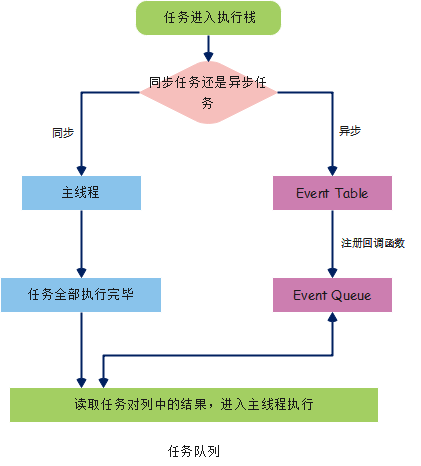
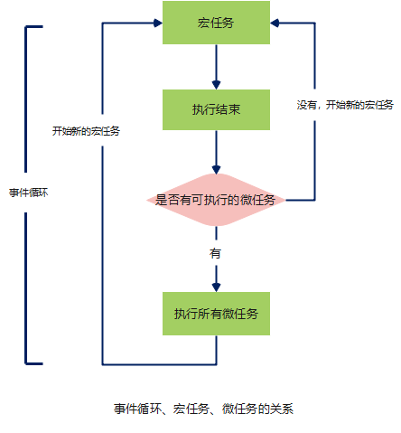
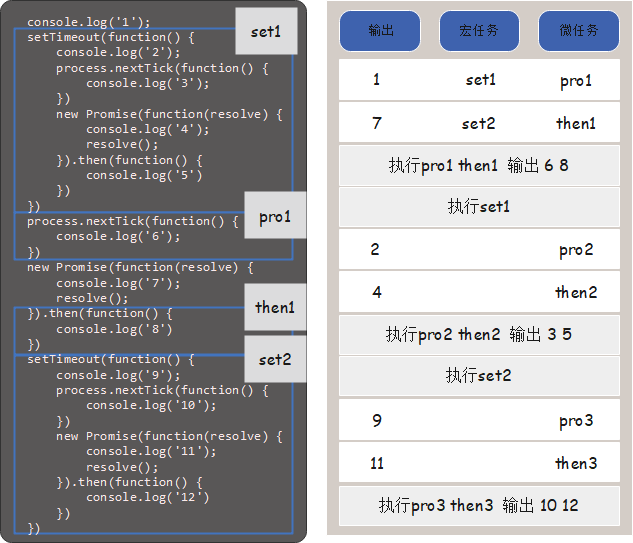

# js的执行机制--EventLoop

> js是一门**单线程**语言，一切js的`多线程`都是用`单线程`模拟出来的

## 单线程任务

> 同步任务
> 异步任务



1. `同步任务`进入`主线程`，`异步任务`进入`Event Table`并注册函数
2. 当指定事件完成时，`Event Table`会将这个函数移入`Event Queue`
3. 主线程内的任务执行完毕为空，会去`Event Queue`读取对应的函数进入主线程执行
4. 重复上述过程，即Event Loop（事件循环）

### 怎么知道主线程执行栈为空？

> js引擎存在`monitoring process`进程，会持续不断地检查主线程执行栈是否为空，一旦为空，就会去`Event Queue`检查是否有等待被调用的函数

## 异步任务

> 宏任务
> 微任务
> 不同类型的任务会进入对应的`Event Queue`



1. 事件循环的顺序，决定js代码的执行顺序
2. 进入整体代码（宏任务）后，开始第一次循环
3. 接着执行所有的`微任务`
4. 再次执行`宏任务`，找到其中一个任务队列执行完毕
5. 再执行所有`微任务`

### 2.1 宏任务macro-task

> 整体代码script（UIrender）
> setTimeout
> setInterval
> setImmediate
> i/o

#### setTimeout

```js
setTimeout(() => {
  task()
  console.log('延时3s')
}, 3000)
```

##### 定义延时3s，实际却5、6s才执行函数，是怎么回事？

> 理解`setTimeout`的定义

1. `task()`进入`Event Table`并注册，计时开始
2. 执行`sleep函数`，计时仍在继续
3. 3s到了，计时事件`timeout`完成，`task()`进入`Event Queue`，但是`sleep`还没执行完，事件等待
4. `sleep`执行完，`task()`从`Event Queue`进入`主线程`执行

> `setTimeout`是经过指定时间后，把要执行的任务加入到`Event Queue`中，又因为单线程任务要一个一个执行，如果前面的任务需要的时间太久，就只能等待，导致真正的延迟时间大于3s

##### 零延迟

* 20210128 JS

#### setInterval

* 对于执行顺序来说，`setInterval`会隔指定的时间将注册的函数置入`Event Queue`，如果前面的任务耗时太久，那么同样需要等待

> 一旦`setInterval`的回调函数`fn`执行时间超过了延迟时间`ms`，那么就完全看不出有时间间隔了

### 2.2 微任务micro-task

> Promise
> process.nextTick
> mutationObserver

### 总结

* 宏队列：执行每个宏队列时会先清空微任务队列
* 微队列：微队列为空时执行宏队列

> 任务队列中，在每一次事件循环中，`macrotask`只会提取一个执行，而`microtask`会一直提取，直到`microtask`队列为空。

## 栗子

```js
console.log('1');
setTimeout(function() {
    console.log('2');
    process.nextTick(function() {
        console.log('3');
    })
    new Promise(function(resolve) {
        console.log('4');
        resolve();
    }).then(function() {
        console.log('5')
    })
})
process.nextTick(function() {
    console.log('6');
})
new Promise(function(resolve) {
    console.log('7');
    resolve();
}).then(function() {
    console.log('8')
})
setTimeout(function() {
    console.log('9');
    process.nextTick(function() {
        console.log('10');
    })
    new Promise(function(resolve) {
        console.log('11');
        resolve();
    }).then(function() {
        console.log('12')
    })
})

```


