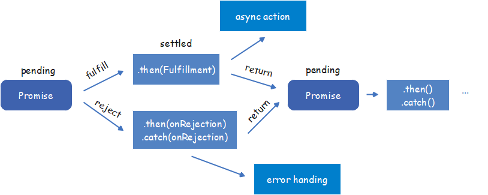

## Promise

> `Promise`对象用于表示一个异步操作的最终完成（或失败）及其结果值

### 描述

> 一个 `Promise`对象代表一个在这个`promise`被创建出来时不一定已知的值。使得能够把异步操作最终的成功返回值或者失败原因和相应的处理程序关联起来。 这样使得异步方法可以像同步方法那样返回值：**异步方法并不会立即返回最终的值，而是会返回一个`promise`，以便在未来某个时候把值交给使用者。**

* **一个`Promise`必然处于以下几种状态之一**
  * **待定`pending`**：初始状态
  * **已兑现`fulfilled`**：意味着操作成功
  * **已拒绝`rejected`**：意味着操作拒绝

> `Promise`只能处于一种状态，且状态的改变是不可逆的，只能从pending->fulfilled|rejected

### 特点

1. **对象的状态不受外界影响。**状态值只会被异步结果决定，其它任何操作无法改变
2. **状态一旦成型，就不会再变，且任何时候都可以得到这个结果。**

### 缺点

1. `Promise`一旦执行便无法取消
2. 如果不设置回调函数，内部发生的错误无法在外部捕获
3. 当处于`pending`状态时，无法得知其具体发展到哪个阶段

### 优点

1. 解决回调地狱问题
2. 更好的进行错误捕获

### Promise的链式调用

* 因为`Promise.prototype.then`和`Promise.prototype.catch`方法返回的是`promise`，所以他们可以被链式调用

> `Promise`无论成功或失败都会调用`.then()`
> `.catch()`只有当`Promise`失败时才会调用



> 可以用`promise.then()`、`promise.catch()`和`promise.finally()`方法将进一步的操作与一个已敲定状态的`promise`关联起来。这些方法还会返回一个新生成的`promise对象`，这个对象可以被非强制性的用来做链式调用

```js
const myPromise = 
 (new Promise(myExcutorFunc))
 .then(handleFulfillledA)
 .then(handleFulfillledB)
 .then(handleFulfillledC)
 .catch(handleRejectedAny);
```

* 任何不是`throw`的终止都会创建一个`已决议resolved`状态，而以`throw`终止则会创建于一个`已拒绝`状态
* 当`.then()`中缺少能够返回`promise对象`的函数时，链式调用就直接继续进行下一环操作。因此，链式调用可以在最后一个`.catch()`之前把所有的`handleReject`都省略掉。

#### 俄罗斯套娃

* 链式调用中的`promise`就像俄罗斯套娃一样，是嵌套起来的，但又像是一个栈，每个都必须从栈顶被弹出。

```js
(promise D, (promise C, (promise B, (promise A))))
```

* 当存在一个`nextValue`是`promise`时，就会出现一种动态的替换效果。

> 假设与`promise B`相关的`.then()`返回了一个值为`promise X`的`nextValue`

```js
(promise D, (promise C, (promise X)))
```

* 一个`promise`可能会参与不止一次的嵌套

> `promiseA`向`已敲定settled`状态的过渡会导致两个实例的`.then`都被调用

```js
const promiseA = new Promise(myExcutorFunc);
const promiseB = promiseA.then(handleFulfilled1, handleRejected1);
const promiseC = promiseA.then(handleFulfilled2, handleRejected2);
```

### 静态方法

#### Promise.all(iterable)

* 返回值：
    * 一个新的`promise对象`，该`promise对象`在iterable参数对象里所有的`promise对象`都成功时才会触发成功，一旦有任何一个iterable里面的`promise对象`失败则立即触发该`promise对象`的失败。
    * 该`promise对象`在触发成功状态以后，会把一个包含iterable里所有的`promise`返回值的数组作为成功回调的返回值，顺序跟iterable的顺序保持一致。
    * 若该`promise对象`触发了失败状态，它就把iterable里第一个触发失败的`promise对象`的错误信息作为它的错误信息。
* **`Promise.all()`常被用于处理多个`promise对象`的状态集合**

#### Promise.race(iterable)

> 顾名思义，`Promise.race()`就是赛跑的意思，即`Promise.race([p1, p2, p3])`里面哪个结果获得的快，就返回那个结果，不管结果本身是成功状态还是失败状态。

##### 模拟

```js
Promise._race = promises => new Promise((resolve, reject) => {
  promises.forEach(promise => {
    promise.then(resolve, reject) 
  })
})
```

### Promise原型

#### 属性

##### `Promise.prototype.constructor`

* 返回被创建的实例函数，默认为`Promise函数`

#### 方法

##### `Promise.prototype.catch(onRejected)`

* 添加一个`rejection回调`到`当前promise`, 返回一个`新的promise`。当这个回调函数被调用，`新 promise `将以它的返回值来resolve，否则如果`当前promise `进入`fulfilled状态`，则以`当前promise`的完成结果作为`新promise`的完成结果.

##### `Promise.prototype.then(onFulfilled, onRejected)`

* 添加`fulfillment & rejection回调`到`当前promise`，返回一个`新的promise`，将以回调的返回值来resolve

##### `Promise.prototype.finally(onFinally)`

* 添加一个事件处理回调于`当前promise对象`，并且在`原promise对象`解析完毕后，返回一个`新的promise对象`。回调会在`当前promise`运行完毕后被调用，无论`当前promise`的状态是`完成(fulfilled)`还是`失败(rejected)`

###### 模拟

```js
Promise.prototype.finally = function(callback) {
  let P = this.constructor;
  return this.then(
    value => P.resolve(callback()).then(() => value),
    reason => P.resolve(callback()).then(() => {throw reason})
  );
}
```

### 创建Promise

```js
const myFirstPromise = new Promise((resolve, reject) => {
	// do something async
	// resolve(someValue); // fulfilled
	// reject("failure reason"); // rejected
})
```

* 想要某个函数拥有`promise`功能，只需让其返回一个`promise`即可

```js
function myAsyncFunc(url) {
	return new Promise((resolve, reject) => {
		const xhr = new XMLHttpRequest();
		xhr.open("GET", url);
		xhr.onload = () => resolve(xhr.responseText);
		xhr.onerror = () => resolve(xhr.statusText);
		xhr.send();
	});
}
```