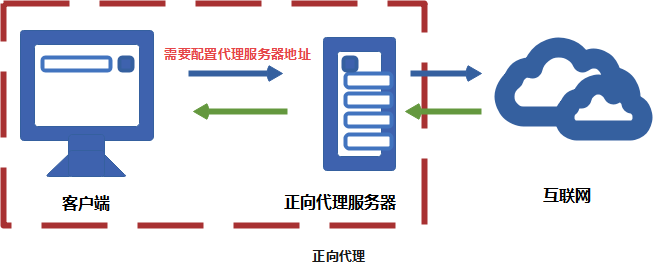
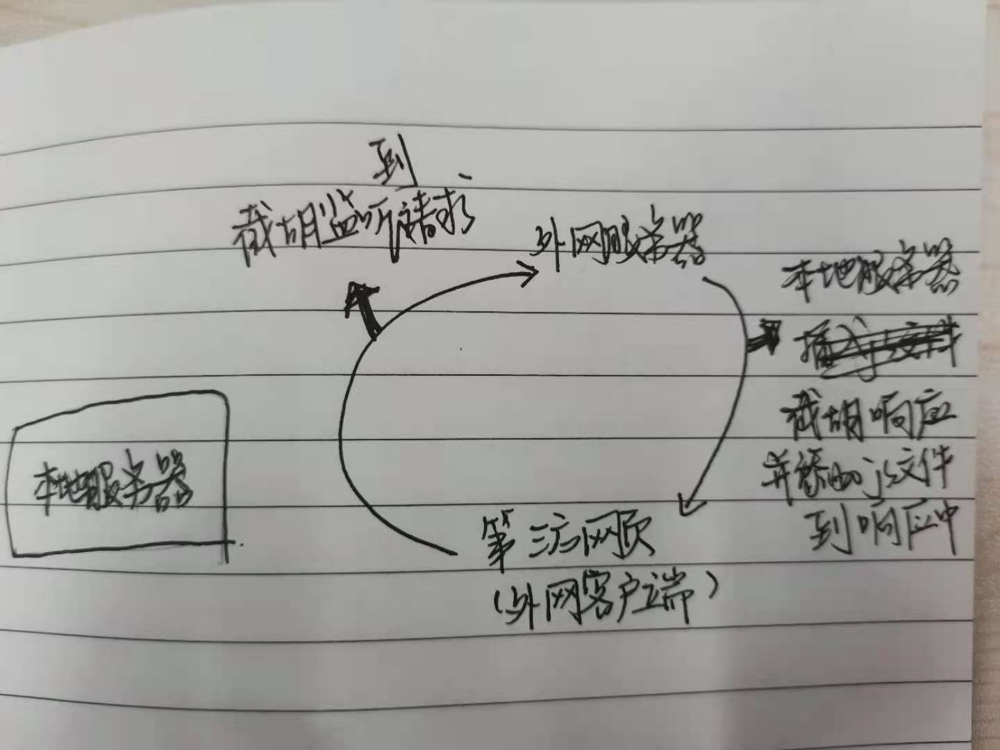
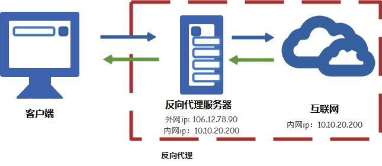
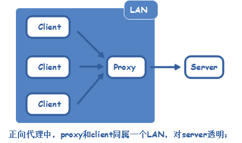
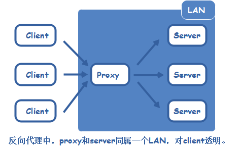

## 正向代理 & 反向代理

### What is 代理？

* 代理其实是一个中介，A和B本来可以直接连接，中间插入一个C，C就是中介。
* 起初，代理多数用来**帮助内网`client`访问外网`server`用的**；后来出现了**方向代理**，即**代理将来自外网客户端的请求转发到内网服务器，从外到内**

#### 正向代理

##### 正向代理的用途

1. 访问原来无法访问的资源，如google
2. 可以做缓存，加速访问资源
3. 对客户端访问授权，上网进行认证
4. 代理可以记录用户访问记录（上网行为管理），对外隐藏用户信息

> 说法一：正向代理是帮客户端做事的，所以该插件是正向代理
> 说法二：安装在客户端的都是正向代理

#### 反向代理

> 反向代理实际运行方式是指**以代理服务器来接受`internet`上的请求，然后将请求转发给内部网络上的服务器，并将从服务器上得到的结果返回给`internet`上请求连接的客户端**，此时代理服务器对外就表现为一个服务器

##### 反向代理的用途

1. 保证内网的安全，阻止web攻击，大型网站，通常将反向代理作为公网访问地址，Web服务器是内网
2. 负载均衡，通过反向代理服务器来优化网站的负载

> 说法一：正向代理是帮客户端做事的，所以该插件是正向代理
> 说法二：安装在客户端的都是正向代理

#### 总结

##### 1. 正向代理即客户端代理，代理客户端，服务端不知道实际发起请求的客户端。

##### 2. 反向代理即是服务端代理，代理服务端， 客户端不知道实际提供服务的服务端。

* 实际上`proxy`在两种代理中做的事，都是代为收发请求和响应。