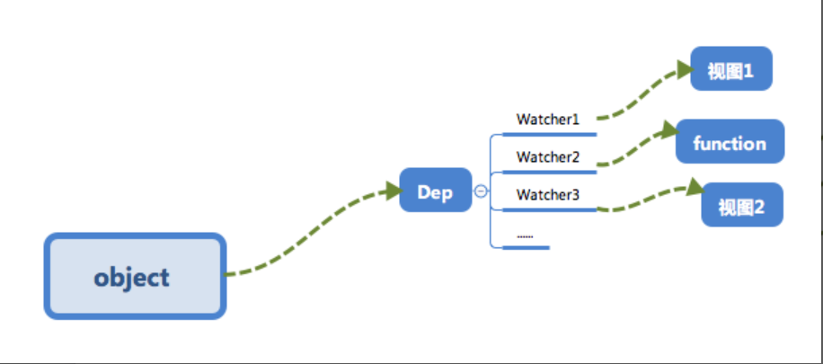

#### 响应式系统的依赖收集追踪原理

##### 为什么要依赖收集？

######  栗子
1. new一个Vue实例
```js
new Vue({
    template: `
    	<div>
    		<span>{{text1}}</span>
    		<span>{{text2}}</span>
    	</div>
    `,
    data: {
        text1: 'text1',
        text2: 'text2',
        text3: 'text3'
    }
})
```
2. 执行操作 `this.text3="modify text3";`
	> 因为视图并不需要用到text3，所以我们并不需要触发**cb**函数来更新视图

###### 栗子

1. 在多个Vue实例中用到同一个对象（全局对象）
```js
let globalObj = {
    text1: 'text1'
};
let o1 = new Vue({
    template: `
    	<div>
    		<span>{{text1}}</span>
    	</div>
    `,
    data: globalObj
});
let o2 = new Vue({
    template: `
    	<div>
    		<span>{{text1}}</span>
    	</div>
    `,
    data: globalObj
});
```
2. 执行操作`globalObj.text1 = 'hello text1';`
	> **依赖收集**会让text1这个数据知道需要通知o1和o2两个Vue实例进行视图的更新

* 形成数据与视图的一种对应关系


##### 如何实现依赖收集？

###### 订阅者Dep

* 实现**订阅者Dep**：用来**存放Watcher观察者对象**
	> 用**addSub**方法可以在目前的**Dep**对象中增加一个**Watcher**的订阅操作
	> 用**notify**方法通知目前**Dep**对象的**subs**中的所有**Watcher**对象触发更新操作
```js
class Dep {
    constructor () {
        // 用来存放Watcher对象的数组
        this.subs = [];
    }
    // 在subs中添加一个Watcher对象
    addSub (sub) {
        this.subs.push(sub);
    }
    // 通知所有Watcher对象更新视图
    notify () {
        this.subs.forEach(sub => {
            sub.update();
        })
    }
}
```

###### 观察者Watcher

```js
class Watcher {
    constructor () {
        // 在new一个Watcher对象时将该对象赋值给Dep.target，在get中会用到
        Dep.targer = this;
    }
    // 更新视图的方法
    update () {
        console.log('视图更新啦~');
    }
}
Dep.target = null;
```

###### 依赖收集

* 修改**defineReactive**以及Vue的构造函数
* 增加**Dep类**，用来收集**Watcher对象**
	> 在对象被 **读** 时，会触发 **reactiveGetter方法** 把当前的**Watcher对象（存放在Dep.target中）**收集到**Dep类**中去
	> 当该对象被 **写** 时，会触发 **reactiveSetter方法** ，通知**Dep类**调用**notify**来触发所有**Watcher对象**的**update方法**更新对应视图
```js
function defineReactive (obj, key, val) {
	// Dep类对象
	const dep = new Dep();
    Object.defineProperty(obj, key, {
        enumberable: true,
        configurable: true,
        get: function reactiveGetter () {
            // 将Dep.target（当前Watcher对象）存入dep的subs中
            dep.addSubs(Dep.target);
            return val;
        },
        set: function reactiveSetter (newVal) {
            if (newVal === val) return;
            // 在set时触发dep的notify来通知所有的Watcher对象更新视图
            dep.notify();
        } 
    })
}

class Vue {
    // Vue构造类
    constructor (options) {
        this._data = options.data;
        // 新建一个Watcher观察者对象，此时Dep.target会指向这个Watcher对象
        new Watcher();
        // 模仿render的过程，为了触发test属性的get函数
        console.log('render~', this._data.test)
    }
}
```

##### 总结

1. 在observer的过程会注册get方法，用来进行**依赖收集**
2. 该闭包【observer】中会有一个Dep对象，用来存放Watcher对象的实例

* Object.defineProperty 的set/get方法所处理的事情：
> **依赖收集**的过程就是把Watcher实例存放到对应的Dep对象中，get方法可以让当前的Watcher对象（Dep.target）存放到它的subs中（addSub），在数据变化时，set会调用Dep对象的notify方法通知它内部所有的Watcher对象进行视图更新。
* **依赖收集**的前提条件
	1. 触发get方法
	2. 新建一个Watcher对象


