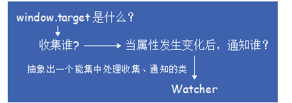
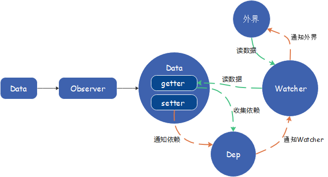

# 变化侦测

## Object的变化侦测

### 1.什么是变化侦测？

#### 1.1 渲染


* 在运行时应用内部的状态会不断发生变化，此时需要不停的重新渲染。如何确定状态中发生了什么变化？

  * **通过变化侦测解决**

#### 1.2 Vue.js的变化侦测


### 2.如何追踪变化？

#### 2.1 js是如何侦测一个对象的变化？

* `Object.defineProperty`
* ES6的`proxy`

#### 2.2 使用`Object.defineProperty`实现变化侦测的原理

```js
function defineReactive (data, key, val) {
    Object.defineProperty(data, key, {
        enumberable: true,
        configurable: true,
        get: function() {
            return val
        },
        set: function(newVal) {
            if(val === newVal) {
                return
            }
            val = newVal
        }
    })
}
```

### 3.如何收集依赖？

> **在getter中收集依赖，在setter中触发依赖**

### 4.依赖收集在哪里？

#### 4.1 每个key都有一个数组，用来存储当前key的依赖

* 假设依赖是一个函数，保存在window.target上

```js
function defineReactive (data, key, val) {
    let dep = []
    Object.defineProperty(data, key, {
        enumberable: true,
        configurable: true,
        get: function() {
            dep.push(window.target)
            return val
        },
        set: function(newVal) {
            if(val === newVal) {
                return
            }
            for(let i = 0; i < dep.length; i++) {
                dep[i](newVal, val)
            }
            val = newVal
        }
    })
}
```

#### 4.2 函数解耦

* 把依赖收集的代码封装成一个Dep类--专门管理依赖
* 使用这个类，可以收集依赖、删除依赖、向依赖发送通知等

```js
export class Dep {
    constructor() {
        this.subs = []
    }
    addSub(sub) {
        this.subs.push(sub)
    }
    removeSub(sub) {
        remove(this.subs, sub)
    }
    depend() {
        if(window.target) {
            this.addSub(window.target)
        }
    }
    notify() {
        const subs = this.subs.slice()
        for(let i = 0, len = subs.length; i < len; i++) {
            subs[i].update()
        }
    }
    function remove(arr, item) {
        if(arr.length) {
            const index = arr.indexOf(item)
            if(index > -1) {
                return arr.splice(arr,)
            }
        }
    }
}
```

* `defineReactive`改造

```js
function defineReactive (data, key, val) {
    let dep = new Dep()
    Object.defineProperty(data, key, {
        enumberable: true,
        configurable: true,
        get: function() {
            dep.addSub()
            return val
        },
        set: function(newVal) {
            if(val === newVal) {
                return
            }
            dep.notify()
            val = newVal
        }
    })
}
```

#### 依赖收集到Dep中

### 5.依赖是谁？



* 在收集依赖阶段，只收集这个封装好的类的实例，通知也只通知它一个

### 6.什么是Watcher？

> Watcher是一个中介，数据发生变化时通知它，然后它再通知其他地方

#### 6.1 栗子

```js
vm.$watch('a.b.c', function(newVal, oldVal) {
    // do something...
})
// 当data.a.b.c发生变化时，触发第二个参数的函数，如何实现？
```


#### 6.2 封装Watcher类

```js
export class Watcher {
    constructor(vm, expOrFn, cb) {
        this.vm = vm
        this.getter = parsePath(expOrFn) //[不知道是干嘛的]
        this.cb = cb
        this.value = this.get()
    }
    get() {
        window.target = this
        let value = this.getter.call(this.vm, this.vm)
        window.target = undefined
        return value
    }
    update() {
        const oldValue = this.value
        this.value = this.get()
        this.cb.call(this.vm, this.value, oldVal)
    }
}
```

* `get方法`可以把自己主动添加到`data.a.b.c`的Dep中去
  * 1.`window.target = this` -- 在`get`方法中，先把`window.target`设置成`this`，即当前的watcher实例
  * 2.读一下`data.a.b.c`的值，触发getter，触发依赖收集
  * 3.`this.addSub(window.target)` -- 会从`window.target`中读取一个依赖（当前的watcher实例）并添加到`Dep`中

* `dep.notify()`当`data.a.b.c`的值发生变化时
  * 1.会让依赖列表中所有依赖循环触发Watcher中的update方法`subs[i].update()`
  * 2.`update`方法会执行参数中的回调函数

#### 6.3 parsePath [不知道是干嘛的]

> `parsePath`是怎样读取一个字符串的keypath的

```js
// 解析简单路径
const bailRE = /[^\w.$]/
export function parsePath(path) {
    if(bailRE.test(path)) {
        return
    }
    const segments = path.split('.')
    return function(obj) {
        for(let i = 0; i < segments.length; i++) {
            if(!obj) return
            obj = obj[segments[i]]
        }
        return obj
    }
}
```

### 7.递归侦测所有key

> 封装一个Observer类：将一个数据内的所有属性（包括子属性）都转换成getter/setter的形式，来收集属性的依赖，并且当属性发生变化时会通知这些依赖

```js
export class Observer {
    constructor(value) {
        this.value = value
        if(!Array.isArray(value)) {
            this.walk()
        }
    }
    walk(obj) {
        const keys = Object.keys(obj)
        for(let i = 0; i < keys.length; i++) {
            defineReactive(obj, keys[i], obj[keys[i]])
        }
    }
}
function defineReactive (data, key, val) {
    if(typeof val === 'Object') {
        new Observer(val)
    }
    let dep = new Dep()
    Object.defineProperty(data, key, {
        enumberable: true,
        configurable: true,
        get: function() {
            dep.addSub()
            return val
        },
        set: function(newVal) {
            if(val === newVal) {
                return
            }
            dep.notify()
            val = newVal
        }
    })
}
```

### 8.关于Observer

> 数据的变化是通过getter/setter来追踪的 --> 有些语法中即便是数据发生了变化，Vue.js也追踪不到

* 栗子 -- 向object添加属性，在`actions`中在`obj`上新增了`name`属性，Vue.js无法侦测到这个变化，所以不会向依赖发送通知

```js
var vm = new Vue({
    el: '#el',
    template: '#demo-template',
    methods: {
        actions() {
            this.obj.name = 'babibrown'
        }
    },
    data: {
        obj: {}
    }
})
```

* 栗子 -- 从object删除属性，在`actions`中删除`obj`上的`name`属性，Vue.js无法侦测到这个变化，所以不会向依赖发送通知

```js
var vm = new Vue({
    el: '#el',
    template: '#demo-template',
    methods: {
        actions() {
            delete this.obj.name
        }
    },
    data: {
        obj: {}
    }
})
```

* **Vue.js通过`Object.defineProperty`来将对象的`key`转换成`getter/setter`的形式来追踪变化，但`getter/setter`只能追踪一个数据是否被修改，无法追踪新增属性和删除属性。**
* Vue.js提供了两个API--vm.$set vm.$delete来解决这个问题

### 9.总结

