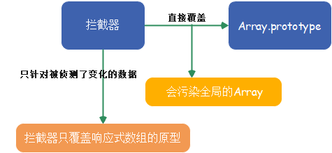
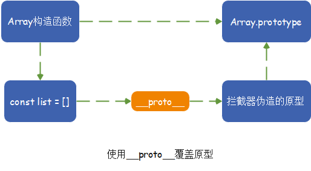
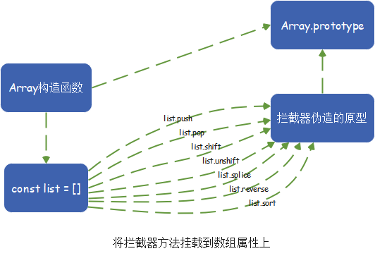

# 变化侦测

## Array的变化侦测

### 1.为什么Array的变化侦测跟Object的变化侦测不同？

> Object的侦测方式是通过`getter/setter`实现的，数组是通过`push`等Array原型上的方法改变内容的，并不会触发`getter/setter`

### 2.如何追踪变化？


1. **用一个拦截器覆盖`Array.prototype`**
2. **每当使用Array原型上的方法去操作数组时，执行的都是拦截器中提供的方法**
3. **在拦截器中使用原生Array的原型方法去操作数组**

> 这样通过拦截器，就可以追踪到Array的变化

#### 2.1.如何实现拦截器？

> 拦截器其实就是一个和`Array.prototype`一样的`Object`，里面包含的属性一模一样，只不过**这个Object中某些可以改变数组自身内容的方法是我们`处理`过的**

* Array原型中可以改变数组自身内容的方法有7个： `push`、`pop`、`shift`、`unshift`、`splice`、`sort`、`reverse`

```js
const arrayProto = Array.prototype
export const arrayMethods = Object.create(arrayProto)

;[
    'push',
    'pop',
    'shift',
    'unshift',
    'splice',
    'sort',
    'reverse'
].forEach(function(method) {
    // 缓存原始方法
    const original = arrayProto[method]
    Object.defineProperty(arrayMethods, method, {
        value: function mutator(...args) {
            return original.apply(this, args)
        },
        enumberable: false,
        writable: true,
        configurable: true
    })
})
```

1. **创建了变量`arrayMethods`,继承自`Array.prototype`，具备其所有功能 ---- 之后将使用`arrayMethods`去覆盖`Array.prototype`**
2. **在`arrayMethods`上使用`Object.defineProperty`方法将可以改变数组自身内容的方法进行封装**
3. **栗子:** 当使用push方法时,其实调用的是`arrayMethods.push`,而`arrayMethos.push`是函数`mutator` ---- 实际上执行的是`mutator`函数
4. **在`mutator`中执行`original`来做它应该做的事 ---- `original`是原生`Array.prototype`上的方法**
5. **因此,我们就可以在`mutator`函数中做一些其它事,比如发送变化通知**

#### 2.2.使用拦截器覆盖`Array`原型



> 将一个数据转为响应式的，需要通过`Observer` --> 只需要在`Observer`中使用拦截器覆盖那些即将被转换成响应式`Array`类型数据的原型

```js
export class Observer {
  constructor(value) {
    this.value = value
    if(Array.isArray(value)) {
        value.__proto__ = arrayMethods
    } else {
      this.walk()
    }
  }
}
```



#### 2.3.将拦截器方法挂载到数组的属性上

> 如果不能使用`__proto__`，就直接将`arrayMethods`上的方法设置到被侦测的数组上

```js
import { arrayMethods } from './array'
const hasProto = '__proto__' in {}
const arrayKeys = Object.getOwnPropertyNames(arrayMethods)

export class Observer {
    constructor(value) {
        this.value = value
        if(Array.isArray(value)) {
            const augment = hasProto ? protoAugment : copyAugment
            augment(value, arrayMethods, arrayKeys)
        } else {
            this.walk()
        }
    }
    ...
}
// 覆盖原型
function protoAugment(target, src, keys) {
    target.__proto__ = src
}
// 将拦截器的方法挂载到value上
function copyAugment(target, src, keys) {
    for(let i = 0, len = keys.length; i < len; i++) {
        const key = keys[i]
        def(target, key, src[key])
    }
}
```

* `hasProto`用来判断当前浏览器是否支持`__proto__`
* `copyAugment`用来将已经加工了拦截操作的原型方法直接添加到value的属性中



> 当用户使用这些方法时，执行的是拦截器提供的方法【因为当访问一个对象的方法时，只有其自身不存在这个方法，才会去它的原型上找这个方法】

### 3.如何收集依赖？

* `Object`的依赖是如何收集的？
  > 在`getter`中收集依赖,依赖被存储在`Dep`中

* 数组在哪里收集依赖?
  > 数组也是在`getter`中收集依赖的

```js
function defineReactive(data, key, val) {
  if(typeof val === 'object') new Observer(val)
  let dep = new Dep()
  Object.defineProperty(data, key, {
    enumerable: true,
    configurable: true,
    get: function() {
      dep.depend()
      // 这里收集Array的依赖
      return val
    },
    set: function(newVal) {
      if(val === newVal) {
        return
      }
      dep.notify()
      val = newVal
    }
  })
}
```

* **Array在getter中收集依赖,在拦截器中触发依赖**

### 4.依赖列表存在哪?

* **Vue把Array的依赖存放在Observer中**

> 为什么把Array的依赖存放在Observer中?
> **Array在getter中收集依赖,在拦截器中触发依赖,** 所以依赖保存的位置必须在`getter`和`拦截器`中都可以访问到

```js
export class Observer {
    constructor(value) {
        this.value = value
        this.dep = new Dep()
        if(Array.isArray(value)) {
            const augment = hasProto ? protoAugment : copyAugment
            augment(value, arrayMethods, arrayKeys)
        } else {
            this.walk()
        }
    }
    ...
}
```

> 如何在`getter`中访问`Dep`开始收集依赖,在`拦截器`中如何访问`Observer`实例

### 5.收集依赖

> 把Dep实例保存在Observer的属性上之后，可以在getter访问并收集依赖

1. 通过`observe`得到数组的Observer实例--`childOb`
2. 最后通过`childOb`的`dep`执行`depend方法`来收集依赖

```js
function defineReactive(data, key, val) {
  // childOb即Observer实例
  let childOb = observe(val)
  let dep = new Dep()
  Object.defineProperty(data, key, {
    enumerable: true,
    configurable: true,
    get: function() {
      dep.depend()
      if(childOb) {
        childOb.dep.depend()
      }
      return val
    },
    set: function(newVal) {
      if(val === newVal) {
        return
      }
      dep.notify()
      val = newVal
    }
  })
}
/**
 * 尝试为value创建一个Observer实例；
 * 如果创建成功，直接返回新创建的Observer实例
 * 如果value已经存在一个Observer实例，则直接返回它
 * 避免重复侦测value变化
 * */
export function observe(value, asRootData) {
  if(!isObject(value)) {
    return
  }
  let ob
  if(hasOwn(value, '__ob__') && value.__ob__ instanceof Observer) {
    ob = value.__ob__
  } else {
    ob = new Observer(value)
  }
  return ob
}
```

### 6.在拦截器中获取Observer实例

> `Array拦截器`是对原型的一种封装，所以可以在拦截器中访问到this（当前正在操作的数组）
> `dep`保存在Observer中，所以需要在this上读到Observer实例

```js
// 工具函数
function def(obj, key, val, enumberable) {
  Object.defineProperty(obj, key, {
    value: val,
    enumberable: !!enumberable,
    writabel: true,
    configurable: true
  })
}
export default Observer {
  constructor(value) {
    this.value = value
    this.dep = new Dep()
    def(value, '__ob__', this) // 新增

    if(Array.isArray(value)) {
      const augment = hasProto ? protoAugment : copyAugment
      augment(value, arrayMethods, arrayKeys)
    } else {
      this.walk()
    }
  }
  ...
}
```

* `def(value, '__ob__', this)`在value上新增一个不可枚举的属性`__ob__`，这个属性的值就是`当前Observer实例` --> 使得可以通过数组数据的`__ob__属性`拿到`Observer实例`，然后就可以拿到`__ob__`上的`dep`
* `__ob__`的作用不仅仅是为了`在拦截器中访问Observer实例`，还可以用来`标记当前value是否已经被Observer转换成了响应式数据`

> 当value身上被标记了`__ob__`之后，就可以通过`value.__ob__`来访问`Observer实例`

* 如果是`Array拦截器`，因为拦截器是原型方法，所以可以直接通过`this.__ob__`来访问`Observer实例`

```js
;[
    'push',
    'pop',
    'shift',
    'unshift',
    'splice',
    'sort',
    'reverse'
].forEach(function(method) {
  // 缓存原始方法
  const original = arrayProto[method]
  Object.defineProperty(arrayMethods, method, {
    value: function mutator(...args) {
      // 通过`this.__ob__`来访问`Observer实例`
      const ob = this.__ob__ // 新增
      return original.apply(this, args)
    },
    enumberable: false,
    writable: true,
    configurable: true
  })
})
```

### 7.向数组的依赖发送通知

> 当侦测到数组发生变化时，会向依赖发送通知。

* 首先要能访问到依赖
  1. `this.__ob__`访问到Observer实例
  2. 在`Observer实例`中拿到`dep属性`
  3. 然后直接发送通知

```js
;[
    'push',
    'pop',
    'shift',
    'unshift',
    'splice',
    'sort',
    'reverse'
].forEach(function(method) {
  // 缓存原始方法
  const original = arrayProto[method]
  def(arrayMethods, method, function mutator(...args) {
    const result = original.apply(this, args)
    const ob = this.__ob__
    ob.dep.notify() // 向依赖发送消息
    return result
  })
})
```

### 8.侦测数组中元素的变化

#### 8.1 如何侦测所有数据子集的变化?

```js
export default Observer {
  constructor(value) {
    this.value = value
    dep(value, '__ob__', this)
    if(Array.isArray(value)) {
      this.observeArray(value)
    } else {
      this.walk(value)
    }
  }
  // 侦测Array中的每一项
  observeArray(items) {
    for(let i = 0, len = items.length; i < len; i++) {
      observe(items[i])
    }
  }
  ......
}
```

### 9.侦测新增元素的变化

> 获取新增元素并使用Observer来侦测它们

#### 9.1 获取新增元素

```js
;[
    'push',
    'pop',
    'shift',
    'unshift',
    'splice',
    'sort',
    'reverse'
].forEach(function(method) {
  // 缓存原始方法
  const original = arrayProto[method]
  def(arrayMethods, method, function mutator(...args) {
    const result = original.apply(this, args)
    const ob = this.__ob__
    // 获取新增的元素
    let inserted
    switch(method) {
      case 'push':
      case 'unshift':
        inserted = args
        break
      case 'splice':
        inserted = args.slice(2)
        break
    }
    ob.dep.notify() // 向依赖发送消息
    return result
  })
})
```

#### 9.2 使用Observer侦测新增元素

> Observer将自身的实例附加到value的__ob__属性上

* 在拦截器中，从`this.__ob__`上拿到Observer实例，使用`observeArray方法`侦测新增元素的变化

```js
;[
    'push',
    'pop',
    'shift',
    'unshift',
    'splice',
    'sort',
    'reverse'
].forEach(function(method) {
  // 缓存原始方法
  const original = arrayProto[method]
  def(arrayMethods, method, function mutator(...args) {
    const result = original.apply(this, args)
    const ob = this.__ob__
    // 获取新增的元素
    let inserted
    switch(method) {
      case 'push':
      case 'unshift':
        inserted = args
        break
      case 'splice':
        inserted = args.slice(2)
        break
    }
    if(inserted) ob.observeArray(inserted) // 新增
    ob.dep.notify()
    return result
  })
})
```

### 10.关于Array

> 对Array的变化侦测是通过拦截原型的方式实现的，所以有些数组操作Vuejs时拦截不到的

### 11.总结
