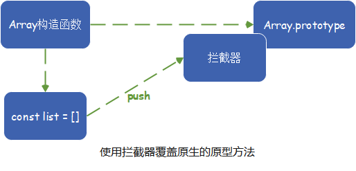

# 变化侦测

## Array的变化侦测

### 1. 为什么Array的变化侦测跟Object的变化侦测不同？

> Object的侦测方式是通过`getter/setter`实现的，数组是通过`push`等Array原型上的方法改变内容的，并不会触发`getter/setter`

### 2. 如何追踪变化？

1. **用一个拦截器覆盖`Array.prototype`**
2. **每当使用Array原型上的方法去操作数组时，执行的都是拦截器中提供的方法**
3. **在拦截器中使用原生Array的原型方法去操作数组**

> 这样通过拦截器，就可以追踪到Array的变化

### 3.如何实现拦截器？

> 拦截器其实就是一个和`Array.prototype`一样的`Object`，里面包含的属性一模一样，只不过**这个Object中某些可以改变数组自身内容的方法是我们`处理`过的**

* Array原型中可以改变数组自身内容的方法有7个：`push`、`pop`、`shift`、`unshift`、`splice`、`sort`、`reverse`

