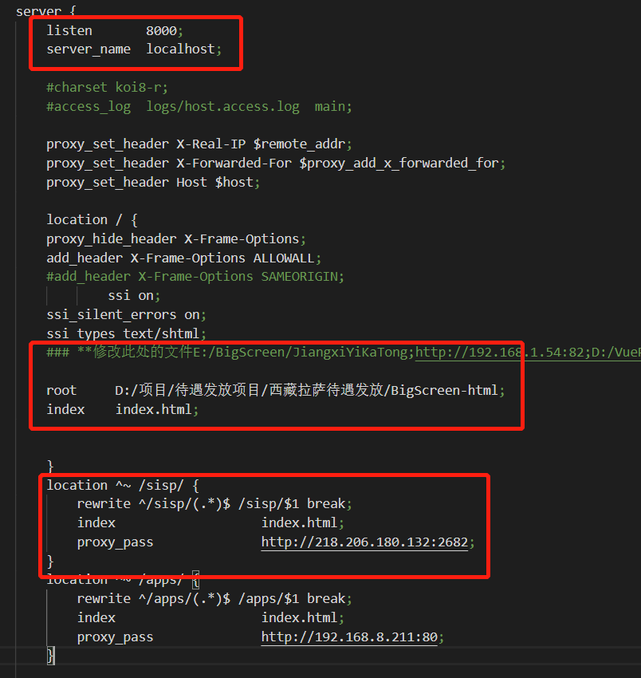

## HTML

### 如何在不同的端口间共享cookie?

* 使用nginx做反向代理，将不同端口的服务映射到统一端口，就可以实现cookie共享

### 怎么配置nginx?



## CSS

### 写的css样式是否能被js所读到？如果可以如何读取?

#### 1 内联样式

* **直接使用`ele.stype.属性名`获取**
* **注意在css中单词之间用-连接,在js中要用驼峰命名法**

```html
<div id="dv" style="width: 100px;height: 200px; background-color: #ccc; border: 1px solid #ddd"></div>
```

```js
var dv = document.getElementById('dv');
console.log(dv.style.width); // 100px
console.log(dv.style['height']); // 200px
console.log(dv.style.backgroundColor); // #ccc
console.log(dv.style.border); // 1xp solid #ddd
```

#### 2 外联样式表 | 内部样式表

* **使用js中的`window.getComputedStyle(element, pseudoElement).属性名`的方法获取**其中window可以省略
* **获取到的样式是元素在浏览器中最终渲染效果的样式**

```css
#dv {
  width: 10px;
  height: 20px;
  background-color: #58bc58;
  border: 1px solid #ccc;
}
```

```js
var dv2 = document.getElementById('dv');
console.log(dv2.style['height']); // 空值
console.log(dv2.style.backgroundColor); // 空值
console.log(window.getComputedStyle(dv2,null).width); // 10px
console.log(getComputedStyle(dv2,null).backgroundColor); // #58bc58
console.log(getComputedStyle(dv2,null)['border']); // 1px solid #ccc
```

## JS

### setTimeout(fn,0)，延迟执行吗?

* **会**

1. 调用`setTimeout`函数会在一个时间段过去后在队列中添加一个任务
2. 如果队列中没有其它任务,该任务会被马上处理
3. 如果队列中有其它任务,`setTimeout任务`必须等待其它任务处理完再执行

#### `零延迟(Zero delay)`并不意味着立即执行

* 在零延迟调用`setTimeout`时,并不是过了给定时间间隔就马上执行回调函数
* 其等待的时间基于队列正在等待的消息数量

> 即`setTimeout()`只是将事件插入了任务队列,必须等到当前任务(执行栈)执行完,主线程才会去执行指定的回调函数
> 没办法保证回调函数一定会在`setTimeout()`指定的时间执行

#### 总结

* `setTimeout(fn, 0)`的含义是: 指定任务在主线程最早可得的空闲时间执行,也就是说,尽可能早的执行.它在任务队列的尾部添加一个事件,因此要等到主线程把同步任务和任务队列现有的事件都处理完,才会得到执行
* 在某种程度上,我们可以利用`setTimeout(fn,0)`的特性,修正浏览器的任务顺序
