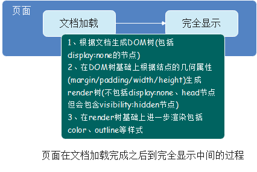
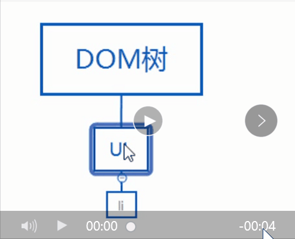
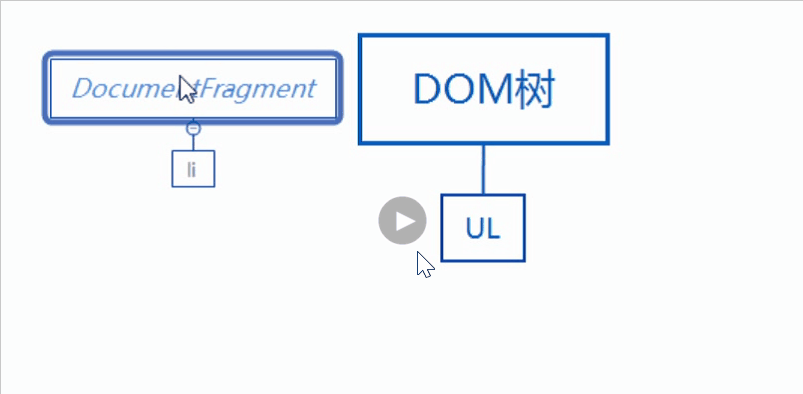
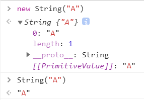

# 20210218

## HTML

### 页面的重绘和回流是什么？

#### 1.重绘和回流



##### 重绘repaint

* **当元素的一部分属性发生变化，如外观背景色不会引起布局变化而需要重新渲染的过程**

##### 回流reflow

* **当render树中的一部分或者全部因为大小边距等问题发生改变而需要重建的过程**

#### 2.重绘和回流的区别

> 引起DOM树结构变化，页面布局变化的行为叫回流，且回流一定伴随重绘；
> 只是样式的变化，不会引起DOM树变化，页面布局变化的行为叫重绘，且重绘不一定会伴随回流。
> 回流往往伴随着布局的变化，代价较大；重绘只是样式的变化，结构不会改变

#### 3.怎么减少回流

##### 1 DOM的增删行为

* 栗子：删除某个节点，给某个元素增加子元素，这类操作都会引起回流。如果要加多个子元素，最好使用documentfragment

##### 2 几何属性的变化

* 栗子：元素宽高变了、border变了、字体大小变了，这种直接会引起页面布局变化的操作会引起回流。如果要改变多个属性，最好将这些属性定义在一个class中，直接修改class名，这样只需要引起一次回流

##### 3 元素位置的变化

* 修改一个元素的左右margin、padding之类的操作会引起回流。在做元素位移的动画，不要更改margin之类的属性，使用定位脱离文档流后改变位置会更好

##### 4 获取元素的偏移量属性

* 多次操作，每次取完做个缓存

##### 5 页面初次渲染

* 无法避免

##### 6 浏览器窗口尺寸改变

* resize事件发生也会引起回流

#### 4.页面优化-documentfragment对象

##### 1 documentfragment对象是什么？

> documentfragment节点不属于dom树，因此改变它不会引起dom树的变化；
> dom树的操作会引起回流，则可以将documentfragment作为一个暂时的dom节点存储器，当我们在documentfragment修改完成时，我们就可以将存储dom节点的documentfragment一次性加入dom树，从而减少回流次数，达到性能优化的目的

##### 2 documentfragment对象怎么用？

```js

// 创建documentfragment，每个新建的documentfragment都会继承所有node方法，且拥有nodeValue、nodeName、nodeType属性
let fragment = document.createDocumentFragment();
console.log(fragment.nodeValue);
console.log(fragment.nodeName);
console.log(fragment.nodeType);
```

* 使用documentfragment能解决直接操作DOM引发大量回流的问题

###### 栗子

* 给ul添加5个li节点
* 直接操作dom，回流5次



* 使用documentfragment一次性添加，回流一次



## CSS

### flex是哪些属性的简写呢？

> flex 将剩余空间补全

* **flex-grow:0;** 放大--->flex:1;会补全页面
* **flex-shrink:1;** 缩小---->flex-shrink:0; 会使子元素不被挤压
* **flex-basis:100%;** --->项目长度

## JS

### 请说说new String("A")和String("A")分别返回的结果，请解释为什么？



#### 原因

1. `String("A")`返回的是基本类型；`new String("A")`创建的是一个对象
2. `String("A")`返回的是值类型；`new String("A")`返回的是引用类型
3. `String("A")`入栈；`new String("A")`入堆
