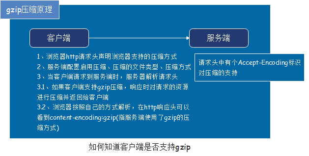

# 20210219

## HTML

### 说说你对Gzip压缩的了解

```js
// vue.config.js文件
// 这个要gzip压缩要配置nginx
if (process.env.NODE_ENV === 'production') {
  config.plugin('gzip-plugin')
    .use('compression-webpack-plugin', [{
      filename: '[path].gz[query]',
      algorithm: 'gzip',
      test: /\.js$|\.html$|\.json$|\.css$|\.ttf$/,
      threshold: 0, // 只有大小大于该值的资源会被处理
      minRatio: 0.8, // 只有压缩率小于这个值的资源才会被处理
      deleteOriginalAssets: true // 删除原文件
    }])
    .end()
}
```

#### 前端性能优化之gzip

##### 1. gzip压缩原理

> 不是每个浏览器都支持gzip的，如何知道客户端是否支持gzip呢？



##### 2. 如何启用gzip

> 启用gzip需要客户端和服务端的支持，如果客户端支持gzip的解析，那么只要服务端能够返回gzip文件就可以启用gzip了。

## CSS

### 设置元素为display:flex后，哪些属性会失效呢？为什么？

#### 1.设置元素为display:flex后，哪些属性会失效呢？

* 指定`flex`之后，子元素的**float、clear清除浮动、vertical-align**属性将失效

#### 2.为什么？

* `flex`容器为其内容建立一个新的`flex格式化上下文`。这与建立一个块格式化上下文是一样的，除了使用了`flex布局`而不是`块布局`。
* 浮动不会侵入`flex容器`，并且`flex容器`的边距不会以其内容的边距折叠。
* 只有行内元素支持`vertical-align`，使用了`flex`属性之后，子元素也会被默认转化成行内块元素。

### 如何让span在div中垂直居中？

* span设置`vertical-align: middle;`

## JS

### 写一个方法找到一维数组里，有且只有两个连续相等的所有元素

### 请使用js写个方法解析emoji表情

### 请通过reduce函数实现一维数组的求和

#### reduce方法

* **对数组中的所有元素调用指定的回调函数。**
* **该回调函数的返回值为累积结果，并且此返回值在下一次调用该回调函数时作为参数提供。**

> **语法： `array1.reduce(callbackfn[, initialValue])`**

* **reduce()方法接收callbackfn函数，而这个函数包含四个参数：**

> **function callbackfn(preValue,curValue,index,array){}**

* **preValue:** 上一次调用回调返回的值，或者是提供的初始值（initialValue）
* **curValue:** 数组中当前被处理的数组项
* **index:** 当前数组项在数组中的索引值
* **array:** 调用 reduce()方法的数组

```js
var arr = [0,1,2,3,4]; 
arr.reduce(function (preValue,curValue,index,array) { 
    return preValue + curValue; 
}); 
```
