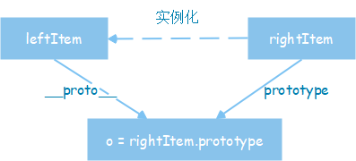

# JavaScript基础

## 变量和类型

### 1. JavaScript规定了几种语言类型

#### 基本数据类型

* number
* string
* boolean
* null
* undefined
* Symbol

#### 复杂数据类型

* object
* array
* function

### 2. JavaScript对象的底层数据结构是什么

> 栈和堆

#### 栈（Stack）

* 基本数据类型都是直接按值存储在栈中的
* 每种类型的数据占用的内存空间大小是确定的，并按系统自动分配和自动释放

##### 好处

* 内存及时得到回收
* 相对于堆来说，更加容易管理内存空间

#### 堆（Heap）

> 完全二叉树

* 引用类型数据存储在堆中，其地址的指针是存储在栈中
* 访问引用类型数据时，需要先从栈中获取对象的地址指针，然后再通过地址指针找到堆中的所需要的数据

### 3. Symbol类型在实际开发中的应用

> 主要用来作为对象的私有成员使用

* Symbol值作为标识符，用于对象的属性名，可以保证不会出现同名的属性
* 特点：所有符号类型的数据都是唯一的

#### Symbol类型的基本使用

1. 在使用for..in循环遍历时默认不会把符号类型的数据遍历出来
2. 只能用方括号才能读取对象中符号类型的数据
3. 获取对象中所有属性名：`Object.getOwnPropertyNames(o);`
4. 获取对象中所有字符类型数据：`Object.getOwnPropertySymbols(o);`

### 4. JavaScript中的变量在内存中的具体存储形式

#### 基本数据类型

> 内容存储在栈中，通过值进行访问

#### 引用类型数据

> 内容存储在堆中，通过引用进行访问，引用和变量标识存储在栈中

### 5. 基本类型对应的内置对象，以及他们之间的装箱拆箱操作

#### 基本类型对应的内置对象

> Object是js中所有对象的父对象

##### 数据封装类对象

> Object Array Booblean Number String

##### 其它对象

> Function Math Date RegExp Error

#### 装箱和拆箱

##### 装箱

> 基本类型数据 -> 对应的对象

* 隐式装箱：读取基本数据类型的值时
* 显式装箱：通过内置对象等

##### 拆箱

> 对象 -> 基本类型的值

* 通过引用类型的`valueof()`和`toString()`方法实现

### 6. 理解值类型和引用类型

#### 值类型

> 保存的内容是值

* 赋值：修改了值，对另一个值不影响，他们是相互独立的

#### 引用类型

> 保存的内容时引用

* 赋值：两个对象共享同一块数据，他们会互相影响

### 7. null和undefined的区别

* null表示空，相当于一个里面什么都没有的盒子
* undefined表示未定义，相当于一个从没有被打开的盒子

### 8. 判断JavaScript数据类型的方式，以及他们的优缺点，如何准确的判断数组类型

#### 判断方法

1. `typeof`
2. `instanceof`
3. `constructor`
4. `Object.prototype.toString()`

#### 优缺点

| | typeof | instanceof | constructor | Object.prototype.toString.call() |
| -- | -- | -- | -- | -- |
| 优点 | 使用简单 | 能检测出引用类型 | 基本能检测所有的类型(除了null和undefined) | 检测出所有的类型 |
| 缺点 | 只能检测出基本类型(除null) | 不能检测出基本类型 | constructor容易被修改 | |

#### 准确的判断数组类型

```js
function isArray(arr) {
  if (Array.isArray) {
    return Array.isArray(arr)
  } else {
    return Object.prototype.toString.call(arr) == "[Object Array]"
  }
}
```

### 9. 可能发生隐式类型转换的场景以及转换原则，应如何避免或巧妙应用

### 10. 出现小数精度丢失的原因，JavaScript可以存储的最大数字、最大安全数字，JavaScript处理大数字的方法、避免精度丢失的方法


## 原型和原型链


### 1.理解原型设计模式以及JavaScript中的原型规则

#### 原型设计模式

> 创建一个共享的原型，通过拷贝这个原型来创建新的类，用于创建重复的对象

```js
var AnimalPrototype = {
  init: function(animal) {
    this.modal = animal
  },
  getModal: function() {
    console.log(this.modal)
  }
}
function Animal(animal) {
  function Cat() {}
  Cat.prototype = AnimalPrototype
  var cat = new Cat()
  cat.init(animal)
  return cat
}
let ocat = Animal('myCat')
ocat.getModal()
```

#### 原型规则

* 所有引用类型数据，都具有对象特性，即可自由扩展属性
* 所有函数都有一个prototype属性（显式原型），属性值是一个普通对象
* 所有引用类型数据，都有一个__proto__属性（隐式原型），属性值是一个普通对象
* 所有引用类型数据，其隐式原型指向其构造函数的显式原型
    * `obj.__proto__ === Object.prototype`
* 当试图访问一个对象的某个属性时，如果这个对象本身没有这个属性，那么会去它的__proto__中去寻扎

### 2. instanceof的底层实现原理，手动实现一个instanceof

#### 底层实现原理

> 只要右变量的prototype在左变量的原型链上即可

* instanceof在查找过程中会遍历左变量的原型链，直到找到右变量的prototype，如果查找失败会返回false

#### 手动实现



```js
function instance_of(leftItem, rightItem) {
  var o = rightItem.prototype
  leftItem = leftItem.__proto__
  while(true) {
    if(leftItem === null) return false
    if(o === leftItem) return true
    leftItem = leftItem.__proto__
  }
}
```

### 4. 实现继承的几种方式以及他们的优缺点

```js
function Animal(name) {
  this.name = name || 'Animal'
  this.sleep = function() {
    console.log(this.name + '正在睡觉')
  }
}
Animal.prototype.eat = function(food) {
  console.log(this.name + '正在吃' + food)
}
```

#### 原型式继承
#### 实例继承
#### 原型链继承
#### 借用构造函数继承
#### 组合继承
#### class继承

### 5. 至少说出一种开源项目(如Node)中应用原型继承的案例

### 6. 可以描述new一个对象的详细过程，手动实现一个new操作符

#### new一个对象的过程

1. `var o = newPerson()`
2. `this = o` && `this.__proto__ = Person.prototype`
3. `Person.call(this)`
4. `return this`

### 7. 理解es6 class构造以及继承的底层实现原理


## 作用域和闭包

### 1. 理解词法作用域和动态作用域

#### 词法作用域

* 函数的作用域在函数定义时决定

#### 动态作用域

* 函数的作用域在函数调用时决定

#### js采用词法作用域

* js函数的执行运用到了作用域链，这个作用域链是在函数定义时创建的

### 2. 理解JavaScript的作用域和作用域链

#### 作用域

##### 全局作用域

* 在代码中的任何地方都能被访问

##### 局部作用域

* 一般只在固定的代码片段内可以被访问到

#### 作用域的访问规则

* 在作用域中访问变量时，会先在当前作用域中查找，如果找到则直接使用；如果没找到就像外层作用于查找，如果找到则直接用；如果没找到就继续向外层找，直到全局作用域；如果全局作用域也没找到，则报错。

#### 作用域链

* 当查找变量时，会先从当前上下文的变量对象中查找，如果没找到，就会从父级执行上下文的变量对象中查找，一直找到全局上下文的变量对象，也就是全局对象。

### 3. 理解JavaScript的执行上下文栈，可以应用堆栈信息快速定位问题


### 4. this的原理以及几种不同使用场景的取值


### 5. 闭包的实现原理和作用，可以列举几个开发中闭包的实际应用


### 6. 理解堆栈溢出和内存泄漏的原理，如何防止


### 7. 如何处理循环的异步操作


### 8. 理解模块化解决的实际问题，可列举几个模块化方案并理解其中原理


## 执行机制


### 1. 为何try里面放return，finally还会执行，理解其内部机制


### 2. JavaScript如何实现异步编程，可以详细描述EventLoop机制


### 3. 宏任务和微任务分别有哪些


### 4. 可以快速分析一个复杂的异步嵌套逻辑，并掌握分析方法


### 5. 使用Promise实现串行


### 6. Node与浏览器EventLoop的差异


### 7. 如何在保证页面运行流畅的情况下处理海量数据


## 语法和API


### 1. 理解ECMAScript和JavaScript的关系


### 2. 熟练运用es5、es6提供的语法规范，


### 3. 熟练掌握JavaScript提供的全局对象（例如Date、Math）、全局函数（例如decodeURI、isNaN）、全局属性（例如Infinity、undefined）


### 4. 熟练应用map、reduce、filter 等高阶函数解决问题


### 5. setInterval需要注意的点，使用settimeout实现setInterval


### 6. JavaScript提供的正则表达式API、可以使用正则表达式（邮箱校验、URL解析、去重等）解决常见问题


### 7. JavaScript异常处理的方式，统一的异常处理方案
