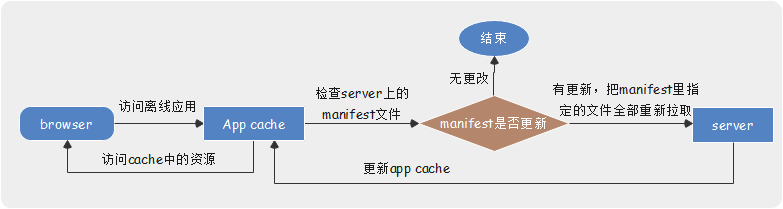
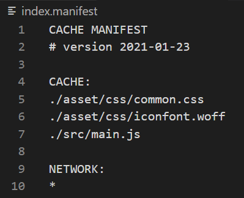
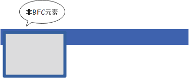
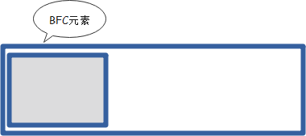
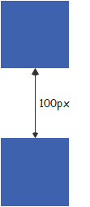
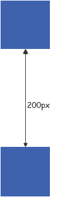
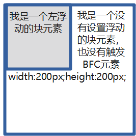
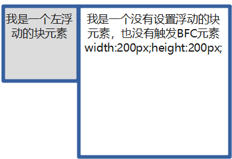

## HTML + CSS

### HTML

#### 1. 语义化标签

* `section` `article` `main` `aside` `header` `footer` `nav` `figure` `figcation`

#### 2. h5离线缓存

##### 2.1 什么是h5离线缓存？

> 离线存储可以将站点的一些文件存储在本地，他是浏览器自己的一种机制，将需要的文件缓存
> 在没有网络时可以访问到缓存的对应的站点页面
> 有网络时，浏览器也会优先使用已离线存储的文件

* h5离线缓存是**基于一个新建的.appcache文件的缓存机制(不是存储技术)**，通过这个文件上的解析清单离线存储资源【清单：把需要离线存储在本地的文件列在一个`manifest`配置文件中】



* **0211 什么是manifest？**
  * `manifest`(清单)是一个简单的文本文件，它的扩展名是任意的，定义需要缓存的文件、资源
  * 当第一次打开时，浏览器会自动缓存相应的资源

* **0212 manifest的特点？**
  * **离线浏览：**当网络断开时，可以继续访问你的页面
    * **访问速度快：**将文件缓存到本地，不需每次都从网络上请求
    * **稳定性：**做了`manifea`t缓存，遇到突发网络故障或者服务器故障，继续访问本地缓存

* **0213 manifest的使用？**
  > html新增了一个`manifest`属性，可以用来指定当前页面的manifest文件
  * 创建一个和html同名的manifest文件
  * **栗子**
    * 1）页面index.html，可以新建一个index.manifest文件
    * 2）给index.html的html标签添加如下属性：
      * `<html lang="en" manifest="index.manifest">`或`<html manifest="http://www.example.com/index.manifest">`
      * 说明
        * 1 manifest的引入可以使用相对路径|绝对路径，如果使用绝对路径，则你的manifest文件必须与你的站点挂在同一个域名下
        * 2 manifest文件可以保存为任意的扩展名，但`mine-type`必须是`text/cache-manifest`
      * `<html lang="en" manifest="index.manifest">`在服务器上部署时需要在服务器上添加相应的mime-type
    * 注意："/page-url/", "/page-url/?something", "/page-url/?something-else" manifest会当成不同的页面，所以manifest最好使用在SPA(单页应用)项目中
    * 在Chrmoe，可以使用`chrome://appcache-internals/`查看缓存在本地的资源文件

* **0214 manifest文件结构？**
* manifest文件代码结构：

  * manifest文件，基本格式为三段：
    * **`CACHE`：标识出哪些文件需要缓存，可以是相对路径也可以是绝对路径**
    * **`NETWORK`[可选]：要绕过缓存直接读取的文件，可以使用通配符`*`**
    * **`FALLBACK`[可选]：当资源无法访问时，浏览器使用后备资源去替代**

```js
CACHE MANIFEST // 第一行是`CACHE MANIFEST`是必须的
# version 2021-01-23 // 以#开头的是注释，一般是版本号

CACHE: // 这里列出来的文件，第一次加载下来时，会被浏览器缓存在本地
./asset/css/common.css
./asset/css/iconfont.woff
./src/main.js

NETWORK: // 大多数网站使用*，*表示除CACHE指定文件外，其它页面都需要联网访问
*

FALLBACK: // 如果无法建立因特网连接，则用"404.html"替代/html5/目录中的所有文件
/html5/ /404.html
```

* **0215 如何更新缓存？**
  * **更新manifest文件**
    * 给manifest添加或删除文件，都可更新缓存
  * **通过javascript操作**
    * h5引入了操作离线缓存的方法：**`window.applicationCache.update();`**
  * **清除浏览器缓存**

> 代码实现**手动更新manifest缓存**，一旦webapp源码更新，会自动更新本地manifest缓存，使用户始终访问到最新的源码

```js
window.applicationCache.addEventListener('updateready', function(e) {
    if(window.applicationCache.statue
    == window.applicationCache.UPDATEREADY) {
        window.applicationCache.swapCache();
        if(
        confirm('A new version of this site is available. Load it ?')
        ) {
            window.location.read();
        } else {
            // manifest didnt changed. Nothing new to server.
        }
    }
}, false);
```

##### 2.2 http缓存与h5离线缓存有什么区别？

> 前端缓存分为**http缓存**和**浏览器缓存**；
> http缓存分为**强缓存**和**协商缓存**；
> 浏览器缓存分为**离线缓存**和**本地缓存（cookie, webstorage等）**

* http缓存和h5缓存可以缓存任何资源（包括API接口）
* h5离线缓存的优势主要有两个：
* 1. **配置与WebServer解耦。**一般来所，静态资源想做http缓存是需要修改WebServer配置的
* 2. **完全脱机。**http缓存其实还有一次网络请求，利用了`Cache-Control`、`ETag`、`Last-Modified`、`If-Modified-Since`、`If-None-Match`这几个标头，服务端返回304状态码告知浏览器可以使用之前的资源，**节省的是该资源本身传输的网络开销，但并没有真正省去网络请求本身。**h5离线缓存则是一旦缓存成功，就完全脱机化了，直到`manifest`发生变化。

#### 3. 可以使用Canvas API、SVG等绘制高性能的动画

### CSS

#### 1.@规则 -- 嵌套规则

> @[KEYWORD]{ /*嵌套语句*/ }

* 1. @font-face

```css
@font-face {
    font-family: "MyWebFont";
    src: url("myfont.woff2") format("woff2");
}
```

* 2. @keyframes -- C3动画

```css
@keyframes fadeIn {
    0% {
        opacity: 0;
    }
    100% {
        opacity: 1;
    }
}
```

* 3. @media 媒介查询

```css
@media all and (min-width: 1280px) {
    //
}
```

#### 2. css伪类和伪元素的区别和实际应用

* 伪类：相当于一个状态开关，需要手动触发，触发开关时修改元素样式达到动态效果
* 伪元素：可以比作一个假的元素，但不存在于dom树中，通常用来向元素添加小图标、清除浮动影响等

#### 3. 页面布局之文档流

##### 3.1 什么是文档流？

* 文档流指的是元素排版布局过程中，元素会默认从左往右，从上往下的流式排列方式。并最终窗体自上而下分成一行行，并在每行中从左至右的顺序排放元素。

##### 3.2 html标签在文档流中是怎样排列的？

* 块级元素在标准文档流中独占一行，不能与其它任何元素并列。多个块级元素垂直排列。
* 行内元素在标准文档流中没有宽高，与其它元素并排。

#### 4 BFC

##### 4.1 BFC的实现原理？

* BFC是普通文档流，BFC会产生一个独立的容器，该容器内部的元素不会在布局上影响到外部元素。

##### 4.2 BFC可以解决的问题？

###### 1. BFC可以清除浮动防止高度塌陷

> 浮动元素会脱离普通文档流，导致外部元素的高度计算不包括浮动元素本身高度，形成高度塌陷

```html
<div class="container">
  <div class="box box1"></div>
</div>
```

```css
.box {
  width: 20px;
  height: 20px;
  border: 4px solid green;
  float: left; // 脱离了文档流形成了一个BFC
}
```



```css
.container {
  overflow: hidden; // 外层容器产生BFC
}
```



###### 2. BFC可以处理外边距折叠的问题

```html
<div></div>
<div></div>
```

```css
div {
  width: 100px;
  height: 100px;
  margin: 100px;
}
```



> 同一个BFC下外边距发生折叠，如果要避免外边距的重叠，可以将其放在不同的BFC容器中

```html
<div class="container">
  <p><p>
</div>
<div class="container">
  <p><p>
</div>
```

```css
.container {
  overflow: hidden;
}
p {
  width: 100px;
  height: 100px;
  margin: 100px;
}
```



###### 3. BFC可以阻止元素被浮动元素覆盖

```html
<div style="width:100px;height:100px;float:left;">我是一个左浮动的块元素</div>
<div style="width:200px;height:200px;">我是一个没有设置浮动的块元素，也没有触发BFC元素width:200px;height:200px;</div>
```



> 第二个元素有部分被浮动元素所覆盖（但文本信息不会）
> 在第二个元素加入`overflow: hidden`触发其BFC特性可避免元素被覆盖



##### 4.3 如何创建BFC？

* **1. 根元素html -- BFC的区域就是整个文档**
* **2. `float`属性不为`none` -- BFC的区域不会与`float box`重叠**
* **3. `position`为`absolute`或`fixed` - BFC的区域有自己的尺寸**
* **4. `display`为`inline-block`,`table-cell`,`table-caption`,`inline-flex` -- BFC的区域有自己的宽高**
* **5. `overflow`不为`visible` -- 计算BFC的高度时，浮动元素也参与计算**

#### 5 sass和less的

##### 5.1 sass和less的异同

###### 1. sass和less的相同点

* 都是css的预编译处理语言
* 都引入了mixins、参数、嵌套规则、运算、颜色、命名空间、作用域、js赋值等

###### 2. sass和less的不同点

* less是基于js的，在客户端处理，所以安装时用npm
* sass是基于ruby的，在服务器处理

##### 5.2 less

###### 1. 变量

```less
@变量名: 值
@width: 100px;
.box {
  width: @width;
}
```

###### 2. 混合

```less
定义classa 然后可以将classa引入到classb
.classa(a) {
  width: @width;
}
.classb {
  .classa(a);
}
```

###### 3. 嵌套规则

```less
父级 {
  子集
}
```

###### 4. 函数和运算

```less
可以将值计算
@the-border: 1px;
@base-color: #111;
@red: #842210;

#header {
  color: @base-color * 3;
  border-left: @the-border;
  border-right: @the-border * 2;
}
#footer {
  color: @base-color + #003300;
  border-color: desaturate(@red, 10%);
}
```

##### 5.3 sass

###### 1. 变量

```scss
$变量名: 值
$width: 100px;

.box {
  width: $width;
}

如果属性包含字符串则写在 #{}之中
$c: color;
.box{
  border-#{$c}: red;
}
```

###### 2. 嵌套计算

同less

###### 3. 继承

```scss
.classa {
  width: @width;
}
.classb {
  @extend .classa;
}
```

###### 4. Mixin -- 重用代码块

```scss
//使用方法先用@mixin命令定义一个代码块
@mixin left(参数1, 参数2) {
  float: left;
  margin-left: 10px;
}
// 使用@include调用刚刚定义的代码块
.box {
  @include left(参数1, 参数2);
}
```

###### 5. 颜色函数 lighten(颜色, 百分比)

###### 6. 插入文件

```scss
@import命令插入外部文件 .scss和css都可
```

###### 7. 条件语句

```scss
// @if 可以用来判断 @else则是配套
.box {
  @if 1+1>1 {width: 100px}@else {
    width: 100px;
  }
}
```

###### 8. 循环语句

```scss
// @for @while @each
@for $i from 1 to 10 {
  border-#{$i} {
    border: #{$i}px solid red;
  }
}

// @while
$i: 6;
@while $i>0 {
  .item-#{$i} {
    width: 2em * $i;
  }
  $i: $i - 2;
}

//@each
@each $member in a, b, c, d {
  .#{$member} {
    background-image: url("/image/#{$member}.jpg");
  }
}
```

###### 9. 自定义函数

```scss
@function name($n) {
  @return $n * 2;
}
.box {
  width: name(value);
}
```
