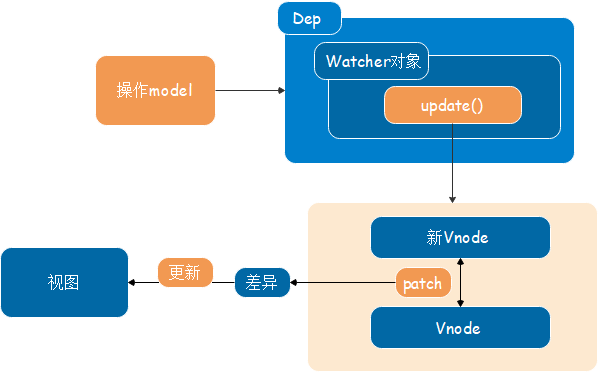
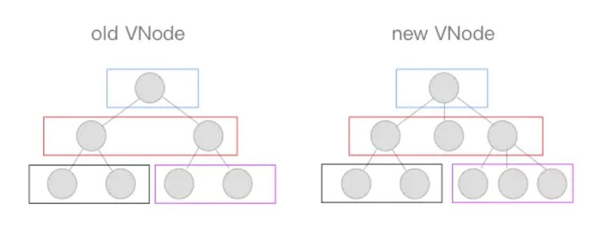
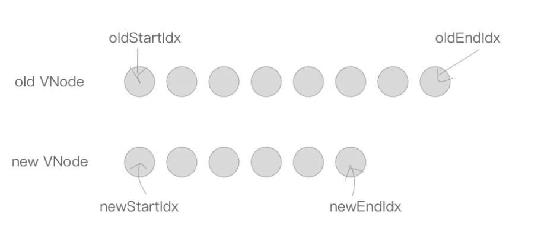

## 数据状态更新时的差异diff及patch机制

### 数据更新视图



### 跨平台

> 因为使用了Virtual DOM，Vue.js具有了跨平台能力
> Virtual DOM只是js对象，是如何调用不同平台的api的？

* 依赖于适配层：将不同平台的api封装在内，以同样的接口对外暴露

#### 举个栗子

* 提供**nodeOps对象**做适配，根据**platform**区分不同平台来执行当前平台对应的api，而对外提供了一致的接口，供Virtual DOM来调用。

```js
const nodeOps = {
    setTextContent(text) {
        if(platform === 'weex') {
            node.parentNode.setAttr('value', text);
        } else if(platform === 'web') {
            node.textContent = text;
        }
    },
    parentNode() {
        // ...
    },
    removeChild() {
        // ...
    },
    nextSibling() {
        // ...
    },
    insertBefore() {
        // ...
    }
}
```

### patch过程使用到的API

> 这些**api**在patch的过程中使用，调用nodeOps中的相应函数来操作平台

#### insert

> 用来在**parent**这个父节点下插入一个子节点，如果指定了**ref**则插入到**ref**这个子节点前面

```js
function insert(parent, elm, ref) {
    if(parent) {
        if(ref) {
            if(ref.parentNode === parent) {
                nodeOps.insertBefore(parent, elm, ref);
            }
        } else {
            nodeOps.appendChild(parent, elm);
        }
    }
}
```

#### createElm

> 用来新建一个节点，**tag**存放创建一个标签节点，否则创建一个文本节点

```js
function createELm(vnode, parentElm, refElm) {
    if(vnode.tag) {
        insert(parentElm, nodeOps.createElement(vnode.tag), ref);
    } else {
        insert(parentElm, nodeOps.createElement(vnode.text), ref);
    }
}
```

#### addVnodes

> 用来批量调用**createElm**新建节点

```js
function addVnodes(parentElm, refElm, vnodes, startIdx, endIdx) {
    for(; startIdx <= endIdx; ++startIdx) {
        createElm(vnodes[startIdx], parentElm, refElm);
    }
}
```

#### removeNode

> 用来移除一个节点

```js
function removeNode(el) {
    const parent = nodeOps.parentNode(el);
    if(parent) {
        nodeOps.removeChild(parent, el);
    }
}
```

#### removeVnodes

> 用来批量调用**removeNode**移除节点

```js
function removeVnodes(parentElm, vnodes, startIdx, endIdx) {
    for(; startIdx <= endIdx; ++startIdx) {
        const ch = vnodes[startIdx];
        if(ch) {
            removeNode(cn.elm);
        }
    }
}
```

### patch

#### diff算法

> 用**diff算法**可以比对出两棵树的**差异**

* **diff算法**是通过同层的树节点进行比较 --> 时间复杂度只有O(n)，是一种相当高效的算法



#### patch的过程

* patch的主要功能：比对两个Vnode节点，将**差异**更新到视图上

```js
function patch(oldVnode, vnode, parentElm) {
    if(!oldVnode) {
        addVnodes(parentElm, null, vnode, 0, vnode.length - 1);
    } else if(!vnode) {
        removeVnodes(parentElm, oldVnode, 0, oldVnode.length - 1);
    } else {
        if(sameVnode(oldVnode, vnode)) {
            patchVnode(oldVnode, vnode);
        } else {
            removeVnodes(parentElm, oldVnode, 0, oldVnode.length - 1);
            addVnodes(parentElm, null, vnode, 0, vnode.length - 1);
        }
    }
}
```

1. 在**oldVnode**不存在时

	* 相当于新的Vnode替代原本没有的节点，所以直接用**addVnodes**将这些节点批量添加到**parentElm**上

```js
	if(!oldVnode) {
        addVnodes(parentElm, null, vnode, 0, vnode.length - 1);
	}
```

2. 在**Vnode（新Vnode节点）**不存在时

	* 相当于要把旧的节点删除，所以直接用**removeVnodes**进行批量的节点删除

```js
	else if(!vnode) {
        removeVnodes(parentElm, oldVnode, 0, oldVnode.length - 1);
	}
```

3. 当**oldVnode**与**Vnode**都存在时

	* 需要判断它们是否属于**sameVnode**，如果是则进行**patchVnode**操作，否则，删除旧节点，增加新节点

```js
	if(sameVnode(oldVnode, vnode)) {
        patchVnode(oldVnode, vnode);
	} else {
        removeVnodes(parentElm, oldVnode, 0, oldVnode.length - 1);
        addVnodes(parentElm, null, vnode, 0, vnode.length - 1);
	}
```

### sameVnode

* 只有当**key**、**tag**、**isComment（是否为注释节点）**、**data**同时定义（不定义），同时满足当标签类型为input的时候type相同即可。

```js
function sameVnode() {
    return (
    	a.key === b.key &&
        a.tag === b.tag &&
        a.isComment === b.isComment &&
        (!!a.data) === (!!b.data) &&
        sameInputType(a, b)
    )
}
function sameInputType(a, b) {
    if(a.tag !== 'input') return true;
    let i;
    const typeA = (i = a.data) && (i = i.attrs) && i.type;
    const typeB = (i = b.data) && (i = i.attrs) && i.type;
    return typeA === typeB;
}
```

### patchVnode

> **patchVnode**是在符合**sameVnode**的条件下触发的，会进行**比对**

```js
function patchVnode(oldVnode, vnode) {
    if(oldVnode === vnode) return
    if(vnode.isStatic && oldVnode.isStatic && vnode.key === oldVnode.key) 
    {
    	vnode.elm = oldnode.elm;
    	vnode.componentInstance = oldVnode.componentInstance;
    	retirn;
	}
	if(vnode.text) {
        nodeOps.setTextContent(elm, vnode.text);
    }
    if(oldCh && ch && (oldCh !== ch)) {
        updateChildren(elm, oldCh, ch);
    } else if(ch) {
        if(oldVnode.text) nodeOps.setTextContent(elm, '');
        addVnodes(elm, null, ch, 0, ch.length - 1);
    } else if(oldCh) {
        removeVnodes(elm, oldCh, 0, oldCh.length - 1);
    } else if(oldVnode.text) {
        nodeOps.setTextContent(elm, '');
    }
}
```

1. 在新旧Vnode节点相同时，直接return

```js
if(oldVnode === vnode) return
```

2. 当新旧Vnode节点都是**isStatic（静态的）**，并且**key**相同时
	* 将**componentInstance**与**elm**从旧Vnode节点“拿过来”，跳过比对的过程

```js
if(vnode.isStatic && oldVnode.isStatic && vnode.key === oldVnode.key) {
    vnode.elm = oldnode.elm;
    vnode.componentInstance = oldVnode.componentInstance;
    retirn;
}
```

3. 当新Vnode节点是文本节点时，直接用**setTextContent**来设置text--nodeOps是适配层

```js
if(vnode.text) {
    nodeOps.setTextContent(elm, vnode.text);
}
```

4. 当新Vnode节点是非文本节点时
	* 当**oldCh** 与 **ch** 都存在且不相同时，使用**UpdateChildren**函数来更新子节点
	* 当只有**ch**存在时，如果旧节点是文本节点则先将节点的文本清除，然后将**ch**批量插入到节点elm下
	* 当只有**oldCh**存在时，说明需要将旧节点通过**removeVnodes**全部清除
	* 当只有旧节点是文本节点时，清除其节点文本内容

```js
if(oldCh && ch && (oldCh !== ch)) {
    updateChildren(elm, oldCh, ch);
} else if(ch) {
    if(oldVnode.text) nodeOps.setTextContent(elm, '');
    addVnodes(elm, null, ch, 0, ch.length - 1);
} else if(oldCh) {
    removeVnodes(elm, oldCh, 0, oldCh.length - 1);
} else if(oldVnode.text) {
    nodeOps.setTextContent(elm, '');
}
```

### updateChildren

1. 定义新旧节点两边的索引：**oldStartIdx**、**newStartIdx**、**oldEndIdx**、**newEndIdx**
> 同时定义指向这几个索引对应的Vnode节点： **oldStartVnode**、**newStartVnode**、**oldEndVnode**、**newEndVnode**



2. **while**循环：**oldStartIdx**、**newStartIdx**、**oldEndIdx**、**newEndIdx**会逐渐向中间靠拢


* 2.1 当**oldStartVnode**或者**oldEndVnode**不存在时，**oldStartIdx**与**oldEndIdx**继续向中间靠拢，并更新对应的**oldStartVnode**与**oldEndVnode**的指向
* 2.2 将**oldStartIdx**、**newStartIdx**、**oldEndIdx**、**newEndIdx**两两比对的过程
    > 一共会出现2*2=4种情况

    * **oldStartVnode**与**newStartVnode**符合**sameVnode**时，直接**patchVnode**，同时**oldStartIdx**与**newStartIdx**向后移一位
    * **oldEndVnode**与**newEndVnode**符合**sameVnode**时，同样进行**patchVnode**操作并将**oldEndIdx**与**newEndIdx**向前移动一位
    * **oldStartVnode**与**newEndVnode**符合**sameVnode**时，将**oldStartVnode.elm**直接移动到**oldEndVnode.elm**这个节点后面，然后**oldStartIdx**向后移动一位，**newEndIdx**向前移动一位
    * **oldEndVnode**与**newStartVnode**符合**sameVnode**时，将**oldEndVnode.elm**直接移动到**oldStartVnode.elm**这个节点后面，然后**oldEndIdx**向前移动一位，**newStartIdx**向后移动一位

* 2.3 其他情况下
    * 处理节点得到一个**key**与**index**索引对应的map表**oldKeyToIdx **
    * 可以根据某一个key值，快速地从**oldKeyToIdx **中获取相同key节点的索引**idxInOld**，然后找到相同的节点
    * 如果没有找到相同的节点，则通过**createElm**创建一个新节点，并将**newStartIdx**向后移一位
    * 如果找到了节点，同时也符合**sameVnode**，则将这两个节点进行**patchVnode**，将该位置的旧节点赋值为undefined，同时将**newStartVnode.elm**插入到**oldStartVnode.elm**前面，**newStartIdx**后移一位
    * 如果不符合**sameVnode**，只能创建一个新节点插入到**parentElm**的子节点中，**newStartIdx**后移一位

3. 当**while**循环结束后，如果**oldStartIdx > oldEndIdx**，调用**addVnodes**将新节点多的节点插入
4. 如果满足**newStartIdx > newEndIdx**，调用**removeVnodes**将多的旧节点批量删除

```js
function updateChildren(parentElm, oldCh, newCh) {
    // 新旧节点 两边的索引及节点
    let oldStartIdx = 0;
    let newStartIdx = 0;
    let oldEndIdx = oldCh.length - 1;
    let newEndIdx = newCh.length - 1;
    let oldStartVnode = oldCh[0];
    let newStartVnode = newCh[0];
    let oldEndVnode = oldCh[oldEndIdx];
    let newEndVnode = newCh[newEndIdx];
    let oldKeyToIdx, idxInOld, elmToMove, refElm;

    // 在while循环中，新旧节点两边的索引会逐渐向中间靠拢
    while(oldStartIdx <= oldEndIdx && newStartIdx <= newEndIdx) {
        if(!oldStartVnode) {
            oldStartVnode = oldCh[++oldStartIdx];
        } else if(!oldEndVnode) {
            oldEndVnode = oldCh[--oldEndIdx];
        } else if(sameVnode(oldStartVnode, newStartVnode)) {
            patchVnode(oldStartVnode, newStartVnode);
            oldStartVnode = oldCh[++oldStartIdx];
            newStartVnode = newCh[++newStartIdx];
        } else if(sameVnode(oldEndVnode, newEndVnode)) {
            patchVnode(oldEndVnode, newEndVnode);
            oldEndVnode = oldCh[--oldEndIdx];
            newEndVnode = newCh[--newEndIdx];
        } else if(sameVnode(oldStartVnode, newEndVnode)) {
            patchVnode(oldStartVnode, newEndVnode);
            nodeOps.insertBefore(parentElm, oldStartVnode.elm, nodeOps.nextSibling(oldEndVnode.elm));// 第三个参数什么意思？第一个参数是什么
            oldStartVnode = oldCh[++oldStartIdx];
            newEndVnode = newCh[--newEndIdx];
        } else if(sameVnode(oldEndVnode, newStartVnode)) {
            patchVnode(oldEndVnode, newStartVnode);
            nodeOps.insertBefore(parentElm, oldEndVnode.elm, oldStartVnode.elm);//不懂too
            oldEndVnode = oldCh[--oldEndIdx];
            newStartVnode = newCh[++newStartIdx];
        } else {
            let elmToMove = oldCh[idxInOld];
            if(!oldKeyToIdx) oldKeyToIdx = createKeyToOldIdx(oldCh, oldStartIdx, oldEndIdx);
            if(!idxInOld) {
                createElm(newStartVnode, parentElm);
                newStartVnode = newCh[++newStartIdx];
            } else {
                elmToMove = oldCh[idxInOld];
                if (sameVnode(elmToMove, newStartVnode)) {
                    patchVnode(elmToMove, newStartVnode);
                    oldCh[idxInOld] = undefined;
                    nodeOps.insertBefore(parentElm, newStartVnode.elm, oldStartVnode.elm);
                    newStartVnode = newCh[++newStartIdx];
                } else {
                    createElm(newStartVnode, parentElm);
                    newStartVnode = newCh[++newStartIdx];
                }
            }
        }
    }

    if(oldStartIdx > oldEndIdx) {
        refElm = (newCh[newEndIdx + 1]) ? newCh[newEndIdx + 1].elm : null;
        addVnodes(parentElm, refElm, newCh, newStartIdx, newEndIdx);
    } else if(newStartIdx > newEndIdx) {
        removeVnodes(parentElm, oldCh, oldStartIdx, oldEndIdx);
    }
}
// 产生key与index索引对应的一个map表
/**
 * [
 *    {xx: xx, key: 'key0'},
 *    {xx: xx, key: 'key1'},
 *    {xx: xx, key: 'key2'}
 * ]
 * {
 *    key0: 0,
 *    key1: 1,
 *    key2: 2    
 * }
 */
createKeyToOldIdx(children, beginIdx, endIdx) {
	let i, key;
	const map = {};
	for(i = beginIdx; i <= endIdx; ++i) {
        key = children[i].key;
        if(isDef(key)) map[key] = i;
	}
	return map;

}
```


