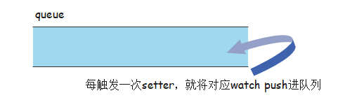

## 批量异步更新策略及 nextTick 原理

### 为什么要异步更新？

> Vue是如何在修改 data 中的数据后修改视图的：setter -> Dep -> Watcher -> patch -> 视图

#### 栗子

```js
<template>
	<div>
		<div>{{number}}</div>
		<div @click="handleClick">click</div>
	</div>
</template>
export default {
    data() {
        return {
            number: 0
        };
    },
    methods: {
        handleClick() {
            for(let i = 0; i < 1000; i++) {
                this.number++;
            }
        }
    }
}
```

* `number+1`,DOM就更新一次？

####  异步更新策略

> Vue 在默认情况下

* **1.  每次触发某个数据的`setter`方法后，对应的`watcher`对象会被`push`进一个队列`queue`中**

* **2. 在下一个`tick`时再触发`queue`的`watcher`对象的`run`（用来触发`patch`操作）**


* 什么是下一个tick？

### nextTick

* Vue实现了一个`nextTick`函数，传入一个`cb`，这个`cb`会被存储到一个队列中，在下一个`tick`时触发队列中的所有`cb`事件
* **Vue源码分别用`Promise`、`setTimeout`、`setImmediate`等方式在microtask中创建一个事件，目的是在当前调用栈执行完毕之后才会去执行这个事件（不一定立即执行）**

```js
// 001 callbacks数组用来存储nextTick
// 在下一个tick处理这些回调函数之前，所有的cb会被存在这个callbacks数组中
let callbacks = [];
// 002 pending是一个标记位，代表一个等待的状态
let pending = false;

function nextTick(cb) {
    callbacks.push(cb);
    if(!pending) {
        pending = true;
        setTimeout(flushCallbacks, 0);
    }
} 
// 003 flushCallbacks会在执行时将callbacks中的所有cb依次执行
function flushCallbacks() {
    pending = false;
    const copies = callbacks.slice(0);
    callbacks.length = 0;
    for(let i = 0; i < copies.length; i++) {
        copies[i]();
    }
}
```

* `number+1`,Watcher就push一次、执行一次？

### Watcher

> 需要执行一个过滤操作，同一个`Watcher`在同一个`tick`时应该只被执行一次，即队列`queue`中不应该出现重复的`Watcher`对象

* 用`id`标记每一个`Watcher`对象
* 实现`update`方法，在修改数据后由`Dep`来调用，而`run`方法才是真正的触发`patch`更新视图的方法

```js
let uid = 0;
class Watcher {
    constructor() {
        this.id = ++uid;
    }
    update() {
        console.log('watch' + this.id + 'uodate');
        queueWatcher(this);
    }
    run() {
        console.log('watch' + this.id + '视图更新啦~');
    }
}
```

### queueWatcher

```js
// 001 has用来判断是否已经存在相同的Watcher对象
// has->map，存放id->ture|false的形式
let has = {};
let queue = [];
// 003 wating是一个标记位
// 标记是否向nextTick传递了flushSchedulerQueue方法
let waiting = false;
function queueWatcher(watcher) {
    const id = watcher.id;
    // 002 如果queue没有这个Watcher对象
    if(has[id] == null) {
        has[id] = true;
        // 0021 该对象会被push进queue中
        queue.push(watcher);
        if(!waiting) {
            waiting = true;
            // 004 在下一个tick时执行flushSchedulerQueue来flush queue，执行他里面的所有Watcher对象的run方法
            nextTick(flushSchedulerQueue);
        }
    }
}
```

### flushSchedulerQueue

```js
function flushSchedulerQueue() {
    let watcher, id;
    for(index = 0; index < queue.length; index++) {
        watcher = queue[index];
        id = watcher.id;
        has[id] = null;
        watcher.run();
    }
    waiting = false;
}
```

### 栗子

```js
let watch1 = new Watcher();
let watch2 = new Watcher();
watch1.update();
watch1.update();
watch2.update();
```
* 如果没有异步更新策略，理论上应该执行Watcher对象的run，则会打印

```js
watch1 updata
watch1更新啦~
watch1 updata
watch1更新啦~
watch2 updata
watch2更新啦~
```

* 实际上执行

```js
watch1 updata
watch1 updata
watch2 updata
// 这就是异步更新策略的效果，相同的Watcher对象会在这个过程中被剔除，在下一个tick时去更新视图
watch1更新啦~ 
watch2更新啦~
```


