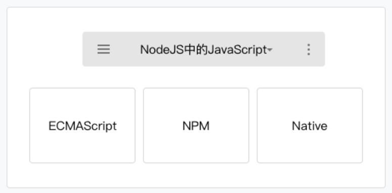

# 小程序开发指南

## 小程序代码组成

### JSON配置

> 在小程序中，JSON 用于做静态配置。

### WXML模板

> WXML 是小程序框架设计的一套标签语言，结合小程序的基础组件、事件系统，可以构建出页面的结构。

#### 数据绑定

* __WXML 通过 `{{变量名}}` 来绑定 WXML 文件和对应的 JavaScript 文件中的 data 对象属性__

```html wxml
<!--
{
  time: (new Date()).toString()
}
-->
<text>当前时间：{{time}}</text>
```

* __属性值也可以动态的去改变，有所不同的是，属性值必须被包裹在`双引号`中__

```html wxml
<!-- 正确的写法 -->
<text data-test="{{test}}"> hello world</text>
<!-- 错误的写法  -->
<text data-test={{test}}> hello world </text >
```

* __变量名是大小写敏感的__，也就是说 {{name}} 和 {{Name}} 是两个不同的变量
* __没有被定义的变量的或者是被设置为 undefined 的变量不会被同步到 wxml 中__

```html wxml
<!--
{
  var2: undefined,
  var3: null,
  var4: "var4"
}
-->
<view>{{var1}}</view>
<view>{{var2}}</view>
<view>{{var3}}</view>
<view>{{var4}}</view>
<!--
输出：
  null
  var4
-->
```

#### 逻辑语法

* __通过 `{{ 变量名 }}` 语法可以使得 WXML 拥有动态渲染的能力，除此外还可以在 {{ }} 内进行简单的逻辑运算__

#### 条件逻辑

* 使用 `wx:if="{{condition}}"` 来判断是否需要渲染该代码块
* 使用 `wx:elif` 和 `wx:else` 来添加一个 else 块
* wx:if 是一个控制属性，需要将它添加到一个标签上【block】

#### 列表渲染

* 在组件上使用 `wx:for` 控制属性绑定一个数组，即可使用数组中各项的数据重复渲染该组件
* 使用 `wx:for-item` 指定数组当前元素的变量名
* 使用 `wx:for-index` 指定数组当前下标的变量名
* 使用 `wx:key` 来指定列表中项目的唯一的标识符

#### 共同属性

| 属性名 | 类型 | 描述 | 注解 |
| -- | -- | -- | -- |
| `id` | `String` | 组件的唯一标识 | 整个页面唯一 |
| `class` | `String` | 组件的样式类 | 在对应的 WXSS 中定义的样式类 |
| `style` | `String` | 组件的内联样式 | 可以动态设置的内联样式 |
| `hidden` | `Boolean` | 组件是否显示 | 所有组件默认显示 |
| `data-*` | `Any` | 自定义属性 | 组件上触发的事件时，会发送给事件处理函数 |
| `bind*/catch*` | `EventHandler` | 组件的事件 |

### WXSS样式

> WXSS 是一套用于小程序的样式语言，用于描述 WXML 的组件样式，也就是视觉上的效果

#### 尺寸单位rpx

> 小程序编译后，rpx会做一次px换算。换算是以`375个物理像素为基准`，也就是在一个宽度为375物理像素的屏幕下，1rpx = 1px。

### js脚本

> 小程序的主要开发语言是 JavaScript ，开发者使用 JavaScript 来开发业务逻辑以及调用小程序的 API 来完成业务需求





#### 小程序的执行环境

> 小程序中ios9和ios10所使用的运行环境并没有完全的兼容到ES6标准，在开发工具>项目设置中，勾选ES6转ES5开启转码工具

#### 模块化

* 浏览器中，所有 JavaScript 是在运行在同一个作用域下的，定义的参数或者方法可以被后续加载的脚本访问或者改写
* 同浏览器不同，小程序中可以将任何一个JavaScript 文件作为一个模块，通过`module.exports` 或者 `exports` 对外暴露接口
* 使用 `require(path)` 引入模块

#### 脚本的执行顺序

* 浏览器中，脚本严格按照加载的顺序执行
* 小程序的执行的入口文件是 app.js。并且会根据其中 require 的模块顺序决定文件的运行顺序

#### 作用域

* 同浏览器中运行的脚本文件有所不同，小程序的脚本的作用域同 NodeJS 更为相似
* 在文件中声明的变量和函数只在该文件中有效，不同的文件中可以声明相同名字的变量和函数，不会互相影响

> 当需要使用全局变量的时，通过使用全局函数 `getApp()` 获取全局的实例，并设置相关属性值，来达到设置全局变量的目的

## 小程序宿主环境

> 小程序可以调用宿主环境提供的微信客户端的能力

### 渲染层和逻辑层

> WXML 模板和 WXSS 样式工作在渲染层，JS 脚本工作在逻辑层

#### 通信模型

* 小程序的渲染层和逻辑层分别由2个线程管理
  * 渲染层的界面使用了WebView 进行渲染
  * 逻辑层采用JsCore线程运行JS脚本
* 一个小程序存在多个界面，所以渲染层存在多个WebView线程
* 这两个线程的通信会经由微信客户端做中转，逻辑层发送网络请求也经由Native转发


#### 数据驱动

* WXML 可以先转成JS对象，然后再渲染出真正的DOM树


* “数据驱动”的原理
  * 通过setData改变数据，产生的JS对象对应的节点就会发生变化
  * 此时对比前后两个JS对象得到变化的部分
  * 然后把这个差异应用到原来的DOM树，从而达到UI更新的目的

#### 双线程下的界面渲染

* __小程序的逻辑层和渲染层是分开的两个线程__
  * 在渲染层，宿主环境会把WXML转化成对应的JS对象
  * 在逻辑层发生数据变更的时候，我们需要通过宿主环境提供的setData方法把数据从逻辑层传递到渲染层
* 再经过对比前后差异，把差异应用在原来的Dom树上，渲染出正确的UI界面


### 程序与页面

#### 程序

> “小程序”指产品层面的程序，“程序”指代码层面的程序实例

##### 程序构造器App()

> 宿主环境提供了 `App()` 构造器用来注册一个程序App，需要留意的是App() 构造器必须写在项目根目录的app.js里，App实例是单例对象，在其他JS脚本中可以使用宿主环境提供的 `getApp()` 来获取程序实例

##### 小程序全局数据

* App实例是单例的，因此不同页面直接可以通过App实例下的属性来共享数据

> 所有页面的脚本逻辑都是跑在同一个JsCode线程，页面使用定时器，然后跳转到其它页面时，这些定时器并没有被清除，需要开发者自己在页面离开时清理

#### 页面

##### 页面构造器Page()

> 宿主环境提供了 `Page()` 构造器用来注册一个小程序页面，Page()在页面脚本page.js中调用
> Page构造器接受一个Object参数，其中data属性是当前页面WXML模板中可以用来做数据绑定的初始数据

##### 页面的数据

> 通过在Page实例下的方法调用this.setData把数据传递给渲染层，从而达到更新界面的目的

* 由于小程序的渲染层和逻辑层分别在两个线程中运行，所以setData传递数据实际是一个 __异步__ 的过程，所以setData的第二个参数是一个callback回调，在这次setData对界面渲染完毕后触发
* data中的key可以非常灵活，以数据路径的形式给出
  * this.setData({"d[0]": 100})
  * this.setData({"d[1].text": 'Goodbye'})
  * 保持一个原则就可以提高小程序的渲染性能：每次只设置需要改变的最小单位数据。

> 直接修改Page实例的this.data而不调用this.setData是无法改变页面的状态的，还会造成数据不一致

##### 页面的用户行为

> 小程序宿主环境提供了四个和页面相关的用户行为回调

1. 下拉刷新 onPullDownRefresh
   * 在app.json的window选项|page.json中设置enablePullDownRefresh为true
   * 当处理完数据刷新后，wx.stopPullDownRefresh可以停止当前页面的下拉刷新
2. 上拉触底 onReachBottom
   * 在app.json的window选项|page.json中设置触发距离onReachBottomDistance
   * 在触发距离内滑动期间，本事件只会触发一次
3. 页面滚动 onPageScroll
4. 用户转发 onShareAppMessage

##### 页面跳转和路由

> __小程序宿主环境限制了这个页面栈的最大层级为10层__


### 组件

> 组件就是小程序页面的基本组成单元

* 所有组件名和属性都是小写，多个单词会以英文横杠 "-" 进行连接

### API

> wx对象实际上就是小程序的宿主环境所提供的全局对象，几乎所有小程序的API都挂载在wx对象底下（除了Page/App等特殊的构造器）

### 事件

#### 什么是事件

> 把“用户在渲染层的行为反馈”以及“组件的部分状态反馈”抽象为渲染层传递给逻辑层的“事件”


#### 事件类型和事件对象

> 常见事件类型

| 类型 | 触发条件 |
| -- | -- |
| `touchstart` | 手指触摸动作开始 |
| `touchmove` | 手指触摸后移动 |
| `touchcancel` | 手指触摸动作被打断，如来电提醒，弹窗 |
| `touchend` | 手指触摸动作结束 |
| `tap` | 手指触摸后马上离开 |
| `longpress` | 手指触摸后，超过350ms再离开，如果指定了事件回调函数并触发了这个事件，tap事件将不被触发 |
| `longtap` | 手指触摸后，超过350ms再离开（推荐使用longpress事件代替）|

* 当事件回调触发的时候，会收到一个事件对象，需要注意target和currentTarget属性的区别
  * `currentTarget`为当前事件所绑定的组件
  * `target`为触发该事件的源头组件

#### 事件绑定与冒泡捕获

> 以key="value"的形式

1. key以bind或者catch开头，然后跟上事件的类型
2. value是一个字符串，需要在对应的页面Page构造器中定义同名的函数，否则触发事件时在控制台会有报错信息

* bind和capture-bind的含义分别代表事件的冒泡阶段和捕获阶段
* bind事件绑定不会阻止冒泡事件向上冒泡，catch事件绑定可以阻止冒泡事件向上冒泡

> 其他组件自定义事件，如无特殊声明都是非冒泡事件
> 如`<form/>`的submit事件，`<input/>`的input事件，`<scroll-view/>`的scroll事件
