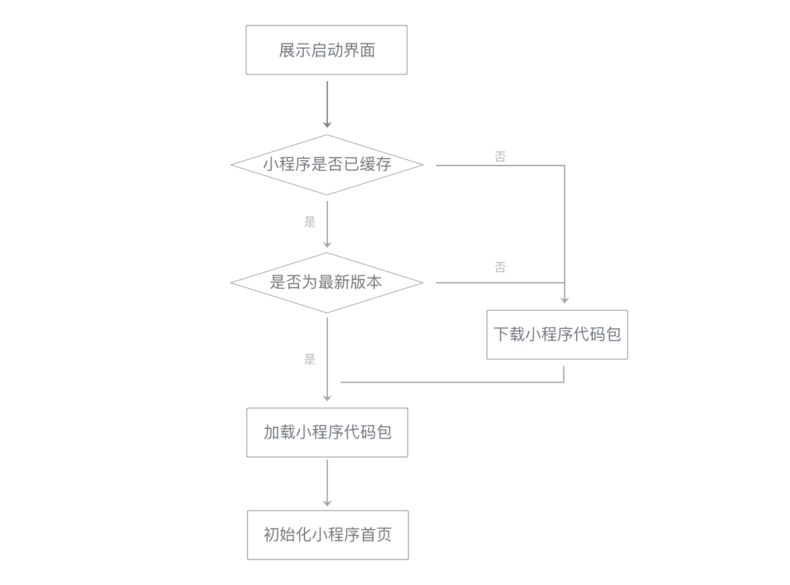

# 小程序开发指南

## 1. 底层框架

### 1.1 双线程模型

* 小程序的逻辑层与渲染层分开在不同的线程运行
* 跟传统的Web 单线程模型有很大的不同

#### 1 技术选型

* __要求：快--渲染快、加载快__

* 三种渲染界面的技术
  * 用纯客户端原生技术来渲染
    > 小程序代码需要与微信代码一起编包发布，pass
  * 用纯 Web 技术来渲染
    > 性能问题：单线程
  * __介于客户端原生技术与 Web 技术之间的，互相结合各自特点的技术(Hybrid)来渲染__
    * JS-SDK：界面主要由成熟的 Web 技术渲染，辅之以大量的接口提供丰富的客户端原生能力

> 每个小程序页面都是用不同的WebView去渲染，这样可以提供更好的交互体验，更贴近原生体验，也避免了单个WebView的任务过于繁重  --> 渲染层

#### 2 管控与安全

> 需要阻止开发者使用一些浏览器提供的,诸如跳转页面、操作DOM、动态执行脚本的开放性接口

* 提供一个沙箱环境来运行开发者的js代码,这个沙箱环境不能有任何浏览器相关接口,只提供纯js的解释执行环境 --> 逻辑层

#### 3 天生的延时

> 小程序是基于双线程模型 --> 任何数据传递都是线程间的通信，也就是都会有一定的延时

* 逻辑层与渲染层之间的通信有延时
* 各层与客户端原生交互有延时
  * 开发者的代码 -> 逻辑层
  * 客户端原生 -> 微信主线程

### 1.2 组件系统

> 使用HTML -> 为解决管控与安全而建立的双线程模型就无意义了

#### 1 Exparser框架

* Exparser是微信小程序的组件组织框架，内置在小程序基础库中，为小程序的各种组件提供基础的支持

> 小程序中，所有节点树相关的操作都依赖于Exparser

#### 2 内置组件

* 基于Exparser框架，内置了一套组件，提供了视图容器类、表单类、导航类、媒体类、开放类等几十种组件

> 我们会把一个组件内置到小程序框架里的一个重要原则是：这个组件是基础的。
> 换句话说，没有这个组件的话，在小程序架构里无法实现或者实现不好某类功能。

#### 3 自定义组件

1. ShowTree
2. 运行原理
3. 组件间通信
   * 不同组件实例间的通信有WXML属性值传递、事件系统、selectComponent和relations等方式。
   * __WXML属性值传递是从父组件向子组件的基本通信方式__
   * __事件系统是从子组件向父组件的基本通信方式__

### 1.3 原生组件

> 不完全在Exparser的渲染体系下，而是由客户端原生参与组件的渲染的组件称为“原生组件”。

#### 1 原生组件运行机制

* 原生组件在WebView这一层的渲染任务是很简单，只需要渲染一个占位元素，之后客户端在这块占位元素之上叠了一层原生界面。

> 因此，原生组件的层级会比所有在WebView层渲染的普通组件要高。

* 引入原生组件的好处
  * 扩展Web的能力。
    > 像输入框组件(input, textarea)有更好地控制键盘的能力
  * 体验更好，同时也减轻WebView的渲染工作。
    > 像地图组件(map)这类较复杂的组件，其渲染工作不占用WebView线程，而交给更高效的客户端原生处理。
  * 绕过setData、数据通信和重渲染流程，使渲染性能更好。
    > 像画布组件(canvas)可直接用一套丰富的绘图接口进行绘制。

#### 2 原生组件渲染限制

* 原生组件会浮于页面其他组件之上(相当于拥有正无穷大的z-index值)使其它组件不能覆盖在原生组件上展示
  > 使用cover-view和cover-image组件

### 1.4 小程序与客户端通信原理

#### 1 视图层组件

* 通信机制的实现方式
  * iOS 是利用了WKWebView 的提供 messageHandlers 特性
  * 安卓是往 WebView 的 window 对象注入一个原生方法，最终会封装成 WeiXinJSBridge 这样一个兼容层，主要提供了调用（invoke）和监听（on）这两种方法。

> 开发者只是间接调用的，真正调用是在组件的内部实现中。

* 组件运行的时候被插入到 DOM 树中，会调用客户端接口，通知客户端在哪个位置渲染一块原生界面

#### 2 逻辑层接口

* 逻辑层与客户端原生通信机制与渲染层类似，不同在于，iOS平台可以往JavaScripCore框架注入一个全局的原生方法，而安卓方面则是跟渲染层一致的

> 开发者也是间接地调用到与客户端原生通信的底层接口

## 2. 性能优化

### 2.1 启动

