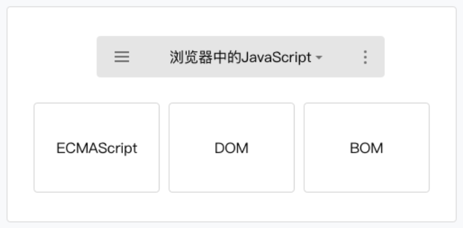
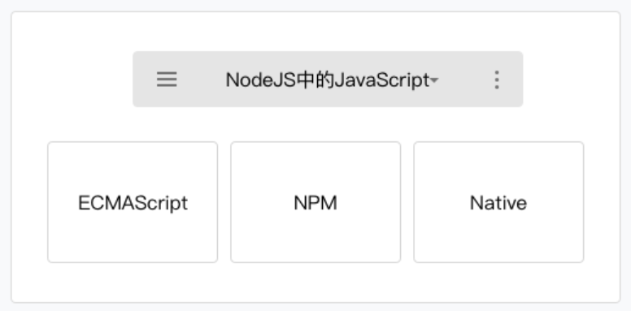
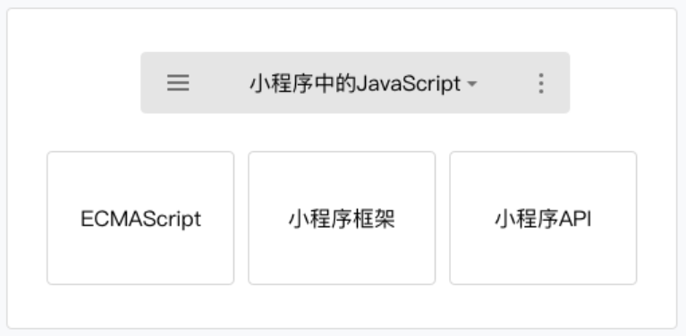

# 小程序开发指南

## 小程序代码组成

### JSON配置

> 在小程序中，JSON扮演的静态配置的角色。

### WXML模板

> WXML 是小程序框架设计的一套标签语言，结合小程序的基础组件、事件系统，可以构建出页面的结构。

#### 数据绑定

* WXML 通过 {{变量名}} 来绑定 WXML 文件和对应的 JavaScript 文件中的 data 对象属性

```html wxml
<!--
{
  time: (new Date()).toString()
}
-->
<text>当前时间：{{time}}</text>
```

* 属性值也可以动态的去改变，有所不同的是，属性值必须被包裹在双引号中

```html wxml
<!-- 正确的写法 -->
<text data-test="{{test}}"> hello world</text>
<!-- 错误的写法  -->
<text data-test={{test}}> hello world </text >
```

* 变量名是大小写敏感的，也就是说 {{name}} 和 {{Name}} 是两个不同的变量
* 没有被定义的变量的或者是被设置为 undefined 的变量不会被同步到 wxml 中

```html wxml
<!--
{
  var2: undefined,
  var3: null,
  var4: "var4"
}
-->
<view>{{var1}}</view>
<view>{{var2}}</view>
<view>{{var3}}</view>
<view>{{var4}}</view>
<!--
输出：
  null
  var4
-->
```

#### 逻辑语法

* 通过 {{ 变量名 }} 语法可以使得 WXML 拥有动态渲染的能力，除此外还可以在 {{ }} 内进行简单的逻辑运算

#### 条件逻辑

* 使用 wx:if="{{condition}}" 来判断是否需要渲染该代码块
* 使用 wx:elif 和 wx:else 来添加一个 else 块
* wx:if 是一个控制属性，需要将它添加到一个标签上【block】

#### 列表渲染

* 在组件上使用 wx:for 控制属性绑定一个数组，即可使用数组中各项的数据重复渲染该组件
* 使用 wx:for-item 指定数组当前元素的变量名
* 使用 wx:for-index 指定数组当前下标的变量名
* 使用 wx:key 来指定列表中项目的唯一的标识符

#### 共同属性

| 属性名 | 类型 | 描述 | 注解 |
| -- | -- | -- | -- |
| id | String | 组件的唯一标识 | 整个页面唯一 |
| class | String | 组件的样式类 | 在对应的 WXSS 中定义的样式类 |
| style | String | 组件的内联样式 | 可以动态设置的内联样式 |
| hidden | Boolean | 组件是否显示 | 所有组件默认显示 |
| data-* | Any | 自定义属性 | 组件上触发的事件时，会发送给事件处理函数 |
| bind*/catch* | EventHandler | 组件的事件 |

### WXSS样式

> WXSS 是一套用于小程序的样式语言，用于描述 WXML 的组件样式，也就是视觉上的效果

#### 尺寸单位rpx

> 小程序编译后，rpx会做一次px换算。换算是以375个物理像素为基准，也就是在一个宽度为375物理像素的屏幕下，1rpx = 1px。

### js脚本

> 小程序的主要开发语言是 JavaScript ，开发者使用 JavaScript 来开发业务逻辑以及调用小程序的 API 来完成业务需求





#### 小程序的执行环境

> 小程序中ios9和ios10所使用的运行环境并没有完全的兼容到ES6标准，在开发工具>项目设置中，勾选ES6转ES5开启转码工具

#### 模块化

* 浏览器中，所有 JavaScript 是在运行在同一个作用域下的，定义的参数或者方法可以被后续加载的脚本访问或者改写
* 同浏览器不同，小程序中可以将任何一个JavaScript 文件作为一个模块，通过module.exports 或者 exports 对外暴露接口
* 使用 require(path) 引入模块

#### 脚本的执行顺序

* 浏览器中，脚本严格按照加载的顺序执行
* 小程序的执行的入口文件是 app.js 。并且会根据其中 require 的模块顺序决定文件的运行顺序

#### 作用域

* 同浏览器中运行的脚本文件有所不同，小程序的脚本的作用域同 NodeJS 更为相似
* 在文件中声明的变量和函数只在该文件中有效，不同的文件中可以声明相同名字的变量和函数，不会互相影响

> 当需要使用全局变量的时，通过使用全局函数 getApp() 获取全局的实例，并设置相关属性值，来达到设置全局变量的目的

## 小程序宿主环境

> 小程序可以调用宿主环境提供的微信客户端的能力

### 渲染层和逻辑层

> WXML 模板和 WXSS 样式工作在渲染层，JS 脚本工作在逻辑层

